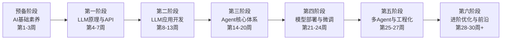
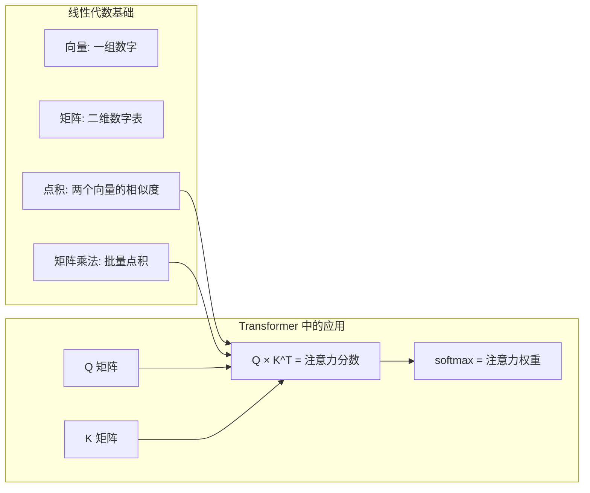
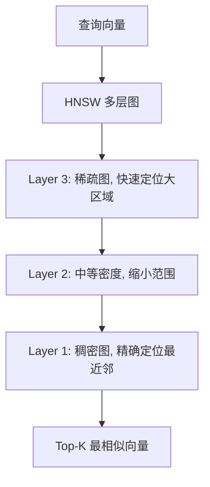
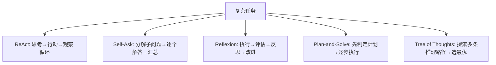
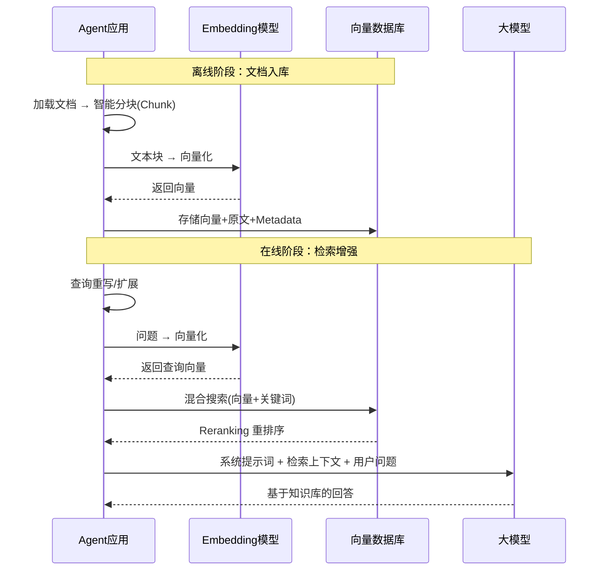
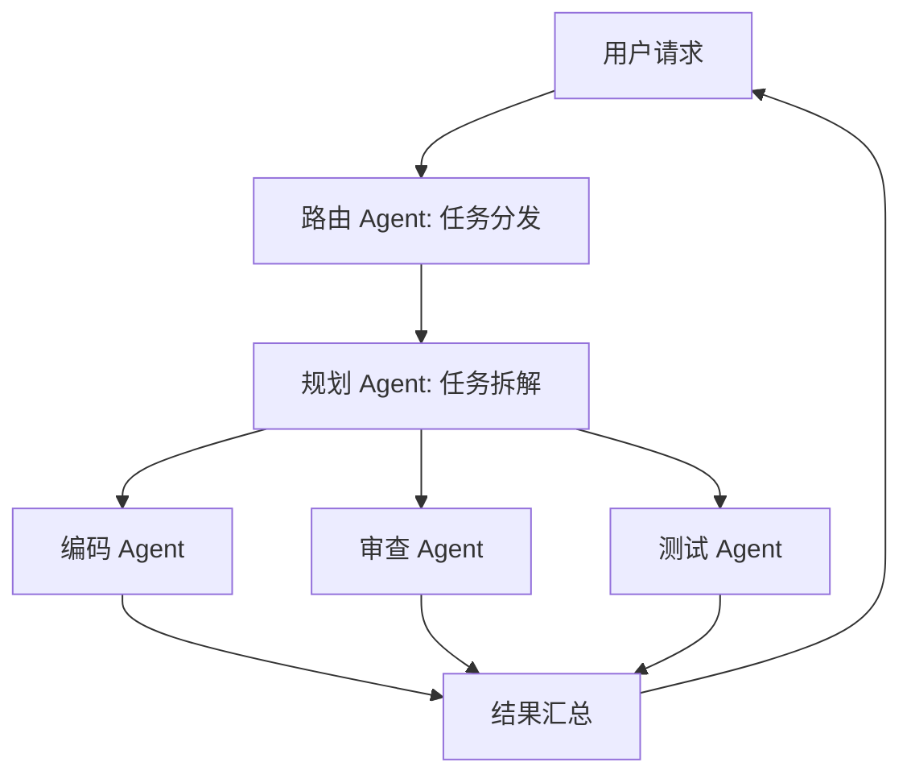
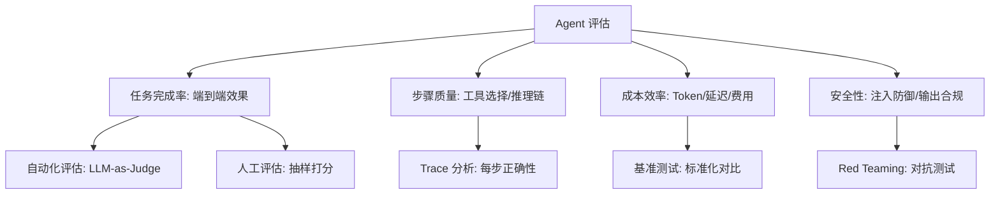
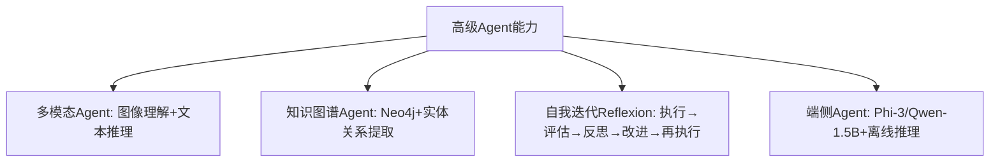

# AI Agent 全栈学习路线（融合版）— Java 开发者 30 周系统规划

## Context

你是一位有经验的 Java 后端开发者（熟悉 Spring Boot、JPA 等），但对 AI/LLM/Agent 完全零基础。本路线从**最底层的数学和深度学习基础**出发，用 30 周（每周 20h+）系统掌握 Agent 开发的全链路能力，最终能独立设计、开发、优化生产级 Agent 系统。

技术栈以 **Java 生态为主**（Spring AI、LangChain4j），辅以 Python 了解主流框架。

---

## 学习路线总览



| 阶段 | 周数 | 核心产出 |
|------|------|---------|
| 预备阶段：AI 基础素养 | 3 周 | Python 环境 + 数学直觉 + DL 基础 |
| 第一阶段：LLM 原理与 API | 4 周 | 纯 Java API 客户端（对话/流式/Embedding） |
| 第二阶段：LLM 应用开发 | 6 周 | 智能对话助手 Web 应用 |
| 第三阶段：Agent 核心体系 | 7 周 | 全能编码 Agent |
| 第四阶段：模型部署与微调 | 4 周 | 微调模型 + 本地部署 |
| 第五阶段：多 Agent 与工程化 | 3 周 | Multi-Agent 协作平台 |
| 第六阶段：进阶优化与前沿 | 3 周+ | 生产级优化 + 评估框架 |

---

## 预备阶段：AI 基础素养与工具准备（第 1-3 周）

### 学什么

| 知识模块 | 具体内容 | 时间 |
|---------|---------|------|
| 数学基础（够用版） | 线性代数：向量/矩阵/点积/矩阵乘法；概率统计：贝叶斯/分布/期望方差；微积分：导数/梯度/链式法则 | 1 周 |
| Python 快速入门 | 基础语法、pip/conda 环境管理、NumPy 基础、Jupyter Notebook；与 Java 的对比学习 | 0.5 周 |
| 深度学习基础 | 神经网络：感知机/前向传播/反向传播/梯度下降；NLP 前置：词袋模型/TF-IDF/Word2Vec/GloVe | 1 周 |
| AI 全景认知 | AI → ML → DL → NLP → LLM 的演进关系；2012-2025 关键里程碑 | 0.5 周 |

### 为什么要学

> 你是 Java 开发者，编程能力不缺。但 AI 领域有三个"门槛知识"：
> 1. **数学**是论文和文档的通用语言——不懂矩阵乘法就看不懂 Attention 公式 `Attention(Q,K,V) = softmax(QK^T / √d_k) × V`
> 2. **Python** 是 AI 生态的第一语言——Hugging Face、PEFT、vLLM 全是 Python，后面阶段绕不开
> 3. **深度学习基础**让你理解"模型为什么能工作"，而不是把 LLM 当黑盒
>
> **这个阶段的目标不是成为数学家或 Python 专家，而是建立"够用"的基础。**

### 核心知识点

**矩阵乘法与 Attention 的关系**



**Word2Vec — Embedding 的前身**

```
Word2Vec (2013) 的核心思想：
  "一个词的含义由它周围的词决定"

训练结果：
  "国王" - "男人" + "女人" ≈ "女王"
  → 向量空间编码了语义关系！

局限：
  每个词只有一个固定向量 → 无法处理多义词
  这个局限催生了 Transformer 的动态 Embedding + Attention
```

**为什么 Java 开发者学 Python 更快？** 你已经理解了循环（对应 NumPy 遍历）、接口抽象（对应 Python 的鸭子类型）、包管理（pip ≈ Maven），只需要把直觉映射到 Python 语法上。

### 实践任务

| 任务 | 描述 | 目标 |
|------|------|------|
| P0-1 | 用 NumPy 手写矩阵乘法和 softmax | 理解 Attention 的数学基础 |
| P0-2 | 用 gensim 训练 Word2Vec 模型，验证"国王-男人+女人=女王" | 理解词向量的语义编码 |
| P0-3 | 用 PyTorch 搭建 2 层神经网络做 MNIST 手写数字识别 | 理解前向传播/反向传播/梯度下降 |
| P0-4 | 搭建 Python 虚拟环境，安装 Hugging Face transformers 库 | 为后续阶段做好环境准备 |

### 里程碑

- [ ] 能手算 2×2 矩阵乘法，能解释点积的几何含义
- [ ] 能用 Python 写基本的 NumPy 操作（创建数组、矩阵运算、广播）
- [ ] 能解释 Word2Vec 的核心思想及其与 Transformer Embedding 的区别
- [ ] 能解释梯度下降的原理，知道"损失函数"和"反向传播"的含义
- [ ] 能画出 AI → ML → DL → NLP → LLM 的演进关系图

### 推荐资源

| 资源 | 类型 | 说明 |
|------|------|------|
| 3Blue1Brown "Essence of Linear Algebra" | 视频 | 矩阵/向量/点积的最佳直觉理解 |
| 3Blue1Brown "Neural Networks" | 视频 | 神经网络原理的可视化讲解 |
| Kaggle "Intro to Deep Learning" | 课程 | 零基础入门，含动手实验 |

### 详细教程

→ `phase0-ai-fundamentals/01-AI基础素养.md`

---

## 第一阶段：LLM 原理与 API 深度认知（第 4-7 周）

### 学什么

| 知识模块 | 具体内容 | 时间 |
|---------|---------|------|
| Transformer 架构 | Self-Attention、Multi-Head Attention、位置编码、FFN、残差连接、层归一化 | 1.5 周 |
| LLM 核心概念 | Token、Tokenization（BPE）、上下文窗口、Temperature、Top-P、Embedding | 1 周 |
| 主流模型深度解析 | GPT/Claude/LLaMA/Qwen/DeepSeek；闭源 vs 开源；模型选型决策 | 0.5 周 |
| API 协议 | OpenAI API 协议、Chat Completions、Message 角色体系、SSE 流式传输、错误处理重试 | 1 周 |

### 为什么要学

> **这是整座大厦的地基。** 预备阶段你理解了神经网络的通用原理，现在要聚焦到 Transformer 这一个架构上。不理解 Self-Attention 就不知道模型为什么能"理解"语言；不理解 Token 就无法控制成本和上下文长度；不理解 Embedding 后续就无法做 RAG。**不懂原理的开发者只能调 API，懂原理的开发者能设计系统。**

### 核心知识点

- **Transformer 架构图解**：从文本到预测的三步流程（Tokenizer → Embedding+位置编码 → N层 Attention+FFN → 输出）
- **Self-Attention Q-K-V 机制**：Q="我在找什么"，K="我能提供什么"，V="我携带的信息"；完整计算演示
- **BPE 分词算法**：常见词=1个Token，罕见词=多个子词，词缀共享
- **Embedding 查找表原理**：50000×768 的矩阵，语义相近的词向量距离更近
- **Temperature/Top-P 量化影响**：T=0.1 几乎确定 vs T=2.0 高度随机
- **模型选型决策树**：成本/质量/隐私/学习 四维度权衡
- **SSE 流式传输**：逐 Token 推送、打字机效果、为什么 LLM 选 SSE 而非 WebSocket
- **指数退避重试**：生产环境必备的 API 容错策略

### 实践任务

| 任务 | 描述 | 目标 |
|------|------|------|
| P1-1 | 用纯 Java HTTP 发送第一条 Chat Completion 请求 | 理解 API 调用流程 |
| P1-2 | 用 tiktoken 计算不同文本的 Token 数量 | 建立 Token 感知 |
| P1-3 | 用 Embedding API 生成文本向量，计算余弦相似度 | 理解语义搜索原理 |
| P1-4 | 实现 SSE 流式对话（逐 Token 推送） | 理解流式传输 |
| P1-5 | 阅读 "Attention Is All You Need" 图解版 | 理解 Transformer |

### 里程碑

- [ ] 能画出 Transformer 架构图并解释每个组件的作用
- [ ] 能手算简化的 Self-Attention（Q × K^T → 缩放 → Softmax → 加权 V）
- [ ] 能解释 Token、Embedding、Temperature 的含义和应用场景
- [ ] 能独立调用 OpenAI 兼容 API 完成对话、Embedding 生成、流式输出
- [ ] 能根据场景需求（成本/质量/隐私）做出模型选型决策

### 详细教程

→ `phase1-fundamentals/01-AI与LLM基础认知.md`

---

## 第二阶段：LLM 应用开发（第 8-13 周）

### 学什么

| 知识模块 | 具体内容 | 时间 |
|---------|---------|------|
| Prompt Engineering | System Prompt 设计、Few-shot、CoT（思维链）、输出格式控制、Self-Consistency | 1 周 |
| Spring AI 框架 | ChatClient、ChatModel、Message 体系、Streaming、ToolCallback、动态模型工厂 | 1.5 周 |
| LangChain4j 框架 | AiServices、Tool 注解、Memory 抽象、RAG 抽象 | 0.5 周 |
| SSE 流式传输 | SSE 原理、Reactor/WebFlux 响应式编程、SseEmitter vs Flux | 1 周 |
| 对话管理 | 多轮对话、上下文窗口管理、消息裁剪（滑动窗口/Token裁剪/摘要压缩） | 1 周 |
| 向量数据库与 Embedding | Milvus/Chroma/PgVector、ANN 检索算法（HNSW/IVF/PQ）、相似度度量 | 1 周 |

### 为什么要学

> 第一阶段理解了 LLM 是什么，这一阶段要学**怎么用好它**。Prompt Engineering 是零成本的"模型调优"；Spring AI 是 Java 生态对接 LLM 的标准框架；流式传输是 Agent 用户体验的基础；**向量数据库从第三阶段提前到本阶段**——Embedding 和向量检索是 RAG 的核心前置，先掌握它，第三阶段的 RAG 全链路会更顺畅。

### 核心知识点

- **Prompt Engineering 底层原理**：PE 如何影响概率分布（构造"前文"使期望输出成为概率最高的续写）
- **Spring AI 分层架构**：ChatClient → ChatModel → 具体实现（OpenAI/Ollama/Azure）
- **响应式编程**：阻塞 vs 非阻塞、Flux/Mono、用更少的线程处理更多请求
- **对话管理三种裁剪策略**：滑动窗口（简单高效）、Token 裁剪（精确控量）、摘要压缩（保留关键信息）
- **ANN 检索算法**：HNSW（多层图快速定位）、IVF（聚类+倒排索引）、PQ（乘积量化压缩）



### 实践项目

**项目：智能对话助手（Spring Boot + Spring AI + 前端）**

- 接入 OpenAI/国内大模型 API，实现多轮对话
- 实现 SSE 流式输出，逐字显示
- 设计系统提示词模板，支持角色切换
- 实现对话历史持久化（数据库）
- 实现上下文窗口自动裁剪（Token 计数 + 滑动窗口）
- 集成向量数据库，实现基础的语义搜索

技术栈：Spring Boot 3.x + Spring AI + WebFlux + JPA + MySQL + Milvus/PgVector

### 里程碑

- [ ] 能用 Spring AI 实现一个完整的多轮对话应用
- [ ] 理解 Prompt Engineering 的核心技巧并能在实际场景运用
- [ ] 实现 SSE 流式输出，理解其工作原理
- [ ] 实现上下文窗口管理（Token 计数 + 消息裁剪）
- [ ] 理解 HNSW/IVF 检索原理，能使用向量数据库完成语义搜索

### 详细教程

→ `phase2-llm-development/01-LLM应用开发入门.md`

---

## 第三阶段：Agent 核心体系（第 14-20 周）★ 核心阶段

### 学什么

| 知识模块 | 具体内容 | 时间 |
|---------|---------|------|
| Function Calling / Tool Use | OpenAI Tool Use 协议、JSON Schema、工具注册与调度、并行工具调用 | 1 周 |
| Agent 经典范式 | ReAct、Self-Ask、Reflexion、Plan-and-Solve、Tree of Thoughts | 1 周 |
| RAG 全链路 | 文档加载→智能分块→向量化→检索→注入；查询重写/HyDE/Hybrid Search | 1.5 周 |
| Memory 系统 | 短期记忆、长期记忆（摘要/实体/情景）、工作记忆；跨对话持久化 | 1 周 |
| Agent Loop | Agent 循环、最大迭代、错误恢复、工具编排、动态工具加载 | 0.5 周 |
| 工具实战体系 | 联网搜索、数据库查询(Text-to-SQL)、代码执行(Docker沙箱)、文件操作 | 1 周 |
| 主流框架实战 | LangChain4j 深入、Spring AI Agent 抽象、LangGraph 设计思想 | 1 周 |

### 为什么要学

> 这是 Agent 开发的**核心阶段**。前面学的只是"聊天机器人"，加上 Tool Use + RAG + Memory + Agent Loop，才是真正的"智能体"。这一阶段决定了你能不能做出**能解决实际问题的 Agent**。

### 核心知识点

**Agent 五大经典范式**



| 范式 | 核心思想 | 适用场景 | 局限 |
|------|---------|---------|------|
| ReAct | 思考-行动-观察循环 | 通用工具调用 | 容易陷入循环 |
| Self-Ask | 将问题分解为子问题 | 多跳问答、复杂分析 | 子问题划分依赖模型 |
| Reflexion | 执行后自我反思、改进 | 需要迭代优化的任务 | 需要评估反馈 |
| Plan-and-Solve | 先规划再执行 | 多步骤复杂任务 | 计划可能过于理想 |
| Tree of Thoughts | 探索多条推理路径 | 需要最优解的决策 | 计算成本高 |

**RAG 全链路**



**工具实战体系**

| 工具类型 | 实现要点 | 安全考虑 |
|---------|---------|---------|
| 联网搜索 | API 调用、结果摘要提取、去重 | 域名白名单 |
| 数据库查询 | Text-to-SQL、Schema 注入、结果格式化 | 只读权限、SQL 注入防御、查询超时 |
| 代码执行 | Docker 沙箱、资源限制、输出捕获 | 隔离执行、超时终止、文件系统限制 |
| 文件操作 | 读写权限控制、路径验证 | 目录沙箱、文件大小限制 |

### 实践项目

**项目：全能编码 Agent（CLI + Web 双端）**

- 实现 Agent Loop（五种范式可切换，默认 ReAct）
- 注册 5+ 工具（读文件、写文件、搜索代码、执行命令、列目录）
- 集成 RAG：对目标项目建立代码索引，支持语义搜索
- 实现对话历史持久化 + 摘要压缩
- 支持工具调用的错误恢复（最多重试 3 次）
- 实现 Reflexion 模式：代码生成 → 自动测试 → 反思错误 → 重新生成

技术栈：Spring Boot + Spring AI / LangChain4j + Lucene/Milvus

### 里程碑

- [ ] 实现完整的 Agent Loop（ReAct 循环），支持多轮工具调用
- [ ] 理解并能解释五种 Agent 范式的区别与适用场景
- [ ] 搭建可用的 RAG 系统（文档加载→分块→向量化→混合检索→注入）
- [ ] 实现 Memory 系统（短期 + 长期记忆）
- [ ] 理解 Function Calling 底层机制（JSON Schema、Tool Call 协议）
- [ ] 实现至少 2 种实战工具（联网搜索/数据库查询/代码执行），含安全防护

### 详细教程

→ `phase3-agent-core/01-Agent核心体系.md`

---

## 第四阶段：模型部署与微调（第 21-24 周）

### 学什么

| 知识模块 | 具体内容 | 时间 |
|---------|---------|------|
| 本地开源模型部署 | Ollama/vLLM/llama.cpp/TGI；模型格式（GGUF/Safetensors）；OpenAI 兼容 API 搭建 | 1 周 |
| 模型量化 | FP16/INT8/INT4 精度对比、GPTQ/AWQ/GGUF 量化原理 | 0.5 周 |
| 模型推理引擎 | KV Cache、Continuous Batching、Speculative Decoding、PagedAttention | 0.5 周 |
| LoRA/QLoRA 微调 | 低秩适应微调原理、参数高效微调(PEFT)、4-bit 量化微调 | 1 周 |
| 训练数据工程 | SFT 数据构造、DPO 偏好数据、数据清洗与去重 | 0.5 周 |
| 模型评估 | Perplexity、BLEU/ROUGE、LLM-as-Judge、人工评估 | 0.5 周 |

### 为什么要学

> 前三阶段你一直在**使用**模型（通过 API 或本地部署），这一阶段要学**改造**模型。当 Prompt Engineering 和 RAG 都无法满足需求时，微调就是最后的武器。量化和部署则让你在有限硬件上运行自己的模型——这对数据隐私敏感的企业场景（金融/医疗/政务）是**刚需**。

### 核心知识点

**本地部署工具对比**

| 部署工具 | 特点 | 适用场景 | 硬件要求 |
|---------|------|---------|---------|
| Ollama | 最简单，一行命令启动 | 学习、个人开发 | 8GB+ RAM |
| vLLM | 高性能，支持 PagedAttention | 生产环境、高并发 | 24GB+ GPU |
| llama.cpp | CPU 可运行，GGUF 量化 | 无 GPU 环境 | 16GB+ RAM |
| TGI (HuggingFace) | 功能完整，生态丰富 | 研究、多模型管理 | 24GB+ GPU |

**LoRA — 低成本微调的核心**

```
原始权重: W (d × d, 可能数十亿参数)
LoRA: W' = W + A × B
其中 A 是 d × r, B 是 r × d, r << d (通常 r=8~64)
可训练参数从 d² 降到 2 × d × r，减少 99%+

7B 模型全量微调需 ~120GB 显存
用 LoRA + 4bit 量化只需 ~8GB — 一张消费级显卡就能微调
```

**推理引擎核心技术**
- **KV Cache**：缓存已计算的 Key/Value 向量，避免重复计算
- **Continuous Batching**：动态合并多个请求，提高 GPU 利用率
- **Speculative Decoding**：用小模型"猜测"多个后续 Token，大模型一次验证
- **PagedAttention**：类似操作系统内存分页，解决 KV Cache 显存碎片化

### 实践项目

**项目：领域微调模型 + 私有化部署**

- 构造代码领域的 SFT 训练数据（指令-回答对）
- 使用 LoRA 微调 Qwen2.5-7B 或 LLaMA-3-8B
- 使用 GPTQ/AWQ 量化为 INT4
- 使用 Ollama 部署为 OpenAI 兼容 API
- 与原始模型做 A/B 对比评估（Perplexity + LLM-as-Judge）

工具：Python + Hugging Face Transformers + PEFT + AutoGPTQ + Ollama

### 里程碑

- [ ] 使用 Ollama 部署本地模型并通过 OpenAI API 协议访问
- [ ] 理解 LoRA 原理，能独立完成模型微调
- [ ] 理解模型量化原理（FP16/INT8/INT4），能将模型量化并部署
- [ ] 理解训练数据构造方法，能设计高质量 SFT 数据集
- [ ] 能用 LLM-as-Judge 做模型效果评估

### 详细教程

→ `phase4-model-deployment/01-模型部署与微调.md`

---

## 第五阶段：多 Agent 与工程化（第 25-27 周）

### 学什么

| 知识模块 | 具体内容 | 时间 |
|---------|---------|------|
| Multi-Agent 协作 | 主从模式、协商模式、流水线模式；角色分工、通信协议、冲突解决 | 1 周 |
| Agent 编排 | LangGraph 状态图、工作流编排、条件分支、人机协作（Human-in-the-Loop） | 0.5 周 |
| A2A/MCP 协议 | Google A2A（Agent Card/Task/Message）、Anthropic MCP（Resources/Tools/Prompts） | 0.5 周 |
| 可观测性 | Tracing（OpenTelemetry/LangFuse/LangSmith）、指标监控、成本追踪、结构化日志 | 0.5 周 |
| 安全与对齐 | 提示注入防御、输出过滤、权限控制、沙箱执行、Red Teaming | 0.5 周 |

### 为什么要学

> 前面做的是"Demo"，这一阶段要变成"产品"。Multi-Agent 解决复杂任务分解；MCP/A2A 协议让你的 Agent 能与外部系统互操作；可观测性让你知道线上发生了什么；安全防御防止恶意利用；生产化确保稳定可靠。

### 核心知识点

**Multi-Agent 协作模式**



| 模式 | 原理 | 适用场景 |
|------|------|---------|
| 主从模式 | Orchestrator 分配任务给 Worker | 任务分解明确的场景 |
| 协商模式 | Agent 之间互相讨论、投票决策 | 需要多视角判断的场景 |
| 流水线模式 | Agent A 的输出是 Agent B 的输入 | 处理流程固定的场景 |

**MCP 与 A2A 协议**

| 协议 | 提出者 | 解决的问题 | 核心概念 |
|------|--------|-----------|---------|
| MCP | Anthropic | 统一 Agent 与外部工具/数据源的接口 | Resources、Tools、Prompts |
| A2A | Google | 统一不同 Agent 之间的通信协议 | Agent Card、Task、Message |

**可观测性三大支柱**
- **Tracing**：记录 Agent 每一步的输入/输出/耗时/Token 消耗（LangSmith、LangFuse）
- **Metrics**：聚合指标——成功率、平均延迟、Token 用量、工具调用分布
- **Logging**：结构化日志，支持按 conversation_id 追踪完整链路

### 实践项目

**项目：Multi-Agent 协作开发平台**

- 实现 Orchestrator Agent（任务分解与分发）
- 实现 3 个专业 Agent（代码生成、代码审查、测试生成）
- Agent 间通过消息队列通信
- 实现一个 MCP Server（如数据库查询工具）
- 集成 LangFuse 实现全链路追踪
- 实现提示注入防御层 + 工具权限控制与沙箱执行

技术栈：Spring Boot + Spring AI + LangGraph4j + LangFuse

### 里程碑

- [ ] 实现 Multi-Agent 协作系统（至少两种协作模式）
- [ ] 理解 MCP 协议并实现一个 MCP Server
- [ ] 集成可观测性平台（LangFuse/LangSmith），能追踪全链路
- [ ] 实现安全防护层（提示注入防御 + 工具权限控制 + 沙箱执行）

### 详细教程

→ `phase5-multi-agent/01-多Agent与工程化.md`

---

## 第六阶段：进阶优化与前沿（第 28-30 周+，持续学习）

### 学什么

| 知识模块 | 具体内容 | 时间 |
|---------|---------|------|
| 高级 RAG | GraphRAG（知识图谱+RAG）、Self-RAG、Corrective RAG、多模态 RAG | 1 周 |
| Agent 评估体系 | 任务完成率/步骤质量/成本效率/安全性评估；基准测试与回归测试 | 0.5 周 |
| 工具调用优化 | 语义缓存、限流、熔断降级、并行调用、推测执行 | 0.5 周 |
| 性能成本优化 | Prompt 压缩、小模型路由、流式工具执行、Token 预算分配 | 0.5 周 |
| 高级 Agent 能力 | 多模态 Agent（图像/音频理解）、知识图谱 Agent、自我迭代 Reflexion | 0.5 周 |
| 端侧 Agent | 端侧模型（Phi-3/Qwen-1.5B）、边缘推理、离线 Agent | 自学 |
| 安全对齐 | RLHF/DPO 对齐原理、Red Teaming、Constitutional AI、对抗攻击与防御 | 自学 |
| 前沿技术跟踪 | Agentic Coding、Computer Use、Deep Research、自主 Agent | 持续 |

### 为什么要学

> 这是从"能做"到"做到极致"的最后一步。优化决定了你的 Agent 系统在生产环境中的竞争力——更快响应、更低成本、更高准确率。评估体系让你知道"做得好不好"。高级能力（多模态、知识图谱、端侧）决定了你能走多远。

### 核心知识点

**Agent 评估体系**



| 评估维度 | 指标 | 方法 | 工具 |
|---------|------|------|------|
| 任务完成率 | 成功率、部分完成率 | 端到端测试集 | RAGAS、LangSmith |
| 步骤质量 | 工具选择准确率、推理链正确率 | Trace 分析 | LangFuse、Arize |
| 成本效率 | 平均 Token 消耗、平均延迟 | 监控统计 | 自建 Dashboard |
| 安全性 | 注入成功率、越权操作率 | Red Teaming | Garak、PromptBench |

**工具调用优化**

| 优化策略 | 原理 | 效果 |
|---------|------|------|
| 语义缓存 | 相似问题命中缓存直接返回 | 延迟降 90%，成本降 90% |
| 并行工具调用 | 无依赖的工具调用并发执行 | 延迟降 50%+ |
| 熔断降级 | 工具连续失败 N 次后降级为兜底方案 | 系统可用性 > 99.9% |
| 限流保护 | 单用户/单工具 QPS 限制 | 防止资源耗尽 |
| 小模型路由 | 简单问题用小模型，复杂问题用大模型 | 成本降 50-70% |
| Prompt 压缩 | 去除冗余信息，精简 Token | 成本降 30-50% |

**高级 Agent 能力**



### 实践项目

**项目：生产级 Agent 系统优化**

- 实现语义缓存层（Embedding 相似度匹配）
- 实现小模型路由器（分类问题复杂度，分发到不同模型）
- 实现 GraphRAG（从文档构建知识图谱 + 图检索）
- 搭建完整评估框架（自动化评估 + LLM-as-Judge + 基准测试）
- 实现工具调用的缓存/限流/熔断降级
- 编写系统设计文档（架构图、容量规划、故障恢复方案）

### 里程碑

- [ ] 实现至少 2 种高级 RAG 技术（GraphRAG / Self-RAG）
- [ ] 搭建 Agent 评估框架，能量化评估系统效果
- [ ] 实现语义缓存和模型路由，显著降低成本
- [ ] 实现工具调用的熔断降级和限流保护
- [ ] 完成一个完整的 Agent 系统设计文档
- [ ] 深度阅读至少一个开源 Agent 框架源码

### 详细教程

→ `phase6-advanced/01-进阶优化与前沿.md`

---

## 时间线总览

```
周次     1  2  3  4  5  6  7  8  9 10 11 12 13 14 15 16 17 18 19 20 21 22 23 24 25 26 27 28 29 30+
预备阶段 ██████
第一阶段          ████████████
第二阶段                      ██████████████████
第三阶段                                      ██████████████████████
第四阶段                                                            ████████████
第五阶段                                                                        ██████████
第六阶段                                                                                    ████████████
```

---

## 推荐资源汇总

### 论文必读清单

| 序号 | 论文 | 年份 | 对应阶段 |
|------|------|------|---------|
| 1 | "Attention Is All You Need" | 2017 | 第一阶段 |
| 2 | "Chain-of-Thought Prompting Elicits Reasoning in LLMs" | 2022 | 第二阶段 |
| 3 | "ReAct: Synergizing Reasoning and Acting in LLMs" | 2022 | 第三阶段 |
| 4 | "Reflexion: Language Agents with Verbal Reinforcement Learning" | 2023 | 第三阶段 |
| 5 | "Tree of Thoughts" | 2023 | 第三阶段 |
| 6 | "Retrieval-Augmented Generation for Knowledge-Intensive NLP Tasks" | 2020 | 第三阶段 |
| 7 | "Toolformer" | 2023 | 第三阶段 |
| 8 | "LoRA: Low-Rank Adaptation of Large Language Models" | 2021 | 第四阶段 |
| 9 | "Self-RAG: Learning to Retrieve, Generate, and Critique" | 2023 | 第六阶段 |
| 10 | "From Local to Global: A Graph RAG Approach" | 2024 | 第六阶段 |

### 开源项目源码研读

| 项目 | 语言 | 重点学习 |
|------|------|---------|
| Spring AI | Java | LLM 框架抽象设计、Tool Calling 实现 |
| LangChain4j | Java | Agent 抽象、Memory 系统、RAG 链路 |
| LangGraph | Python | 状态图编排思想（可借鉴到 Java） |
| OpenHands | Python | 编码 Agent 的完整实现 |
| LangFuse | TypeScript | LLM 可观测性的工程实现 |
| Ollama | Go | 本地模型推理服务的架构设计 |

### 在线课程

| 课程 | 平台 | 对应阶段 |
|------|------|---------|
| 3Blue1Brown "Essence of Linear Algebra" + "Neural Networks" | YouTube | 预备阶段 |
| Hugging Face NLP Course | Hugging Face | 第一/四阶段 |
| DeepLearning.AI "AI Agents in LangGraph" | DeepLearning.AI | 第三/五阶段 |
| DeepLearning.AI "Building Agentic RAG with LlamaIndex" | DeepLearning.AI | 第三/六阶段 |
| Spring AI 官方文档与示例 | Spring.io | 第二阶段 |

---

## 实施建议

1. **预备阶段可以加速**：如果数学基础尚可、Python 完全零基础，3 周是合理时间。如果已有一定基础，可压缩到 1-2 周，把节省的时间给后续阶段。

2. **不要跳过第一阶段**：即使你觉得"AI 基础已经够了"，第一阶段的 Transformer 深度讲解（Q-K-V 逐步计算、BPE 算法演示等）是后续理解 Function Calling、RAG 的基础。

3. **第三阶段是核心之核心**：7 周时间看似长，但 Agent 核心体系是知识密度最高的阶段。建议多花时间做项目，而不是赶进度。

4. **第六阶段是持续学习**：标注为"30 周+"意味着这是一个开放式的阶段。AI 领域发展极快，保持对前沿论文和开源项目的跟踪是长期习惯。

5. **项目驱动学习**：每个阶段都有实践项目，建议花 60% 时间做项目、40% 时间学理论。项目是检验理解深度的最好方式。
