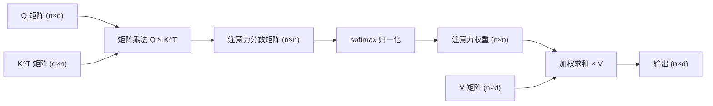
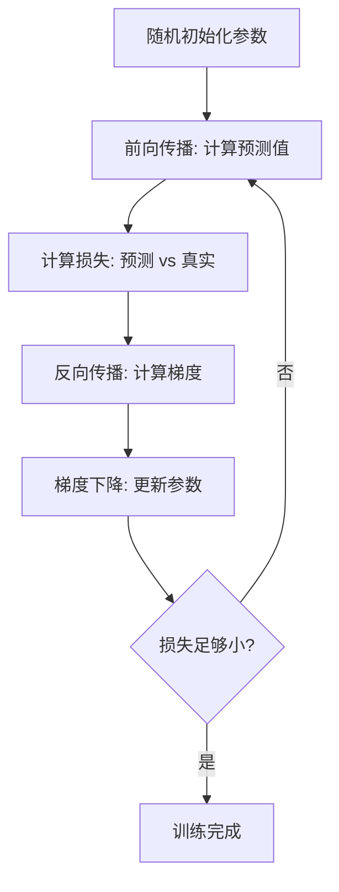
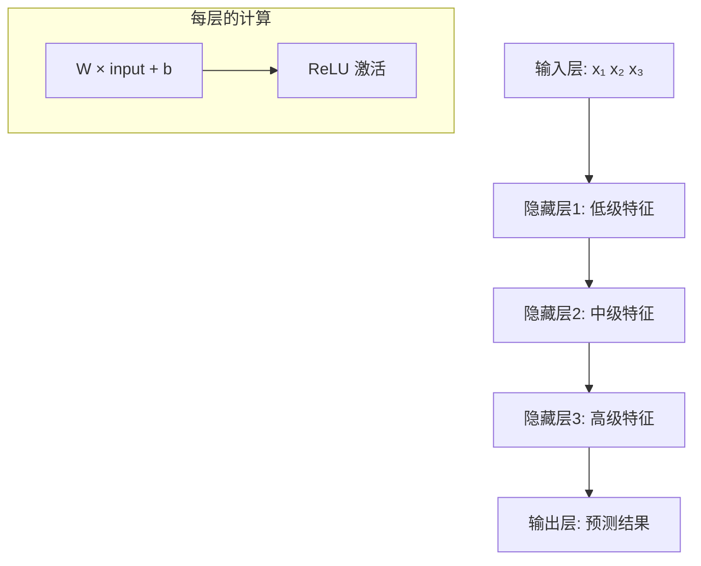
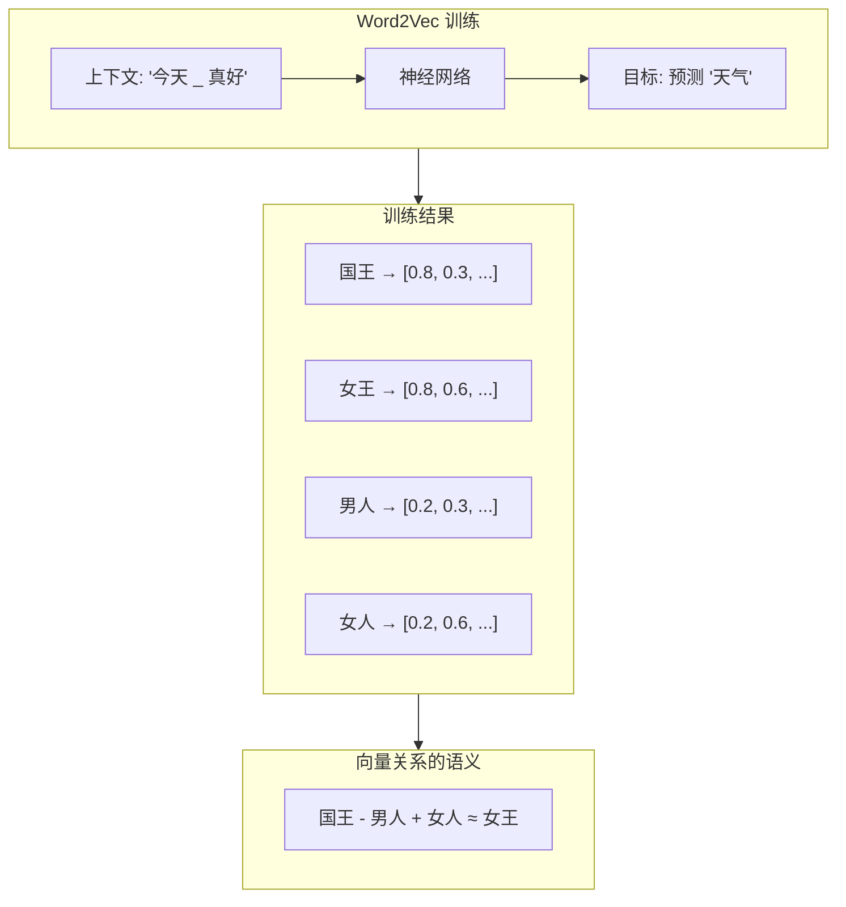
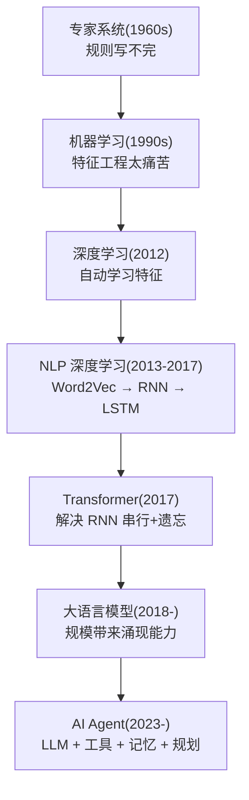

# 预备阶段：AI 基础素养与工具准备（第 1-3 周）

> 🎯 **学习思路**：你是一位有经验的 Java 后端开发者，编程能力不缺。但 AI 领域有三个"门槛知识"挡在你面前——**数学**（论文和文档的通用语言）、**Python**（AI 生态的第一语言）、**深度学习基础**（理解模型为什么能工作）。这个阶段的目标不是成为数学家或 Python 专家，而是建立"够用"的基础，让后续阶段的公式、代码、论文不再成为障碍。

---

## 第一章：数学基础 — 不是"重新学数学"，而是"看懂 AI 的数学语言"

### 1.1 为什么 AI 离不开数学？

你可能听过一种说法："做 AI 应用不需要数学"。这半对半错——

```
做 API 调用层（CRUD Agent）→ 确实不需要数学
做 RAG 优化、微调、模型评估 → 处处是数学

具体场景：
1. 不理解向量点积 → 无法理解 Embedding 相似度 → 无法调试 RAG 检索质量
2. 不理解 softmax → 无法理解 Temperature 参数 → 无法控制 Agent 的 Tool Call 输出
3. 不理解梯度下降 → 无法理解 LoRA 微调 → 无法优化专属领域模型
4. 看不懂论文中的公式 → 错过最新技术（Self-Attention、LoRA、PagedAttention...）
```

**好消息是**：AI 用到的数学其实不多，而且你已经有了基础。Java 开发者日常写的循环、条件判断、数据结构，在数学中都有对应物。

### 1.2 线性代数：向量、矩阵、点积

**向量 — 一组有序的数字**

```
向量就是一个数字列表：
  v = [0.12, 0.87, -0.33, 0.45]

在 AI 中，向量通常表示"一段文本的含义"：
  "猫"   → [0.12, 0.87, -0.33, ...]  (768 维)
  "小猫" → [0.11, 0.85, -0.31, ...]  (语义相近，向量也接近)
  "汽车" → [0.95, -0.12, 0.67, ...]  (语义不同，向量也远离)

Java 类比：
  向量 ≈ double[] 数组
  768 维 = 数组长度 768
```

**矩阵 — 二维数字表**

```
矩阵就是二维数组：
  M = [[1, 2, 3],
       [4, 5, 6]]

  2 行 3 列，记作 2×3 矩阵

在 Transformer 中：
  Q 矩阵 = 所有词的 Query 向量堆叠在一起
  K 矩阵 = 所有词的 Key 向量堆叠在一起
  
  Q 是 n×d 矩阵（n 个词，每个 d 维）
  K 是 n×d 矩阵
  
  Attention 的第一步就是计算 Q × K^T（矩阵乘法）
```

**点积（内积）— 两个向量有多"像"**

```
点积 = 对应位置相乘再相加：

  a = [1, 2, 3]
  b = [4, 5, 6]
  
  a · b = 1×4 + 2×5 + 3×6 = 4 + 10 + 18 = 32

几何含义：
  a · b = |a| × |b| × cos(θ)
  其中 θ 是两个向量的夹角

  cos(θ) = 1  → 方向完全一致（语义相同）
  cos(θ) = 0  → 正交/垂直（语义无关）
  cos(θ) = -1 → 方向完全相反（语义相反）
```

**用 Java 实现余弦相似度（RAG 检索的核心函数）**

```java
/**
 * 余弦相似度：衡量两个向量的"方向相似程度"
 * 
 * 在 RAG 系统中：
 *   - 用户提问 → 向量化为 queryVector
 *   - 知识库文档 → 向量化为 docVectors[]
 *   - 用余弦相似度找到最相似的文档
 * 
 * 这是 Embedding + 向量检索的底层数学原理
 */
public static double cosineSimilarity(double[] a, double[] b) {
    double dotProduct = 0.0;  // 点积：对应位置相乘再相加
    double normA = 0.0;       // a 的模长（向量长度）
    double normB = 0.0;       // b 的模长
    
    for (int i = 0; i < a.length; i++) {
        dotProduct += a[i] * b[i];
        normA += a[i] * a[i];
        normB += b[i] * b[i];
    }
    
    // 除以模长的乘积 = 归一化（消除长度影响，只看方向）
    return dotProduct / (Math.sqrt(normA) * Math.sqrt(normB));
}
```

**矩阵乘法 — 批量点积**

```
矩阵乘法 = 一行 × 一列 = 点积

  A = [[1, 2],    B = [[5, 6],
       [3, 4]]         [7, 8]]

  A × B = [[1×5+2×7, 1×6+2×8],   = [[19, 22],
           [3×5+4×7, 3×6+4×8]]      [43, 50]]

在 Transformer 中的意义：
  Attention(Q, K, V) = softmax(Q × K^T / √d) × V
  
  Q × K^T = 矩阵乘法 = 同时计算所有词之间的注意力分数
  这就是为什么 Transformer 能"并行"处理——矩阵乘法一次算完所有配对
```



### 1.3 概率论：softmax、交叉熵、Temperature

**概率分布 — LLM 输出的本质**

```
LLM 不是"确定性地输出一个答案"，而是：
  1. 对词汇表中每个 Token 计算一个"原始分数"（logit）
  2. 通过 softmax 把分数转成概率（所有概率之和 = 1）
  3. 按概率随机采样一个 Token

这意味着：
  同一个输入，每次运行可能得到不同的输出！
  Temperature 参数就是在控制这个随机性的大小
```

**softmax — 把"原始分数"变成"概率"**

```
公式：softmax(x_i) = exp(x_i) / Σ exp(x_j)

举例：3 个候选词的原始分数
  "好" = 5.2,  "热" = 4.1,  "棒" = 3.8

softmax 计算：
  exp(5.2) = 181.3
  exp(4.1) = 60.3
  exp(3.8) = 44.7
  总和 = 286.3

  P("好") = 181.3 / 286.3 = 0.633 (63.3%)
  P("热") = 60.3 / 286.3 = 0.211 (21.1%)
  P("棒") = 44.7 / 286.3 = 0.156 (15.6%)

直觉理解：softmax 把"绝对分数"变成"相对概率"
  → 分数最高的"好"获得最大概率
  → 但其他候选仍有被选中的可能
```

```java
/**
 * softmax 函数：把原始分数转成概率分布
 * 
 * 在 Transformer 中，softmax 出现在两个关键位置：
 * 1. Attention 计算中：把注意力分数转成权重
 * 2. 输出层：把 logit 转成 Token 概率
 */
public static double[] softmax(double[] logits) {
    double[] exps = new double[logits.length];
    double sum = 0.0;
    
    for (int i = 0; i < logits.length; i++) {
        exps[i] = Math.exp(logits[i]);
        sum += exps[i];
    }
    
    double[] probs = new double[logits.length];
    for (int i = 0; i < logits.length; i++) {
        probs[i] = exps[i] / sum;  // 归一化：每个概率 = exp(x) / 总exp
    }
    return probs;
}
```

**交叉熵 — 模型训练的"指南针"**

```
交叉熵 = 衡量"预测分布"和"真实分布"之间的差距

  H(p, q) = - Σ p(x) × log(q(x))
  
  p = 真实分布（正确答案是"好" → [1, 0, 0]）
  q = 模型预测（"好"=0.63, "热"=0.21, "棒"=0.16）

  H = -(1 × log(0.63) + 0 × log(0.21) + 0 × log(0.16))
    = -log(0.63) = 0.462

  如果模型预测完全正确（"好"=1.0）：
  H = -log(1.0) = 0（交叉熵为 0，完美！）

训练目标：最小化交叉熵
  → 让模型的预测概率分布尽可能接近真实分布
  → 梯度下降就是在调整权重来降低这个值
```

### 1.4 微积分：梯度、梯度下降

**梯度 — "哪个方向能最快降低错误"**

```
梯度 = 损失函数对每个参数的偏导数

  直觉理解：
  想象你在一座山上，目标是走到最低点（损失最小）
  
  梯度告诉你：
    "当前位置，往哪个方向走最陡（下降最快）"
  
  梯度下降的更新公式：
    新参数 = 旧参数 - 学习率 × 梯度
  
  学习率太大 → 跨过最低点，震荡
  学习率太小 → 下降太慢，训练时间过长
```



**为什么这对 Agent 开发者重要？**

```
当你用 LoRA 微调模型时：
  → 梯度下降在优化 LoRA 的 A 和 B 矩阵
  → 理解梯度才能诊断"为什么微调不收敛"

当你看到论文中的 "gradient checkpointing"：
  → 这是一种用时间换显存的技巧
  → 理解梯度才能理解它的原理
```

---

## 第二章：Python 快速入门 — Java 开发者的"翻译指南"

### 2.1 为什么 AI 领域必须用 Python？

```
现实：
  Hugging Face Transformers → Python
  PyTorch（训练/微调） → Python
  PEFT（LoRA 微调） → Python
  vLLM（推理引擎） → Python
  Jupyter Notebook（实验） → Python

Java 能做的是"上层服务"（Spring AI 调 API），
但"底层研究/实验/微调"必须 Python。
```

### 2.2 Java → Python 核心语法对照

```
Java                              Python
────────────────────────────────────────────────────────
int x = 10;                       x = 10           # 无需类型声明
String s = "hello";               s = "hello"      # 无需类型声明
final int MAX = 100;              MAX = 100        # 约定大写=常量
List<Integer> list = new ArrayList<>();  lst = []  # 列表
Map<String, Integer> map = new HashMap<>(); d = {} # 字典
for (int i = 0; i < 10; i++)      for i in range(10):  # 更简洁
if (x > 0) { ... } else { ... }   if x > 0: ... else: ...  # 缩进代替花括号
try { ... } catch (Exception e)   try: ... except Exception as e:
public class MyClass              class MyClass:
    private int x;                    def __init__(self):
                                          self.x = 0
```

### 2.3 NumPy — AI 的"数组操作标准库"

```python
import numpy as np

# 创建向量（一维数组）
v = np.array([0.12, 0.87, -0.33])

# 创建矩阵（二维数组）
M = np.array([[1, 2, 3],
              [4, 5, 6]])

# 矩阵乘法（对应 Java 的嵌套循环）
A = np.array([[1, 2], [3, 4]])
B = np.array([[5, 6], [7, 8]])
C = A @ B  # 矩阵乘法，等价于 np.dot(A, B)
# C = [[19, 22], [43, 50]]

# 余弦相似度（AI 中最常用的相似度度量）
def cosine_similarity(a, b):
    dot = np.dot(a, b)           # 点积
    norm_a = np.linalg.norm(a)   # 模长
    norm_b = np.linalg.norm(b)
    return dot / (norm_a * norm_b)

a = np.array([0.12, 0.87, -0.33])
b = np.array([0.11, 0.85, -0.31])
print(cosine_similarity(a, b))  # → 0.998 (非常相似)

# softmax 函数（AI 中最核心的概率函数）
def softmax(x):
    exps = np.exp(x)             # 对每个元素取 exp
    return exps / np.sum(exps)   # 归一化

scores = np.array([5.2, 4.1, 3.8])
probs = softmax(scores)
print(probs)  # → [0.633, 0.211, 0.156]
```

### 2.4 环境搭建

```bash
# 1. 安装 Anaconda（推荐，包含 Python + 常用科学库）
# 下载：https://www.anaconda.com/download

# 2. 创建虚拟环境（类似 Java 的 Maven 项目隔离）
conda create -n ai-learning python=3.11
conda activate ai-learning

# 3. 安装核心库
pip install numpy matplotlib jupyter
pip install torch torchvision  # PyTorch（深度学习框架）
pip install gensim             # Word2Vec
pip install transformers       # Hugging Face（模型库）

# 4. 启动 Jupyter Notebook（交互式实验环境）
jupyter notebook
```

---

## 第三章：深度学习基础 — 理解"模型为什么能学习"

### 3.1 神经网络：从感知机到多层网络

**感知机 — 最简单的神经网络**

```
感知机 = 一个神经元

  输入 x₁, x₂, x₃
  权重 w₁, w₂, w₃（可调参数）
  偏置 b（可调参数）
  
  输出 = f(w₁x₁ + w₂x₂ + w₃x₃ + b)
  其中 f 是激活函数（引入非线性）

  类比：
  你在决定"今天要不要出门"
  输入：天气好(0.8)、有空闲(0.6)、有目的(0.9)
  权重：天气对你有多重要、空闲有多重要...
  输出：出门的概率
```

**多层神经网络 — 层与层的组合**

```
输入层 → 隐藏层1 → 隐藏层2 → ... → 输出层

每层：output = activation(W × input + b)
  W = 权重矩阵（这层的"知识"）
  b = 偏置向量
  activation = 激活函数（ReLU、sigmoid 等）

层数越多 → 能表达的"特征层级"越丰富
  第1层：低级特征（边缘、纹理）
  第2层：中级特征（形状、部件）
  第N层：高级特征（整体对象、语义）
```



**激活函数 — 引入非线性**

```
为什么需要非线性？
  如果所有层都是线性的：
  output = W₃(W₂(W₁x + b₁) + b₂) + b₃
  = W₃W₂W₁x + ...（合并后还是一个线性变换！）
  → 无论多少层，效果等价于一层

ReLU（最常用）：f(x) = max(0, x)
  → 负数变 0，正数不变
  → 简单高效，梯度不会消失

sigmoid：f(x) = 1 / (1 + e⁻ˣ)
  → 输出在 0~1 之间
  → 常用于二分类的输出层
```

### 3.2 训练过程：前向传播 → 损失计算 → 反向传播 → 梯度下降

```
完整的训练循环：

Step 1: 前向传播（Forward Pass）
  输入数据通过每一层，计算出预测结果
  x → h₁ → h₂ → ... → ŷ（预测值）

Step 2: 计算损失（Loss）
  损失函数 L = 衡量预测 ŷ 和真实值 y 的差距
  交叉熵损失（分类）：L = -Σ yᵢ log(ŷᵢ)
  均方误差（回归）：L = Σ(ŷᵢ - yᵢ)²

Step 3: 反向传播（Backward Pass / Backpropagation）
  利用链式法则，从输出层往回逐层计算梯度
  ∂L/∂W = ∂L/∂ŷ × ∂ŷ/∂hₙ × ... × ∂h₁/∂W
  → 每个权重都知道"自己该往哪个方向调"

Step 4: 梯度下降（Gradient Descent）
  W_new = W_old - learning_rate × ∂L/∂W
  学习率控制每步走多远
```

```java
/**
 * 用 Java 模拟一个简单的神经网络训练过程
 * 帮助理解 PyTorch 中 .backward() 和 .step() 在做什么
 */
public class SimpleTraining {
    
    // 学习率：控制每步更新的幅度
    static final double LEARNING_RATE = 0.01;
    
    public static void main(String[] args) {
        // 初始化权重（随机值）
        double w = Math.random();  // 初始权重
        double target = 3.14;      // 我们想学习的真实值
        
        // 训练循环（类似 PyTorch 的 training loop）
        for (int epoch = 0; epoch < 100; epoch++) {
            // Step 1: 前向传播（计算预测值）
            double prediction = w;  // 简化：预测 = 权重本身
            
            // Step 2: 计算损失（预测 vs 真实）
            double loss = Math.pow(prediction - target, 2);  // MSE
            
            // Step 3: 反向传播（计算梯度）
            // dL/dW = 2 × (prediction - target) × d(prediction)/dW
            //       = 2 × (prediction - target) × 1
            double gradient = 2 * (prediction - target);
            
            // Step 4: 梯度下降（更新权重）
            w = w - LEARNING_RATE * gradient;
            
            if (epoch % 20 == 0) {
                System.out.printf("Epoch %d: w=%.4f, loss=%.4f%n", epoch, w, loss);
            }
        }
        System.out.printf("训练完成: w=%.4f (目标: %.4f)%n", w, target);
    }
}
```

### 3.3 Word2Vec — 从"词的编号"到"语义向量"

**Word2Vec 解决了什么问题？**

```
在 Word2Vec 之前，NLP 处理词的方式：
  "猫" → 编号 3741
  "狗" → 编号 5021
  
  3741 和 5021 没有任何数学关系！
  但在语义上，猫和狗都是宠物，应该"接近"

Word2Vec (2013) 的革命性想法：
  "一个词的含义由它周围的词决定"
  
  训练方式（CBOW - Continuous Bag of Words）：
    输入：上下文词 ["今天", "真好"]
    目标：预测中间的词 "天气"
    
  训练完成后，每个词对应一个向量：
    "国王" - "男人" + "女人" ≈ "女王"
    "巴黎" - "法国" + "意大利" ≈ "罗马"
    → 向量空间编码了语义关系！
```



**Word2Vec 的局限（催生 Transformer）**

```
局限1：每个词只有一个固定向量
  "bank"（银行）和 "bank"（河岸）是同一个向量
  → 无法处理多义词

局限2：没有上下文理解
  向量是"静态"的，不随句子变化
  "苹果"在"吃苹果"和"苹果公司"中是同一个向量

Transformer 的解决方案：
  → 动态 Embedding + Self-Attention
  → 同一个词在不同上下文中生成不同的向量表示
  → "苹果"在"吃苹果"上下文中与水果相关词接近
  → "苹果"在"苹果公司"上下文中与科技公司相关词接近
```

### 3.4 用 PyTorch 搭建你的第一个神经网络

```python
import torch
import torch.nn as nn
import torch.optim as optim

# 定义一个 2 层神经网络
class SimpleNet(nn.Module):
    def __init__(self):
        super().__init__()
        self.layer1 = nn.Linear(784, 128)  # 输入层: 784 → 隐藏层: 128
        self.layer2 = nn.Linear(128, 10)   # 隐藏层: 128 → 输出层: 10
        self.relu = nn.ReLU()               # 激活函数
    
    def forward(self, x):
        # 前向传播：数据从输入流向输出
        x = self.relu(self.layer1(x))  # 隐藏层 + 激活
        x = self.layer2(x)             # 输出层（不加激活）
        return x

# 创建模型、损失函数、优化器
model = SimpleNet()
criterion = nn.CrossEntropyLoss()  # 交叉熵损失
optimizer = optim.SGD(model.parameters(), lr=0.01)  # 梯度下降

# 训练循环（每个 batch 执行以下步骤）
# 1. 前向传播: predictions = model(input)
# 2. 计算损失: loss = criterion(predictions, labels)
# 3. 反向传播: loss.backward()  → 计算梯度
# 4. 更新参数: optimizer.step() → 梯度下降
# 5. 清零梯度: optimizer.zero_grad() → 为下一个 batch 准备

print(f"模型参数量: {sum(p.numel() for p in model.parameters()):,}")
# → 101,898 参数（约10万个可调数值）
```

---

## 第四章：AI 全景认知 — 从"教机器下棋"到"让机器写代码"

### 4.1 演进脉络：每个技术的诞生都有原因



### 4.2 关键里程碑

| 年份 | 事件 | 意义 |
|------|------|------|
| 1956 | 达特茅斯会议 | "人工智能"概念诞生 |
| 2012 | AlexNet 赢得 ImageNet | 深度学习时代开始 |
| 2013 | Word2Vec | 词向量编码语义 |
| 2017 | Transformer | 所有现代 LLM 的基础架构 |
| 2018 | GPT-1 / BERT | 预训练+微调范式 |
| 2020 | GPT-3 (175B) | 涌现能力：In-context Learning |
| 2022 | ChatGPT | LLM 从实验室走向大众 |
| 2023 | GPT-4 + AutoGPT | AI Agent 概念爆发 |
| 2024 | MCP/A2A 协议 | Agent 标准化互操作 |
| 2025 | 多模态 Agent | 图文音视频统一理解 |

### 4.3 AI → ML → DL → NLP → LLM → Agent 的关系

```
AI（人工智能）— 最广义：让机器表现出"智能"行为
  └── ML（机器学习）— 从数据中学习规则，不手写规则
      └── DL（深度学习）— 用多层神经网络自动学习特征
          └── NLP（自然语言处理）— DL 在语言领域的应用
              └── LLM（大语言模型）— 大规模 NLP，Transformer + 海量数据
                  └── Agent（智能体）— LLM + 工具 + 记忆 + 规划 = 能自主行动

你在这条路线上要学的：
  预备阶段：理解 AI → ML → DL 的基础原理
  第一阶段：深入 Transformer + LLM
  第二-六阶段：精通 Agent 开发的全链路
```

---

## 第五章：自检清单与下一步预告

### 你现在能回答这些问题吗？

```
数学基础：
□ 1. 向量点积的几何含义是什么？它和余弦相似度是什么关系？
□ 2. 矩阵乘法 Q × K^T 在 Attention 中代表什么？
□ 3. softmax 函数的作用是什么？它在 Transformer 中出现几次？
□ 4. 交叉熵损失衡量的是什么？训练的目标是什么？
□ 5. 梯度下降的更新公式是什么？学习率太大/太小会怎样？

Python：
□ 6. Python 的列表推导式和 Java 的 Stream 有什么异同？
□ 7. NumPy 的 @ 运算符做什么？和 Java 的嵌套循环有什么关系？
□ 8. 如何在 Python 中创建虚拟环境并安装依赖？

深度学习：
□ 9. 为什么神经网络需要激活函数？ReLU 是什么？
□ 10. 前向传播和反向传播分别做什么？
□ 11. Word2Vec 的核心思想是什么？它有什么局限？
□ 12. Transformer 解决了 Word2Vec 和 RNN 的什么问题？

AI 全景：
□ 13. AI → ML → DL → NLP → LLM → Agent 的包含关系是什么？
□ 14. 2017 年 Transformer 的出现解决了什么问题？
```

### 下一步预告

**第一阶段**你将深入 Transformer 的每一个组件：
- **Self-Attention 逐步计算**：Q、K、V 是什么？怎么用"猫追狗"的例子理解注意力权重？
- **BPE 分词算法**：为什么罕见词被拆成多个 Token？这对 Agent 开发者有什么影响？
- **Temperature/Top-P 深度解析**：T=0.1 vs T=2.0 的概率分布对比，Agent 的 Tool Call 该用哪个？
- **主流模型对比**：GPT-4o vs Claude vs Qwen vs DeepSeek，选型不是选"最强的"而是"最合适的"
- **API 协议实战**：用纯 Java HTTP 实现对话、流式、Embedding 三件套
