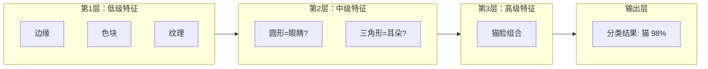
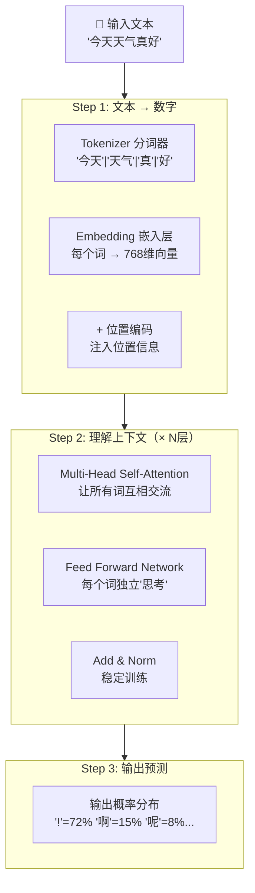
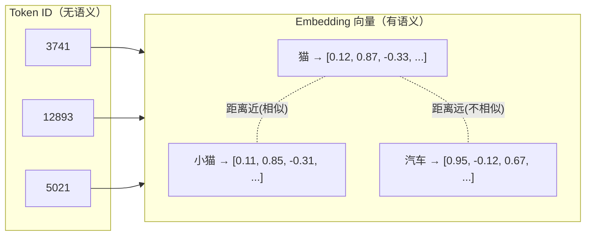
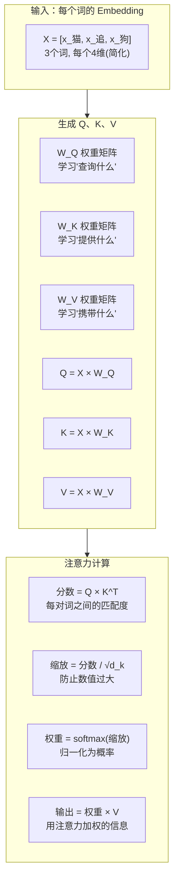
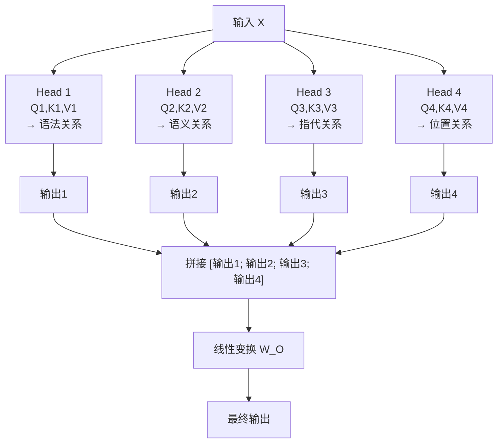
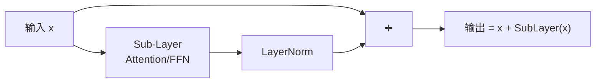
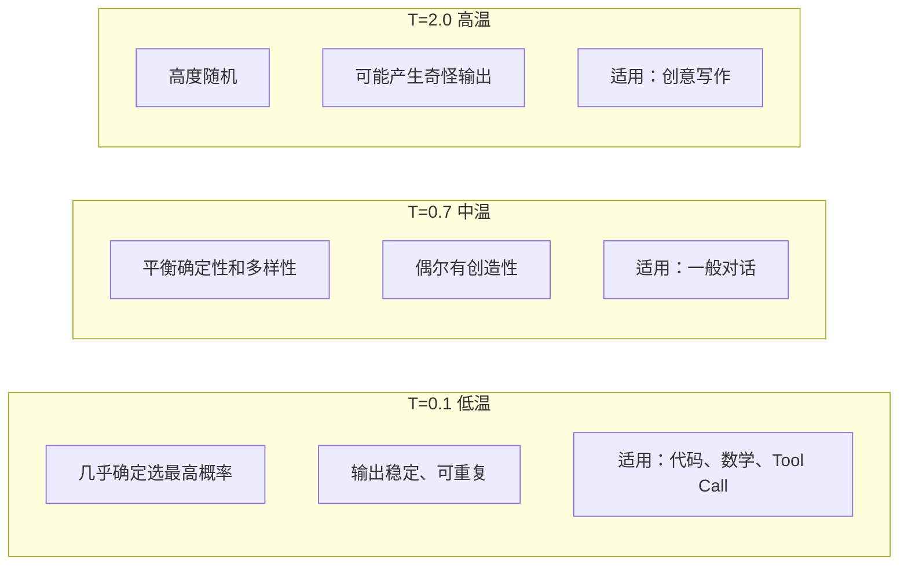
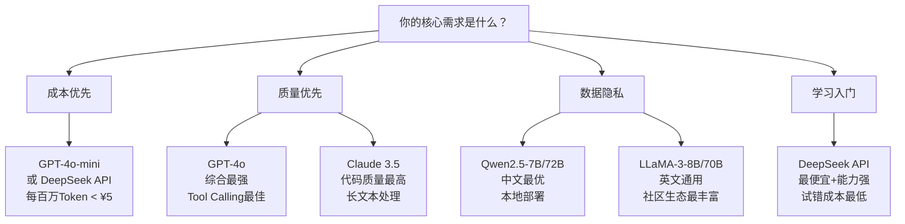
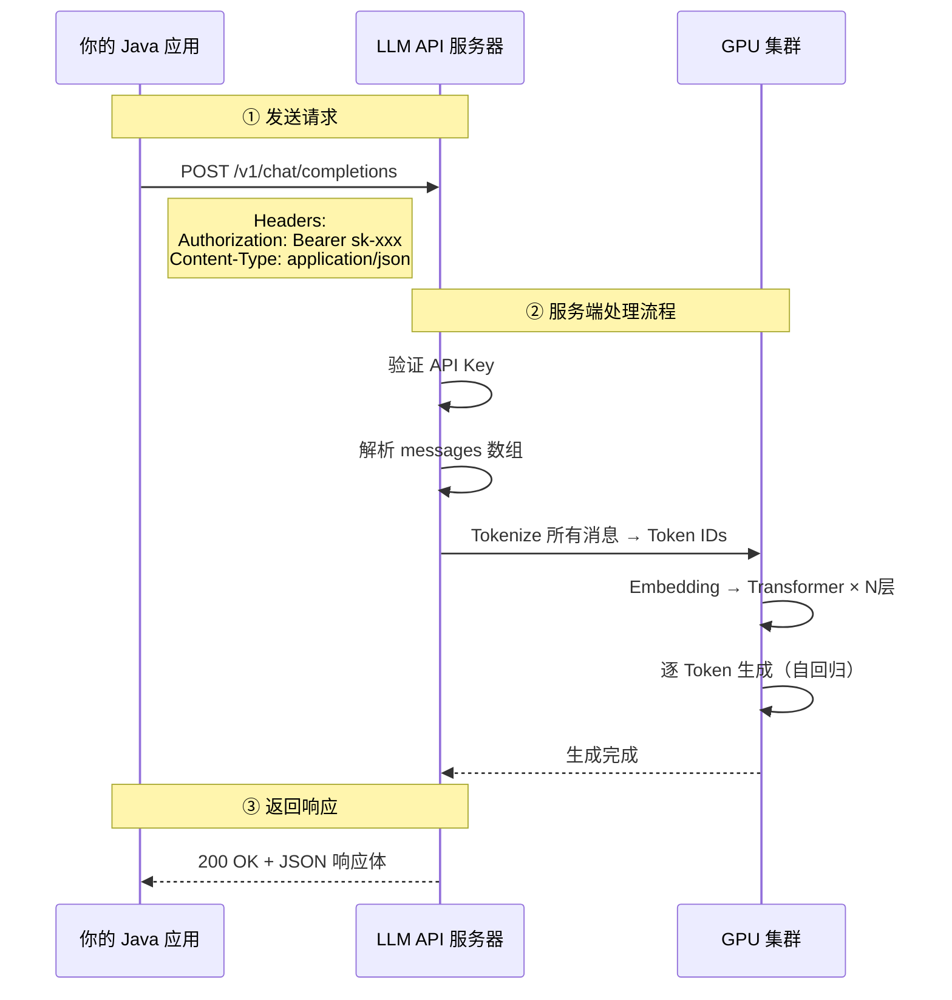
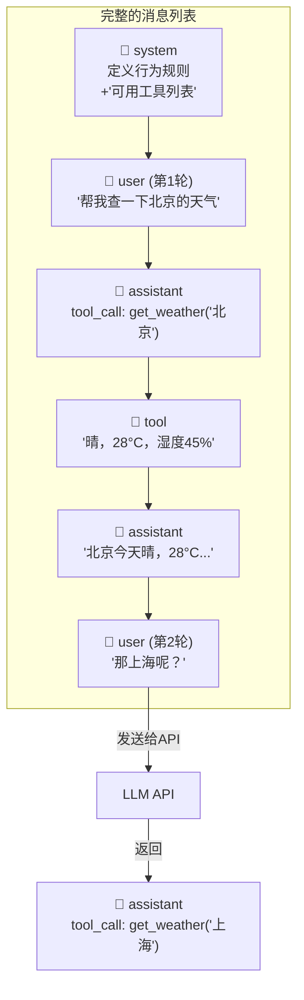

# 第一阶段：AI 与 LLM 基础认知（第1-3周）

> 🎯 **学习思路**：不讲定义、不背概念。我们沿着一条故事线走——**每一个技术的诞生，都是因为上一个技术遇到了无法解决的问题**。

---

## 第一章：从"教机器下棋"到"让机器读遍互联网"

### 1.1 故事的起点：人类想让机器"变聪明"

1956年，达特茅斯会议上，一群科学家提出了一个大胆的想法：**能不能让机器像人一样思考？** 这就是"人工智能"（AI）这个词的诞生。

最初的思路非常直觉——**人下棋靠规则，那就给机器写规则**。于是科学家手写了大量 if-else：

```java
// 1960年代的下棋程序思路
if (对方上一步走了马) {
    if (我的车能吃到它) {
        move(车, 吃马);
    } else {
        move(兵, 控制中心);
    }
}
```

这种方式叫**专家系统**——靠人类专家手写规则。它在简单问题上很有效（比如早期的国际象棋程序），但很快就撞上了一堵墙：

> **规则写不完。** 现实世界太复杂了，你不可能为每种情况都写一条规则。
> 识别一张照片里是猫还是狗？你怎么写规则？"有耳朵+有尾巴+四条腿=猫"？那狐狸呢？

### 1.2 转折：不要告诉机器规则，让机器自己从数据中学

这就是**机器学习（ML）** 的核心思想，也是一次根本性的范式转变：

```
旧思路（专家系统）：人写规则 → 机器按规则执行
新思路（机器学习）：人给数据 → 机器自己发现规则
```

**用垃圾邮件分类举例**：

```
专家系统做法：
  人写规则：包含"中奖"→垃圾邮件，包含"免费"→垃圾邮件...
  问题：骗子换个词"中奬"就绕过了

机器学习做法：
  给机器 10000 封邮件，标注好"垃圾"和"正常"
  机器自己发现：哦，"中奖"+"点击"+"链接"一起出现时 99% 是垃圾邮件
  它甚至能发现人类没想到的隐藏模式
```

机器学习的出现解决了一个大问题：**不再需要人类穷举所有规则**。但它立刻遇到了下一个瓶颈——

> **特征工程（Feature Engineering）太痛苦了。**

什么意思？传统 ML 不是直接吃原始数据，而是吃**人工设计好的特征**。比如做图片分类：

```
人要做的事：
  1. 手动设计特征提取器：边缘检测、颜色直方图、纹理分析...
  2. 把这些特征喂给 ML 模型：SVM、决策树、朴素贝叶斯...
  3. 模型只在"特征层面"做学习

问题：特征设计的好坏直接决定了模型效果，而设计好特征需要深厚的领域知识，
     而且人类能想到的特征维度是有限的。
```

### 1.3 突破：让神经网络自己提取特征

2012年，AlexNet 在 ImageNet 图像识别比赛上以碾压姿态获胜（错误率比第二名低 10%+），宣告了**深度学习（DL）** 时代的到来。

深度学习的核心武器是**多层神经网络**，它的革命性在于：

```
传统 ML：   原始数据 → [人工特征提取] → 特征 → ML模型 → 结果
深度学习：  原始数据 → [自动特征提取] → ML模型 → 结果
               ↑ 神经网络自己学会了什么是"好的特征"
```

**多层神经网络的直觉理解**：

想象你在辨认一张照片里的猫：
- **第1层**神经元看到的只是像素级的东西：这里有一条横线，那里有一个色块
- **第2层**开始组合：两条横线+弧线 = 一个圆形（可能是眼睛？）
- **第3层**更高级：两个圆+三角形+椭圆 = 一张猫脸
- **第N层**最高级：猫脸+猫耳+猫身体 = 这是一只猫



**为什么"深"很重要？** 层数越多，能表达的"特征层级"越丰富。浅层网络只能学到简单模式，深层网络可以学到**复杂的、抽象的、层级化的**特征表示。

深度学习在图像识别上取得了巨大成功。但人类最独特的能力不是看图，而是**语言**。

### 1.4 聚焦：让机器理解人类语言

**自然语言处理（NLP）** 是 AI 中专注于语言的分支。它面临一个图像识别没有的核心难题：

> **语言是离散的、模糊的、依赖上下文的。**

```
"苹果"是什么意思？
  - "我吃了一个苹果" → 水果
  - "苹果发布了新手机" → 公司
  - "苹果脸" → 形容词（红润）

同一个词，在不同语境下含义完全不同。
图片里的猫不管从哪个角度看都是猫，但语言不是。
```

**NLP 的早期尝试**：

```
第1代：基于规则（1950s-1990s）
  手写语法规则 → 覆盖太少，无法处理真实语言

第2代：统计方法（1990s-2010s）
  统计词频、n-gram → 能做简单任务，但不理解语义

第3代：词向量 Word2Vec（2013）
  把每个词变成一个向量，"国王-男人+女人=女王"
  突破！但一个问题：同一个词只有一个向量，无法处理多义词

第4代：RNN/LSTM（2014-2017）
  按顺序逐词处理，能捕捉上下文了
  但有个致命缺陷：长距离依赖遗忘（读了第100个词，忘了第1个词说的什么）
```

### 1.5 RNN 的致命缺陷与 Transformer 的诞生

**RNN（循环神经网络）** 的处理方式像我们读书——从左到右逐字读：

```
输入："今天天气真好我们去公园散步吧"

处理过程：
  t=1: 读"今天" → 生成隐藏状态 h1
  t=2: 读"天气" + h1 → 生成 h2
  t=3: 读"真好" + h2 → 生成 h3
  ...
  t=10: 读"吧" + h9 → 生成 h10
```

**这个"串行"的处理方式有两个致命问题**：

```
问题1：长距离依赖遗忘
  "小明昨天去了图书馆，在那里看了很多书，然后又去了咖啡厅，
   在那里点了一杯拿铁，最后在回家的路上遇到了他的老朋友...
   [中间省略200字]...请问'他'指的是谁？"
  
  RNN 到后面已经"忘了"最开始的"小明"，信息在传递过程中逐渐衰减。

问题2：无法并行计算（慢！）
  h2 依赖 h1，h3 依赖 h2，h4 依赖 h3...
  必须严格按顺序算，无法利用 GPU 的并行能力。
  这导致训练非常慢，限制了模型能做到的规模。
```

**2017年，Google 的8位研究员发表了改变一切的论文：《Attention Is All You Need》**

他们的核心洞察是：

> **我们不需要逐字阅读。人类理解一句话时，眼睛是来回跳动的——
> 看到"他"会回头看"小明"，看到"那里"会回头看"图书馆"。
> 让所有词同时互相"看"，比逐个处理更好。**

这就是 **Transformer** —— 抛弃了 RNN 的串行处理，用 **Self-Attention** 让所有词**同时**互相交互。

```
RNN 做法（串行）：今天 → 天气 → 真好 → ...（一个接一个）
Transformer 做法（并行）：今天、天气、真好...同时看到彼此（全部并行）
```

**这一改变带来的效果是爆炸性的**：

| 对比维度 | RNN/LSTM | Transformer |
|---------|----------|------------|
| 长距离依赖 | 距离越远信息衰减越严重 | 任意两个词直接交互，无衰减 |
| 并行计算 | 不能（必须串行） | 完全可以（GPU 友好） |
| 训练速度 | 几天到几周 | 几小时（同等数据量） |
| 可扩展性 | 难以做大 | 可以轻松堆到千亿参数 |

**正因为 Transformer 的这些优势，模型才能越做越大**——从 2017 年的 6500 万参数，到 2023 年的万亿参数。规模变大 + 数据变多 = 能力涌现，这就是 LLM 的故事。

### 1.6 大语言模型（LLM）：规模带来的"涌现能力"

当 Transformer 架构 + 海量互联网文本 + 大规模 GPU 算力三者结合，就产生了**大语言模型（LLM）**。

```
2018年  GPT-1      1.17亿参数    → 能做简单的文本分类
2019年  GPT-2      15亿参数      → 能写像样的文章（太像人话以至于不敢发布）
2020年  GPT-3      1750亿参数    → 出现"涌现能力"：few-shot learning！
2023年  GPT-4      未公开(估计万亿) → 能推理、写代码、分析图表...
```

**什么是"涌现能力"？**

这是 LLM 最令人震惊的特性——**某些能力不是刻意训练的，而是规模到了自动"冒出来"的**。

```
比如 In-context Learning（上下文学习）：

你给模型看3个例子（不需要训练！）：
  "北京" → "中国"
  "东京" → "日本"  
  "巴黎" → "法国"
  
然后问：
  "柏林" → ？

模型直接回答 "德国"。

它从未针对"首都→国家"这个任务做过训练，
但通过在海量文本中学到的"世界知识"，它自动理解了这个模式。
```

**为什么这很重要？** 这就是为什么一个 LLM 能做翻译、写代码、分析数据、当客服……而不需要为每个任务单独训练模型。**Prompt（提示词）就是任务切换器。**

---

## 第二章：深入 Transformer —— 每一个组件为什么存在

> 上一章我们知道了 Transformer 的诞生是为了解决 RNN 的串行和遗忘问题。
> 这一章我们深入其内部，看每个组件**为什么必须存在**。

### 2.1 整体架构：先鸟瞰，再深入



**三个步骤的核心问题**：
1. 计算机只认数字，怎么把文字变成数字？→ **Tokenizer + Embedding**
2. 怎么让数字"理解"上下文？→ **Self-Attention**
3. 怎么从理解变成预测？→ **输出层**

### 2.2 Tokenizer：文字变数字的第一步

**为什么不能直接把文字喂给神经网络？** 因为神经网络只做数学运算（矩阵乘法、加法），它不认识"猫"这个字。必须把文字变成数字。

**最简单的方案：字符级编码**
```
'你' → 1, '好' → 2, '世' → 3, '界' → 4 ...
问题：词汇量太大（中文几万字），稀疏且低效
```

**更好的方案：子词级编码（BPE - Byte Pair Encoding）**

BPE 的思想是：**常见的词组应该合并成一个 Token，罕见的拆成子词**。

```
BPE 训练过程（简化版）：

初始：每个字符是独立的 Token
  "playing" → [p, l, a, y, i, n, g]

第1轮：统计最高频相邻对 → "in" 出现最多 → 合并
  "playing" → [p, l, a, y, in, g]

第2轮："ing" 出现最多 → 合并  
  "playing" → [p, l, a, y, ing]

第3轮："play" 出现最多 → 合并
  "playing" → [play, ing]

最终效果：
  "playing" → [play, ing]  ← 2个Token（高效！）
  "played"  → [play, ed]   ← 2个Token（共享了"play"）
  "unplayable" → [un, play, able] ← 3个Token

关键洞察：
  - 常见词 = 1个Token（"the", "hello", "是"）
  - 罕见词 = 多个子词Token（"anthropomorphize" → ["anthro", "po", "morph", "ize"]）
  - 词缀共享（"playing"和"played"共享"play"）→ 模型能理解词根含义
```

**实际 Token 化的效果**：
```python
# 使用 tiktoken 库（OpenAI 官方 tokenizer）演示

import tiktoken
enc = tiktoken.encoding_for_model("gpt-4")

# 英文：高效
tokens = enc.encode("Hello, how are you today?")
# → [15496, 11, 1268, 527, 499, 3765, 30]  ← 7个Token

# 中文：每个字通常1-2个Token
tokens = enc.encode("今天天气真好")  
# → 大约 6-8 个Token（比英文多！）

# 代码：变量名会被拆分
tokens = enc.encode("userAuthenticationService")
# → ["user", "Auth", "entication", "Service"] ← 4个Token
```

**对 Agent 开发者的影响**：
```
场景：你的 Agent 有 20 个工具，每个工具的定义（名称+描述+参数Schema）约 200 Token
→ 光工具定义就占 4000 Token
→ 如果上下文窗口 128K，留给对话历史和 RAG 结果的空间就少了 4000
→ 这就是为什么需要"按需加载工具"而不是"全部塞进去"
```

### 2.3 Embedding：让数字携带"语义"

**Tokenizer 把文字变成了数字 ID，但有个问题**：

```
"猫" → Token ID: 3741
"小猫" → Token ID: 12893
"狗" → Token ID: 5021

3741 和 12893 在数学上毫无关系！
但在语义上，"猫"和"小猫"非常接近，"猫"和"狗"也有关系（都是宠物）。

单纯的 Token ID 不携带任何语义信息——它只是一个编号。
```

**Embedding 层的作用：把"编号"变成"语义向量"**



**Embedding 的本质是什么？**

Embedding 是一个**可训练的查找表（Lookup Table）**：

```
假设词汇表大小 = 50000，向量维度 = 768

Embedding 层就是一个 50000 × 768 的大矩阵：
  第 3741 行 = "猫" 的向量
  第 12893 行 = "小猫" 的向量
  ...

查找操作就是取矩阵的一行：
  embedding("猫") = matrix[3741] = [0.12, 0.87, -0.33, ...]

关键：这个矩阵不是随机的！它在训练过程中被不断调整，
使得语义相近的词在向量空间中距离更近。
```

**为什么 768 维？** 因为要编码足够多的语义维度：
- 维度1可能编码"生物 vs 非生物"
- 维度2可能编码"大 vs 小"
- 维度3可能编码"正面 vs 负面"
- ...768个维度 = 768个语义特征

但注意：**这些维度不是人类定义的，是模型自己学出来的！** 我们只是看到"猫"和"小猫"的向量很近，但无法确切知道每个维度代表什么。

**余弦相似度——衡量两个向量有多"像"**

```java
/**
 * 余弦相似度的直觉理解：
 * 
 * 想象两个向量是空间中的两条线（从原点出发）：
 * - 方向完全一致 → 相似度 = 1（语义相同）
 * - 方向垂直 → 相似度 = 0（语义无关）
 * - 方向完全相反 → 相似度 = -1（语义相反）
 * 
 * 公式：cos(θ) = (A·B) / (|A| × |B|)
 * 其中 A·B 是点积，|A| 是向量长度（模）
 */
public static double cosineSimilarity(double[] a, double[] b) {
    double dotProduct = 0.0;  // 点积：对应位置相乘再相加
    double normA = 0.0;       // A 的模长
    double normB = 0.0;       // B 的模长
    
    for (int i = 0; i < a.length; i++) {
        dotProduct += a[i] * b[i];
        normA += a[i] * a[i];
        normB += b[i] * b[i];
    }
    
    // 除以模长的乘积 = 归一化（消除向量长度影响，只看方向）
    return dotProduct / (Math.sqrt(normA) * Math.sqrt(normB));
}
```

### 2.4 位置编码：Attention 天生是"瞎"的

**Self-Attention 有一个隐藏的致命缺陷**：

```
对于 "猫追狗" 和 "狗追猫" 这两个句子，
纯 Self-Attention 的计算结果是完全一样的！

为什么？因为 Self-Attention 只计算"词与词之间的关系"，
不考虑词的顺序。它把输入当作一个"集合"而非"序列"。

但在语言中，顺序至关重要：
  "猫追狗" ≠ "狗追猫"
  "我借给他钱" ≠ "他借给我钱"
```

**解决方案：位置编码（Positional Encoding）**

给每个位置生成一个独特的向量，加到 Embedding 上：

```
"猫" 在第1个位置 → Embedding("猫") + PositionVector(1)
"追" 在第2个位置 → Embedding("追") + PositionVector(2)
"狗" 在第3个位置 → Embedding("狗") + PositionVector(3)

现在即使 Attention 是"无序"的，输入本身已经包含了位置信息。
```

**为什么用正弦/余弦函数？** 原始论文用的是 sin/cos 函数，因为：
- 每个位置的编码是唯一的（不同的频率组合）
- 相对位置可以被学到（sin(a+b) 可以用 sin(a)cos(b)+cos(a)sin(b) 表示）
- 可以外推到更长的序列（训练时没见过的长度）

### 2.5 Self-Attention 深度解剖

这是 Transformer 的**灵魂**，值得花最多时间理解。

**从一个问题出发**：对于句子 "小明把苹果给了小红，她很高兴"，当模型处理"她"时，怎么知道"她"指的是"小红"而不是"苹果"？

**Self-Attention 的解决方式：Q-K-V 机制**

```
对句子中的每个词，生成三个向量：

Q (Query)  — "我在找什么信息？"
K (Key)    — "我有什么信息可以给别人？"  
V (Value)  — "我实际携带的信息内容"

用现实类比：
  想象你在图书馆找书：
  - 你的 Q = "我想找关于AI的书"
  - 每本书的 K = 书封面上的标签（"AI"、"历史"、"小说"...）
  - 每本书的 V = 书的实际内容
  
  你用你的 Q 去匹配每本书的 K，匹配度高的书，你就多读一些它的 V。
```

**完整的计算过程**：



**逐步拆解计算**（以 "猫追狗" 为例，简化到 4 维向量）：

```
Step 1: 计算注意力分数矩阵（Q × K^T）

         猫     追     狗
猫    [ 1.2   0.3   0.1 ]   ← "猫"的Query与每个词的Key的匹配度
追    [ 0.8   0.5   0.9 ]   ← "追"关注"猫"（谁在追？）和"狗"（追谁？）
狗    [ 0.2   0.7   0.4 ]   ← "狗"关注"追"（被追的动作）

Step 2: 缩放（除以 √d_k = √4 = 2）
         猫     追     狗
猫    [ 0.60  0.15  0.05 ]
追    [ 0.40  0.25  0.45 ]
狗    [ 0.10  0.35  0.20 ]

Step 3: Softmax（每行归一化为概率）
         猫     追     狗
猫    [ 0.45  0.29  0.26 ]   ← 45%注意力在自己
追    [ 0.35  0.30  0.35 ]   ← 均匀关注"猫"和"狗"
狗    [ 0.28  0.36  0.36 ]   ← 更多关注"追"

Step 4: 加权求和 V
  "追"的新表示 = 0.35×V_猫 + 0.30×V_追 + 0.35×V_狗
  
  这意味着"追"这个词现在"融合"了：
  - 35%来自"猫"的信息（知道是猫在追）
  - 30%保留自己的信息（追这个动作本身）
  - 35%来自"狗"的信息（知道追的是狗）
```

**为什么叫"Self"-Attention？** 因为 Q、K、V 都来自**同一个序列**（自己和自己做 Attention）。这区别于后面会提到的 Cross-Attention（Q 来自一个序列，K/V 来自另一个）。

### 2.6 Multi-Head Attention：为什么要"多头"？

**一个问题**：单次 Attention 只能学到一种"关注模式"。但词与词之间的关系是多维度的：

```
"小明昨天在图书馆用笔记本电脑学习深度学习"

关系1（语法）：  "学习" → "小明"（主语是谁在学习？）
关系2（地点）：  "学习" → "图书馆"（在哪学的？）
关系3（工具）：  "学习" → "笔记本"（用什么学的？）
关系4（内容）：  "学习" → "深度学习"（学了什么？）
```

**Multi-Head 的解决方案**：并行运行多个 Attention，每个"头"学到不同的关注模式。

```
Head 1: 关注语法关系（主语-谓语-宾语）
Head 2: 关注语义关系（同义词、反义词）
Head 3: 关注位置关系（相邻词、远距离词）
Head 4: 关注指代关系（"他"→"小明"、"那里"→"图书馆"）
...

最后把所有头的输出拼接，再做一次线性变换：
  output = Linear([Head1; Head2; Head3; Head4])
```



### 2.7 Feed Forward Network：Attention 之后还需要什么？

**Self-Attention 做了什么？** 让词与词之间交换信息——"猫"知道了"追"的存在，"追"知道了"狗"的存在。

**Self-Attention 没做什么？** 每个词没有在**自己的特征层面**做深层处理。

这就是 FFN 的作用——**对每个词独立做"深度思考"**：

```
Self-Attention = "社交"（和其他词交流）
FFN = "独处"（消化获得的信息，深层处理）

FFN 的结构很简单：
  output = W₂ × ReLU(W₁ × x + b₁) + b₂
  
  其中 W₁ 把维度扩大 4 倍（如 768 → 3072）
  ReLU 引入非线性
  W₂ 把维度缩回原样（3072 → 768）
  
  为什么先扩大再缩小？
  → 扩大维度 = 在高维空间中展开信息，更容易分离不同的特征
  → 类比：把揉成一团的纸展开，更容易看清上面写了什么
```

### 2.8 残差连接与层归一化：训练深网络的"秘密武器"



**为什么需要残差连接（Add）？**

```
问题：网络有 96 层（GPT-3），梯度在反向传播时会"消失"
     → 底层的权重几乎不更新 → 学不到东西

解决：加一条"捷径"，让输入直接跳到输出
     output = x + F(x)
     
     即使 F(x) 学得很差（接近0），至少 output ≈ x（信息不丢）
     梯度可以直接通过捷径传回底层，不衰减
```

**为什么需要层归一化（LayerNorm）？**

```
问题：每一层的输出数值范围可能越来越大
     第1层输出范围 [-1, 1]
     第2层输出范围 [-5, 5]
     第10层输出范围 [-1000, 1000]
     → 数值爆炸，训练不稳定

解决：每层输出后做归一化
     把均值拉回0，方差拉回1
     → 数值始终在合理范围内
```

---

## 第三章：LLM 如何"控制"输出

> 前两章讲了 Transformer 的结构。现在要回答一个关键问题：
> **模型怎么知道该输出什么？** Temperature、Top-P 这些参数到底在干什么？

### 3.1 从概率分布到采样：模型输出的真相

很多人以为 LLM 每次都会输出"最好的"回答。**这是错的。**

```
模型实际做的事：
  1. 对词汇表中的每个 Token 计算一个"原始分数"（logit）
  2. 把 logit 通过 softmax 转成概率
  3. 根据概率随机采样一个 Token

举例：预测 "今天天气真___" 的下一个词：
  "好"  → logit: 5.2  → softmax概率: 0.55  (55%可能被选中)
  "热"  → logit: 4.1  → softmax概率: 0.18  (18%)
  "棒"  → logit: 3.8  → softmax概率: 0.14  (14%)
  "冷"  → logit: 2.5  → softmax概率: 0.04  (4%)
  ... 其他几千个词总共 9%
```

**关键洞察**：即使"好"的概率最高，也不一定会被选中——这是一个**随机采样**过程！这就解释了为什么同样的输入，模型可能给出不同的回答。

### 3.2 Temperature：控制"保守 vs 冒险"

**Temperature 修改的是 softmax 计算中的"锐度"**：

```
标准 softmax：P(i) = exp(logit_i) / Σ exp(logit_j)

带 Temperature 的 softmax：P(i) = exp(logit_i / T) / Σ exp(logit_j / T)
```

**用具体数字看效果**：

```
原始 logits：  "好"=5.2, "热"=4.1, "棒"=3.8, "冷"=2.5

T=0.1（极低温，极度保守）：
  "好"=99.9%  "热"=0.05%  "棒"=0.03%  "冷"=0.001%
  → 几乎100%选"好"，输出完全确定，可重复

T=0.7（中低温，较保守）：
  "好"=68%  "热"=15%  "棒"=11%  "冷"=2%
  → 大概率选"好"，偶尔选其他

T=1.0（标准温度）：
  "好"=55%  "热"=18%  "棒"=14%  "冷"=4%
  → 原始概率分布

T=2.0（高温，很随机）：
  "好"=35%  "热"=25%  "棒"=23%  "冷"=12%
  → 接近均匀，可能选出很意外的词

T→∞（极限）：
  所有词概率趋近相等 → 完全随机
```



**Agent 开发中的经验值**：
- **Tool Calling（函数调用）→ T=0**：需要精确输出 JSON，不允许"创意"
- **代码生成 → T=0~0.3**：代码要么对要么错，不需要创造性
- **对话 → T=0.7**：自然、有一定变化
- **创意 → T=1.0~1.5**：鼓励意外和多样性

### 3.3 Top-P（核采样）：另一种控制随机性的方式

**Temperature 的问题**：它改变的是**所有**词的概率分布。但有时候你只想排除"最不可能"的那几个词，其他保持不变。

**Top-P 的做法**：按概率降序排列所有候选词，只保留累计概率达到 P 的前几个词。

```
候选词（按概率降序）：
  "好"  55%  ← 累计: 55%
  "热"  18%  ← 累计: 73%
  "棒"  14%  ← 累计: 87%
  "冷"  4%   ← 累计: 91%
  "差"  3%   ← 累计: 94%
  ... 其他词总共 6%

Top-P = 0.9 → 保留累计到90%的词：好、热、棒、冷（排除"差"和更小的）
Top-P = 0.5 → 只保留"好"（因为55%已经超过50%了）

然后在保留的词中重新计算概率并采样。
```

**Temperature 和 Top-P 的区别与配合**：

| 参数 | 影响范围 | 适合场景 |
|------|---------|---------|
| Temperature | 改变所有词的概率分布形状 | 全局调节创造性和确定性 |
| Top-P | 截断概率分布的"尾巴" | 排除完全离谱的词 |

**实践建议**：通常只调一个，不要同时调两个（效果会叠加且难以预测）。

### 3.4 上下文窗口：LLM 的"工作记忆"

```
人类的工作记忆：
  你在读一本书的第200页时，不可能同时记得第1页的每个字。
  你的大脑会自动"摘要"之前的内容，只保留关键信息。

LLM 的上下文窗口也是类似的概念：
  它有一个固定大小的"窗口"，所有信息必须塞进这个窗口。
  包括：系统提示词 + 工具定义 + 对话历史 + RAG结果 + 用户输入 + 模型输出
```

**上下文窗口的硬限制**：

| 模型 | 窗口大小 | 约等于 | 填满的成本(GPT-4o) |
|------|---------|--------|-------------------|
| GPT-4o-mini | 128K | ~10万字 | ~$0.02 |
| GPT-4o | 128K | ~10万字 | ~$0.25 |
| Claude 3.5 | 200K | ~15万字 | ~$0.60 |
| Gemini 1.5 Pro | 1M | ~75万字 | ~$1.25 |

**为什么这是 Agent 开发的核心挑战？**

```
一个典型的 Agent 请求，上下文构成：
  系统提示词:          ~1000 Token
  20个工具定义:         ~4000 Token
  对话历史(20轮):       ~8000 Token
  RAG检索结果(5个文档块): ~3000 Token
  用户当前问题:         ~200 Token
  ─────────────────────────
  输入总计:            ~16200 Token
  
  模型回复:            ~2000 Token
  工具调用+结果(3轮):   ~3000 Token
  ─────────────────────────
  输出总计:            ~5000 Token
  
  一次请求总计: ~21200 Token → 128K 窗口的 16.5%
  
看起来空间很大？但如果对话进行 100 轮，历史就爆了。
所以需要：消息裁剪、历史摘要、选择性加载。
```

---

## 第四章：主流模型——为什么有这么多模型？它们有什么不同？

> 前三章你理解了 Transformer 的原理和 LLM 的输出控制。
> 但打开任何一个模型提供商的网站，你会看到几十个模型名字和价格。
> 它们到底有什么区别？为什么不能只用一个？

### 4.1 从一个问题出发：为什么不只有一个"最强模型"？

你可能会想：**既然 GPT-4 最强，那大家都用 GPT-4 不就行了？为什么还需要其他模型？**

这就好比问"为什么不是所有人都开法拉利？"——因为不同场景需要不同的权衡：

```
矛盾1：能力 vs 成本
  GPT-4o 能力强，但每百万 Token 输入 $2.5、输出 $10
  GPT-4o-mini 能力稍弱，但输入 $0.15、输出 $0.60（便宜 16 倍！）
  日常对话真的需要最强模型吗？90%的场景用 mini 就够了

矛盾2：能力 vs 速度
  模型越大（参数越多），每次推理越慢
  GPT-4o 首 Token 延迟约 0.8s，GPT-4o-mini 约 0.3s
  对于 Agent 的多轮工具调用，延迟会累积放大

矛盾3：能力 vs 隐私
  闭源 API 意味着你的数据（代码、文档、对话）全部发给第三方
  金融机构、医疗行业、政府部门通常不允许这样做
  这就需要开源模型 + 本地部署

矛盾4：通用 vs 专精
  通用模型什么都行但什么都不拔尖
  代码场景需要更强的代码理解能力
  中文场景需要更好的中文训练数据
  推理场景需要 Chain-of-Thought 能力
```

**这就是为什么存在这么多模型**——每个模型在不同的权衡维度上做出了不同的选择。

### 4.2 模型大小的含义：7B、70B、万亿参数到底意味着什么？

在了解具体模型之前，你需要理解**模型大小**这个核心维度：

```
"7B" = 70亿参数 = 7 Billion Parameters
"70B" = 700亿参数
"万亿" = 1 Trillion Parameters

参数是什么？就是 Transformer 中所有的权重矩阵的数值。
  Embedding 层：词汇表大小 × 向量维度 = 50000 × 768 = 3840万参数
  每个 Attention 层：4个权重矩阵 × 768 × 768 = 236万参数
  每个 FFN 层：2个权重矩阵 × 768 × 3072 = 472万参数
  96层堆叠 × (236万 + 472万) ≈ 6.8亿参数
  加上 Embedding、输出层等 → 总共约 7B

参数越多 → 模型"记住"和"理解"的东西越多 → 能力越强
但也意味着：
  · 需要更多显存（7B ≈ 14GB FP16，70B ≈ 140GB）
  · 推理更慢
  · 训练成本更高（7B训练成本约$50万，70B约$500万）
```

**不同大小的模型适用场景**：

| 模型大小 | 显存需求(FP16) | 典型代表 | 适用场景 |
|---------|---------------|---------|----------|
| 1B-3B | 2-6 GB | Qwen2.5-1.5B | 手机/嵌入式、快速实验 |
| 7B-8B | 14-16 GB | LLaMA-3-8B, Qwen2.5-7B | 单卡部署、中小规模应用 |
| 14B-32B | 28-64 GB | Qwen2.5-32B | 需要更强能力、多卡部署 |
| 70B | ~140 GB | LLaMA-3-70B | 接近闭源水平、企业级 |
| 405B+ | ~800 GB | LLaMA-3-405B | 对标 GPT-4、顶级能力 |

### 4.3 闭源阵营深度解析

#### GPT 系列（OpenAI）—— 行业的开创者和标杆

```
发展脉络（每个版本解决了什么问题）：

GPT-1 (2018) → 证明了"预训练+微调"范式可行
  问题：每个NLP任务都需要从头训练模型
  解决：先在海量文本上预训练通用语言能力，再微调到具体任务

GPT-2 (2019) → 证明了规模带来质量飞跃
  突破：15亿参数，生成的文本好到 OpenAI 不敢立即公开
  启示：模型越大 → 能力越强（Scaling Law）

GPT-3 (2020) → 发现了"涌现能力"
  突破：1750亿参数，不需要微调就能做各种任务（In-context Learning）
  意义：从"一个任务一个模型"变成"一个模型做所有任务"

GPT-4 (2023) → 多模态 + 更强推理
  突破：能看图、能推理、能写复杂代码
  意义：LLM 从"玩具"变成"工具"

GPT-4o (2024) → 速度与能力的平衡
  "o" = omni（全能）
  突破：统一文本/图像/音频处理，速度比 GPT-4 快 2 倍

GPT-4o-mini → 极致性价比
  定位：用 GPT-3.5 的价格获得接近 GPT-4o 的能力
  适用：学习、实验、大规模低价值对话

o1 / o1-mini (2024) → 推理专精
  突破：内置 Chain-of-Thought，"思考"后再回答
  解决：GPT-4o 在复杂数学/逻辑推理上仍然会犯错
  原理：生成隐藏的推理链（用户看不到），增加推理时间换准确率
```

**GPT 系列对 Agent 开发者的意义**：
- **Tool Calling 能力最强**：GPT-4o 对 Function Calling 的支持最成熟，JSON Schema 遵循度最高
- **Structured Output**：可以强制模型输出严格符合 JSON Schema 的格式，Agent 解析不会出错
- **生态最完善**：几乎所有框架都优先支持 OpenAI API

#### Claude 系列（Anthropic）—— 安全与长文本的专家

```
Anthropic 的独特之处：
  创始团队来自 OpenAI，核心理念是"AI 安全"
  独创 RLHF 变体：Constitutional AI（宪法AI）
  → 模型不仅"有用"，还"无害"（拒绝生成有害内容的能力更强）

Claude 3.5 Sonnet 的特点：
  · 200K 上下文窗口（约15万字）→ 适合处理长文档
  · 代码生成质量极高 → 在 SWE-bench 测试中超过 GPT-4o
  · "Artifacts" 功能 → 可以生成交互式代码预览
  · Computer Use → 可以操控桌面（截图、点击、输入）

对 Agent 开发者的意义：
  · 写代码首选 → 如果你的 Agent 主要做编码任务
  · 长文档分析 → 如果你的 RAG 需要注入大量上下文
```

#### Gemini 系列（Google）—— 百万上下文的极限

```
Gemini 1.5 Pro 的核心突破：
  100万 Token 上下文窗口（约75万字！）
  → 可以一次性塞进一本完整的书
  → 可以塞进整个代码仓库

  技术实现：MoE（Mixture of Experts）架构
  → 不是所有参数都参与每次计算
  → 总参数多但激活参数少 → 能处理更长上下文

对 Agent 开发者的意义：
  · 适合需要极大上下文的场景（如整个代码库分析）
  · 但 Tool Calling 能力略弱于 GPT-4o
```

### 4.4 开源阵营深度解析

#### LLaMA 系列（Meta）—— 开源运动的引爆者

```
为什么 LLaMA 如此重要？

2023年之前，开源LLM几乎不存在（或质量很差）。
Meta 开放 LLaMA 权重后，社区在其基础上：
  · 做了大量微调版本（Vicuna、Alpaca等）
  · 开发了高效推理引擎（llama.cpp、vLLM等）
  · 推动了量化技术（GPTQ、AWQ等）

LLaMA 3 的特点：
  · 8B / 70B / 405B 三个尺寸
  · 训练数据量 15T Token（是 LLaMA 2 的 7 倍）
  · 英文能力极强，但中文训练数据相对较少

对 Agent 开发者的意义：
  · 通用场景的开源基座模型
  · 英文 Agent 的好选择
  · 中文场景建议用 Qwen（中文训练数据更多）
```

#### Qwen 系列（阿里）—— 中文场景的最强开源

```
Qwen 2.5 的特点：
  · 0.5B / 1.5B / 7B / 14B / 32B / 72B 全尺寸覆盖
  · 中文训练数据极为丰富 → 中文理解和生成质量最高
  · 原生支持 Tool Calling → 开源模型中 Agent 能力最强
  · 支持 128K 上下文 → 长文本处理

为什么中文场景选 Qwen 而不是 LLaMA？
  · LLaMA 主要用英文数据训练，中文Tokenizer效率低
  · Qwen 针对中文优化了 Tokenizer（中文Token更少=更便宜=更快）
  · Qwen 在中文指令遵循、代码生成、数学推理上全面领先

对 Agent 开发者的意义：
  · 中文 Agent 的开源首选
  · 7B 版本适合单机部署实验
  · 72B 版本可对标闭源模型做生产
```

#### DeepSeek 系列（深度求索）—— 性价比与推理之王

```
DeepSeek 的独特之处：
  国内量化私募"深度求索"开发
  核心理念：用更少的钱训练出更强的模型

DeepSeek-V3 的技术创新：
  · MoE（混合专家）架构：总参数 671B，但每次只激活 37B
  → 计算量接近 37B 模型，能力接近 671B 模型
  · MLA（Multi-head Latent Attention）：减少 KV Cache 显存占用
  → 同等显存可以处理更长的上下文

DeepSeek-R1（推理模型）：
  · 类似 o1 的"思考型"模型
  · 开源了完整权重 → 可以本地部署推理模型！
  · 在数学/代码推理上接近 o1，但成本低得多

对 Agent 开发者的意义：
  · API 价格极低（每百万Token输入¥1，输出¥2）
  · 学习入门的最佳选择（便宜+强）
  · R1 可用于需要复杂推理的 Agent 任务
```

### 4.5 模型对比：同一问题，不同模型怎么回答？

理论说再多不如看实际效果。以下是同一个问题在不同模型上的表现差异：

**测试问题**："用 Java 实现一个线程安全的 LRU Cache，要求支持过期时间"

```
GPT-4o 的特点：
  → 生成完整、可运行的代码
  → 主动解释线程安全策略（ConcurrentHashMap + synchronized）
  → 给出时间复杂度分析
  → Tool Calling 格式严格正确

Claude 3.5 Sonnet 的特点：
  → 代码质量更高（边界情况考虑更周全）
  → 会主动指出常见陷阱（如"不要在遍历时删除"）
  → 代码风格更"资深工程师"

GPT-4o-mini 的特点：
  → 代码基本正确但可能遗漏边界情况
  → 解释较简短
  → 价格便宜 16 倍，对于简单任务足够

Qwen2.5-72B 的特点：
  → 中文解释更自然流畅
  → 代码质量接近 GPT-4o
  → 可本地部署，数据不出公司
```

### 4.6 选型决策：不是选"最强的"，而是选"最合适的"



**给 Java 开发者的具体建议**：

| 阶段 | 推荐模型 | 原因 |
|------|---------|------|
| 第一阶段（学习） | DeepSeek API | 最便宜，能力强，支持 OpenAI 协议 |
| 第二阶段（Agent开发） | GPT-4o | Tool Calling 最稳定，Structured Output |
| 第三阶段（本地部署） | Qwen2.5-7B | 中文好，原生支持 Tool Call，7B 单卡能跑 |
| 第四阶段（微调） | Qwen2.5-7B 或 LLaMA-3-8B | 社区支持好，微调工具链成熟 |

---

## 第五章：API 协议深度解析——不只是"发个 HTTP 请求"

> 第四章你知道了有哪些模型可以用。现在要回答一个关键问题：
> **所有模型都在说"兼容 OpenAI API"，这个协议到底是什么？为什么它成了事实标准？**

### 5.1 从"各自为战"到"OpenAI 兼容"：API 标准化的故事

```
2020-2022年：混乱时代
  OpenAI 用自己的 API 格式
  Anthropic 用另一套格式
  Google 又是一套
  每接入一个新模型，都要重写一遍调用代码
  
  开发者痛点：
    · 代码写死 OpenAI → 切换模型要大改
    · 每个模型的参数命名不一样（temperature vs temp vs sampling_temperature）
    · 流式响应的格式也不一样

2023年：OpenAI 格式成为事实标准
  原因：OpenAI 是最早的、用得最多的，所有框架都先支持它
  → 其他模型厂商发现：与其让开发者适配自己，不如主动兼容 OpenAI
  → DeepSeek、Qwen、Moonshot、零一万物...全部支持 OpenAI 格式
  
  结果：你现在只需要写一套代码，改个 base_url 就能切换模型！
```

**这就是为什么所有示例代码只需要改一个 URL 就能切换模型**：

```java
// 同一套代码，切换模型只需改 base_url
String BASE_URL = "https://api.openai.com/v1";        // OpenAI
// String BASE_URL = "https://api.deepseek.com/v1";   // DeepSeek
// String BASE_URL = "https://dashscope.aliyuncs.com/compatible-mode/v1"; // Qwen
// String BASE_URL = "http://localhost:11434/v1";      // Ollama 本地
```

### 5.2 Chat Completions API：一次请求的完整生命周期



**请求体的每个字段意味着什么？**

```json
{
  "model": "gpt-4o-mini",
  "messages": [...],
  "temperature": 0.7,
  "top_p": 1.0,
  "max_tokens": 1000,
  "stream": false,
  "tools": [...],
  "response_format": { "type": "json_object" }
}
```

| 字段 | 含义 | 底层影响 |
|------|------|----------|
| `model` | 选择哪个模型 | 决定参数规模和能力上限 |
| `messages` | 对话历史 | 拼成完整输入序列，占用上下文窗口 |
| `temperature` | 控制随机性（第三章讲过） | 影响 softmax 分布的锐度 |
| `top_p` | 核采样（第三章讲过） | 截断概率分布的尾巴 |
| `max_tokens` | 最多生成多少 Token | 控制输出长度和成本 |
| `stream` | 是否流式返回 | 决定是一次性返回还是持续推送 |
| `tools` | 工具定义列表 | **Agent 的核心**——让模型能调用外部函数 |
| `response_format` | 输出格式约束 | 强制 JSON 输出，Agent 解析不会出错 |

### 5.3 Message 角色体系：LLM 的"对话协议"

**为什么需要角色区分？** 这要从 LLM 的训练方式说起：

```
LLM 在训练时就被教会了区分不同角色的消息：
  · 训练数据中包含了大量 (system, user, assistant) 的对话样本
  · 模型学会了：
    - system 消息 = 我要遵循的指令（影响行为但不直接回复）
    - user 消息 = 我要回答的问题
    - assistant 消息 = 我之前说过的话（保持一致性）
    - tool 消息 = 外部工具的执行结果（我要基于它生成回复）

如果你不区分角色会怎样？
  把所有内容都塞进一个 user 消息：
  → 模型无法区分"指令"和"问题"
  → 容易混淆上下文
  → Agent 的 Tool Calling 几乎无法工作
```



**四条消息组成的 Agent 对话示例**：

```
注意这个流程中的关键点：

1. assistant 消息中的 tool_call 不是文本内容！
   它是特殊的结构化字段：
   {
     "role": "assistant",
     "content": null,
     "tool_calls": [{
       "id": "call_123",
       "type": "function",
       "function": {
         "name": "get_weather",
         "arguments": "{\"city\": \"北京\"}"
       }
     }]
   }

2. tool 消息必须包含 tool_call_id
   告诉模型这个结果是哪个工具调用返回的：
   {
     "role": "tool",
     "tool_call_id": "call_123",
     "content": "晴，28°C，湿度45%"
   }

3. 模型看到 tool 消息后，会基于结果生成最终回复
   这就是 Agent Loop 的一次完整循环
```

### 5.4 SSE 流式传输深入理解

**SSE vs WebSocket：为什么 LLM 用 SSE？**

```
WebSocket：双向通信（客户端↔服务器互相推送）
  优点：实时双向
  缺点：需要升级协议、维护长连接、实现复杂
  
SSE：单向通信（服务器→客户端持续推送）
  优点：基于普通 HTTP、自动重连、实现简单
  缺点：只能服务器向客户端推

为什么 LLM 选 SSE？
  → LLM 生成是单向的：模型生成 → 推给客户端
  → 不需要客户端向服务器推数据
  → SSE 完全够用且更简单
  → 浏览器原生支持（EventSource API）
```

**SSE 数据流详细解析**：

```
一个完整的 SSE 流式响应：

HTTP/1.1 200 OK
Content-Type: text/event-stream     ← 关键：告诉客户端这是SSE
Cache-Control: no-cache
Transfer-Encoding: chunked

                                        ① 角色标识（无内容）
data: {"choices":[{"delta":{"role":"assistant"}}]}

                                        ② 逐 Token 推送内容
data: {"choices":[{"delta":{"content":"你"}}]}
data: {"choices":[{"delta":{"content":"好"}}]}
data: {"choices":[{"delta":{"content":"！"}}]}
data: {"choices":[{"delta":{"content":"我是"}}]}
data: {"choices":[{"delta":{"content":"AI助手"}}]}

                                        ③ finish_reason 标识结束
data: {"choices":[{"delta":{},"finish_reason":"stop"}]}

                                        ④ [DONE] 流结束
data: [DONE]
```

**为什么每个 chunk 都这么小？**
- 模型每生成一个（或几个）Token 就立即推送
- 这就是为什么你看到"打字机效果"——每个 Token 对应一小段文字
- 一个中文字通常是 1-2 个 Token，所以看起来是逐字显示

### 5.5 错误处理与重试：生产环境的必备能力

```
实际开发中，API 调用不总是成功的：

常见错误码及处理：
┌────────┬──────────────────┬──────────────────────────┐
│ 状态码  │ 含义              │ 处理策略                   │
├────────┼──────────────────┼──────────────────────────┤
│ 400    │ 请求格式错误       │ 检查请求体，不重试          │
│ 401    │ API Key 无效      │ 检查 Key，不重试            │
│ 429    │ 请求频率超限       │ 指数退避重试                │
│ 500    │ 服务器内部错误     │ 等待后重试                  │
│ 503    │ 服务不可用         │ 等待后重试                  │
└────────┴──────────────────┴──────────────────────────┘

指数退避重试策略（Exponential Backoff）：
  第1次重试：等待 1 秒
  第2次重试：等待 2 秒
  第3次重试：等待 4 秒
  第4次重试：等待 8 秒
  最多重试 5 次
  
  为什么不是固定间隔？
  → 如果服务器压力大，所有客户端同时重试会雪崩
  → 指数退避 + 随机抖动 → 请求在时间上分散
```

```java
/**
 * 带指数退避重试的 API 调用
 * 这是生产环境中 Agent 必备的容错能力
 */
static String callWithRetry(String requestBody, int maxRetries) throws Exception {
    HttpClient client = HttpClient.newHttpClient();
    HttpRequest request = HttpRequest.newBuilder()
        .uri(URI.create(BASE_URL + "/chat/completions"))
        .header("Content-Type", "application/json")
        .header("Authorization", "Bearer " + API_KEY)
        .POST(HttpRequest.BodyPublishers.ofString(requestBody))
        .build();
    
    for (int attempt = 0; attempt <= maxRetries; attempt++) {
        try {
            HttpResponse<String> response = client.send(request,
                HttpResponse.BodyHandlers.ofString());
            
            if (response.statusCode() == 200) {
                return response.body();
            }
            
            // 429 和 5xx 可以重试
            if (response.statusCode() == 429 || response.statusCode() >= 500) {
                if (attempt < maxRetries) {
                    // 指数退避：1s, 2s, 4s, 8s...
                    long waitMs = (long) Math.pow(2, attempt) * 1000;
                    // 加随机抖动（±25%），避免所有客户端同时重试
                    waitMs += (long) (waitMs * 0.25 * (Math.random() - 0.5));
                    System.out.printf("  ⚠ 请求失败(%d)，%dms后重试...%n",
                        response.statusCode(), waitMs);
                    Thread.sleep(waitMs);
                    continue;
                }
            }
            
            // 400, 401 等客户端错误不重试
            throw new RuntimeException("API Error " + response.statusCode()
                + ": " + response.body());
                
        } catch (java.net.ConnectException e) {
            if (attempt < maxRetries) {
                long waitMs = (long) Math.pow(2, attempt) * 1000;
                System.out.printf("  ⚠ 连接失败，%dms后重试...%n", waitMs);
                Thread.sleep(waitMs);
            } else {
                throw e;
            }
        }
    }
    throw new RuntimeException("超过最大重试次数");
}
```

### 5.6 完整示例代码

三套完整 Java 示例已放在 `code/` 目录下：

| 文件 | 内容 | 你将学到 |
|------|------|----------|
| `Lesson01_BasicChat.java` | 单轮/多轮/System Prompt | HTTP 请求结构、Message 角色、Token 消耗 |
| `Lesson02_StreamingChat.java` | SSE 流式传输 | SSE 协议、逐 chunk 解析、打字机效果 |
| `Lesson03_Embedding.java` | 向量嵌入+语义搜索 | Embedding API、余弦相似度、RAG 原理 |

> 这三个示例用纯 Java HTTP 实现（JDK 11+），不依赖任何第三方库。
> **为什么要手写？** 因为理解底层才能在第二阶段用好 Spring AI——
> 框架帮你封装了这些细节，但出问题时你需要知道底层发生了什么。

---

## 第六章：总结与自检

### 你现在能回答这些问题吗？

```
□ 1. 为什么 RNN 被 Transformer 取代了？（两个致命缺陷）
□ 2. Self-Attention 的 Q、K、V 分别代表什么？计算过程是什么？
□ 3. 为什么要 Multi-Head 而不是 Single-Head？
□ 4. BPE 算法是什么？为什么"罕见词"被拆成多个 Token？
□ 5. Embedding 是什么？Token ID 为什么不携带语义？
□ 6. Temperature=0 和 =2 有什么区别？Tool Call 该用哪个？
□ 7. 为什么需要管理上下文窗口？
□ 8. 7B 和 70B 模型的区别是什么？参数量影响什么？
□ 9. 为什么不能只用 GPT-4o？闭源和开源各解决什么问题？
□ 10. "OpenAI 兼容 API"是什么意思？为什么它成了事实标准？
□ 11. SSE 和 WebSocket 的区别？为什么 LLM 用 SSE？
□ 12. tool 消息为什么要带 tool_call_id？
```

### 下一步预告

**第二阶段**你将学习：
- **Spring AI 框架**：用 Java 生态优雅集成 LLM（不再手写 HTTP + 重试 + 解析）
- **Prompt Engineering**：用精心设计的提示词"免费"提升模型表现
- **完整多轮对话应用**：SSE 流式 + 历史管理 + 上下文裁剪
- **向量数据库与 Embedding**：ANN 检索原理、Milvus/PgVector 实战（为 RAG 铺路）
- **实践项目**：从零搭建一个智能对话助手
