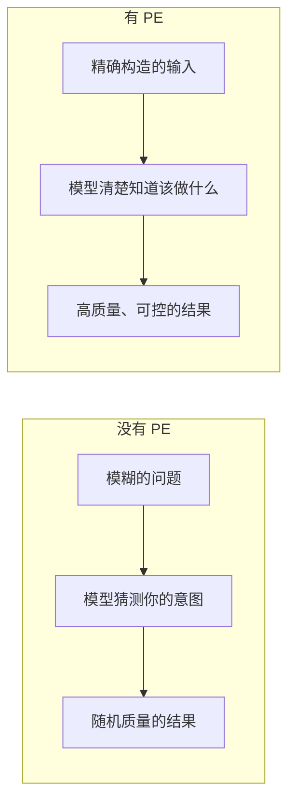
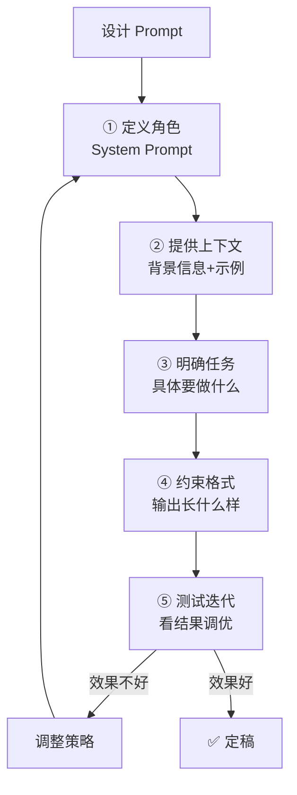
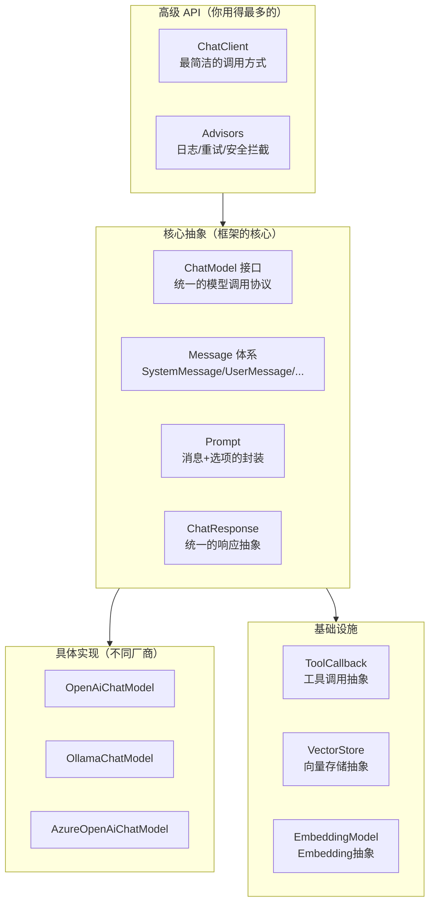
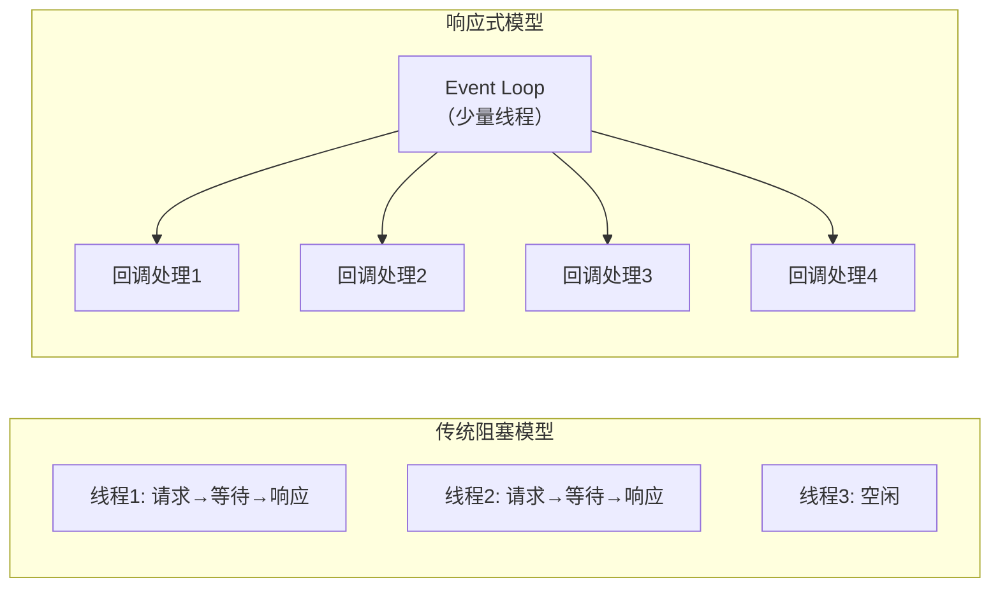
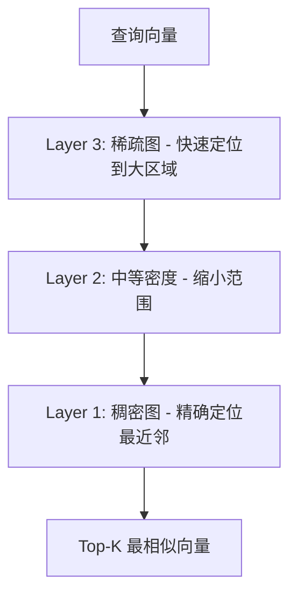

# 第二阶段：LLM 应用开发入门（第4-8周）

> 🎯 **阶段目标**：从"能调用 API"到"能构建生产级对话应用"。掌握 Prompt Engineering 的底层原理，用 Spring AI 框架优雅集成 LLM，实现流式输出、多轮对话、上下文管理。

---

## 第一章：Prompt Engineering —— 零成本的"模型调优"

### 1.1 为什么需要 Prompt Engineering？

第一阶段你学会了调用 LLM API。但你很快会发现一个令人沮丧的现象：

```
同一个模型，不同的提问方式，结果天差地别：

提问1："写个Java排序"
→ 模型可能给你冒泡排序、可能给你快速排序、可能只给代码不给解释

提问2："你是一位资深Java工程师。请用Java实现快速排序算法，
       要求：1)包含详细注释 2)给出时间复杂度分析 3)处理边界情况"
→ 模型给出高质量、完整、专业的代码

为什么差这么多？
  不是模型能力不够，而是你没有告诉它"你想要什么"。
  这就是 Prompt Engineering 要解决的问题。
```

**Prompt Engineering 的本质**：



**为什么 Prompt 能影响输出？回到 Transformer 的本质**：

```
LLM 做的事：根据输入序列，预测最可能的下一个 Token。

Prompt 的作用：构造一个"前文"，使期望的输出成为概率最高的续写。

类比：你在写作文
  题目是"我的梦想" → 你会写个人志向
  题目是"论AI的未来" → 你会写技术分析
  同样的你（同一个模型），不同的前文（Prompt），输出完全不同

Prompt Engineering 就是在设计这个"前文"，
让模型最可能"续写"出你想要的内容。
```

### 1.2 System Prompt：给模型一个"身份"

**为什么 System Prompt 如此特殊？**

```
在第一阶段你知道 messages 中有 system、user、assistant 三种角色。
但 System Prompt 的地位与其他两种有本质不同：

User 消息 = "用户说了什么"（模型要回答）
Assistant 消息 = "我之前说了什么"（模型要保持一致）
System 消息 = "我应该成为谁"（模型的行为准则）

在 Transformer 的注意力机制中：
  System 消息位于序列最前面
  → 所有后续 Token 的 Attention 都会"看到"它
  → 它对整个生成过程的概率分布产生持续影响
  
这就是为什么 System Prompt 能定义 AI 的"人格"——
它在每个生成步骤中都参与了概率计算。
```

**System Prompt 设计原则（从浅到深）**：

```java
// ❌ 级别1：过于简单
String systemPrompt = "你是一个助手";

// ⚠️ 级别2：有一定指导但不够精确
String systemPrompt = "你是一个Java专家，帮用户解答编程问题";

// ✅ 级别3：结构化、有边界、有约束
String systemPrompt = """
    你是一位拥有10年经验的Java高级工程师和技术架构师。
    
    ## 你的能力范围
    - Java 核心（集合、并发、JVM、性能优化）
    - Spring 生态（Boot、Cloud、Security、Data）
    - 系统设计（微服务、分布式、高可用）
    
    ## 回答规范
    1. 代码必须完整可运行，包含必要的 import 语句
    2. 复杂逻辑必须添加注释说明
    3. 涉及性能问题时，给出时间/空间复杂度分析
    4. 如果问题超出你的专业范围，诚实说明并建议咨询方向
    
    ## 禁止行为
    - 不要编造不存在的 API 或类
    - 不要给出未经验证的代码
    - 不要用模糊的语言（"可能"、"大概"）
    
    ## 回答格式
    - 先简要说明核心思路（1-2句）
    - 再给出完整代码
    - 最后分析关键点
    """;
```

**为什么级别3比级别1好得多？**

| 维度 | 级别1 | 级别3 |
|------|------|------|
| 角色定义 | 模糊（"助手"是谁？） | 精确（10年经验Java高级工程师） |
| 能力边界 | 无（什么都可能回答） | 明确（Java/Spring/系统设计） |
| 输出约束 | 无（随机格式） | 有（完整代码+注释+复杂度分析） |
| 幻觉控制 | 无 | 有（"不要编造不存在的API"） |

### 1.3 Few-shot Learning：给模型"看例子"

**为什么 Few-shot 有效？—— In-Context Learning**

```
LLM 有一个惊人的能力：In-Context Learning（上下文学习）

你不需要重新训练模型，只需要在 Prompt 中给几个例子，
模型就能"看懂"模式并应用到新的输入上。

这在第一阶段讲过——"涌现能力"的一种。
现在我们来理解它为什么有效：

Transformer 的 Self-Attention 会计算输入序列中所有位置的关系。
当你在 Prompt 中给出 示例输入→示例输出 的对：
  "北京" → "中国"
  "东京" → "日本"
  "巴黎" → ?

模型通过 Attention 发现：
  "北京"和"中国"的关系 ≈ "东京"和"日本"的关系
  → 这是一种"首都→国家"的映射模式
  → 对"巴黎"也应用同样的模式 → "法国"
```

**Few-shot 的正确用法**：

```
## 任务：将用户反馈分类为 正面/负面/中性

### 示例
输入："这个产品太好用了！"
分类：正面

输入："质量一般般，不太满意"
分类：负面

输入："收到了，还没用"
分类：中性

### 现在请分类
输入："发货速度很快，但包装有点简陋"
分类：
```

**Few-shot 在 Agent 中的应用场景**：

```
场景1：Tool Calling 的格式示例
  在 System Prompt 中给几个工具调用的示例，
  模型会更准确地输出正确的 JSON 格式。

场景2：输出格式约束
  给出期望的输出格式示例，模型会遵循。

场景3：领域知识注入
  给出领域特定的问答对，模型能回答专业问题。
```

### 1.4 Chain-of-Thought（思维链）：让模型"慢慢想"

**为什么直接回答容易出错？**

```
问题："一个商店有23个苹果，卖了17个，又进了15个，现在有多少个？"

直接回答（Zero-shot）：
  模型可能直接输出"21个" → 错误！

为什么？因为模型在"一步"内完成了多步计算，中间步骤可能出错。
```

**Chain-of-Thought 的原理**：

```
CoT 的核心思想：把复杂推理分解为多个简单步骤。

加了"请一步步思考"后：
  步骤1：初始 23 个
  步骤2：卖了 17 个 → 23 - 17 = 6 个
  步骤3：进了 15 个 → 6 + 15 = 21 个
  答案：21个 → 正确！

底层原理：
  Transformer 是逐 Token 生成的。
  每个 Token 只能做一次"小规模"计算（一个 Attention + FFN 层）。
  如果问题需要多步推理，一个 Token 的计算量不够。
  
  CoT 的作用：让模型把"多步推理"分散到多个 Token 上完成。
  每输出一个步骤，相当于做了一次"中间计算"，
  后续步骤的 Attention 可以"看到"前面的中间结果。
```

**CoT 的几种变体**：

```
1. Zero-shot CoT（最简单）
   只需在 Prompt 末尾加一句："Let's think step by step"
   或中文："请一步步分析"
   
2. Few-shot CoT（更可靠）
   给出带推理过程的示例：
   "问题：... 步骤1：... 步骤2：... 答案：..."
   模型会模仿这个推理模式。

3. Self-Consistency（最准确）
   让模型用 CoT 回答多次（如5次），取多数投票结果。
   原理：每次采样可能走不同的推理路径，
   正确答案更可能在多次采样中出现。
```

**CoT 在 Agent 中的关键作用**：

```
Agent 做复杂任务时（如代码重构）：
  不要让模型一步到位。
  让模型先分析 → 再规划 → 再执行 → 最后验证。
  
  这就是 ReAct 模式（第三阶段会深入学）的基础：
  Thought: "我需要先理解这个函数的作用..."
  Action: read_file("UserService.java")
  Observation: "文件内容是..."
  Thought: "现在我明白了，需要重构的地方是..."
  Action: write_file(...)
```

### 1.5 输出格式控制：让模型输出"程序可解析"的内容

**为什么这对 Agent 至关重要？**

```
Agent 需要解析模型的输出来执行工具调用。
如果模型输出的是自由文本，你的程序很难解析。

理想情况：模型输出严格的结构化格式（JSON/XML）
  {
    "tool": "search_code",
    "arguments": { "pattern": "class.*Service" }
  }

实际情况：模型可能输出
  "我觉得可以用 search_code 工具搜索 'class.*Service'"
  → 你的程序怎么解析？
```

**三种控制输出格式的方法**：

```
方法1：Prompt 约束（最简单，但不够可靠）
  在 Prompt 中明确要求：
  "请以严格的 JSON 格式回答，包含 tool 和 arguments 字段"
  
  问题：模型偶尔会不遵循，输出额外的文字。

方法2：response_format 参数（OpenAI 支持）
  {
    "response_format": { "type": "json_object" }
  }
  
  原理：在采样时强制约束输出必须是合法 JSON。
  注意：仍需在 Prompt 中说明 JSON 的结构。

方法3：Function Calling / Tool Use（最可靠，第三阶段深入学）
  通过 tools 参数定义工具的 JSON Schema，
  模型被训练为严格遵循 Schema 输出。
  → 这是 Agent 开发的标配。
```

### 1.6 Prompt Engineering 的系统化方法论



**一个完整的 Agent System Prompt 模板**：

```java
/**
 * Agent System Prompt 模板
 * 
 * 结构解析：
 * 1. 身份定义 → 模型知道"我是谁"
 * 2. 能力边界 → 模型知道"我能做什么"
 * 3. 可用工具 → 模型知道"我有什么工具"
 * 4. 行为规范 → 模型知道"我应该怎么做"
 * 5. 输出约束 → 模型知道"输出什么格式"
 */
static final String AGENT_SYSTEM_PROMPT = """
    # 身份
    你是一个强大的AI编程助手，集成在一个智能开发平台中。
    你帮助用户完成代码编写、调试、重构、理解等任务。
    
    # 可用工具
    你可以通过以下工具来完成任务：
    - read_file(path, start_line?, end_line?): 读取文件内容
    - write_file(path, content): 写入/创建文件
    - search_code(pattern, path?): 用正则搜索代码
    - list_dir(path): 列出目录内容
    - execute_shell(command): 执行终端命令
    
    # 工作流程
    1. 先理解用户的需求
    2. 如果需要了解项目结构，先用 list_dir 和 read_file
    3. 如果需要查找代码，先用 search_code
    4. 收集足够信息后，再给出解决方案
    5. 如果需要修改代码，先 read_file 确认当前内容，再 write_file
    
    # 行为约束
    - 修改文件前必须先读取文件，确认当前内容
    - 每次只修改一个文件，等待用户确认后再修改下一个
    - 如果不确定，先询问用户而不是猜测
    - 不要编造文件路径或不存在的API
    
    # 当前工作目录
    %s
    """;
```

---

## 第二章：Spring AI 框架 —— 从"手写HTTP"到"优雅抽象"

### 2.1 为什么需要框架？—— 回顾第一阶段的痛苦

```
第一阶段你手写了 HTTP 调用，回顾遇到的问题：

1. JSON 序列化/反序列化
   → 手动拼接 JSON 字符串（容易出错）
   → 手动解析响应（脆弱的字符串截取）

2. 流式响应解析
   → 逐行读取 SSE 事件
   → 手动提取 delta 中的 content

3. 错误处理
   → 自己写重试逻辑
   → 自己处理各种错误码

4. 多模型支持
   → OpenAI 和 Anthropic 的 API 格式不同
   → 切换模型要改大量代码

5. Token 计数
   → 没有内置工具，需要自己调 Tokenizer API

Spring AI 就是来解决这些问题的。
```

### 2.2 Spring AI 架构：分层理解



**为什么要这样分层？**

```
这和你熟悉的 Spring MVC 分层思想一致：

Spring MVC：Controller → Service → Repository → 数据库实现
Spring AI： ChatClient → ChatModel → OpenAI/Ollama实现

核心思想：面向接口编程
  → 你的业务代码只依赖 ChatModel 接口
  → 切换模型只需换一个实现类
  → 不需要改业务逻辑
```

### 2.3 ChatClient：最简洁的调用方式

```java
@Configuration
public class SpringAiConfig {
    
    /**
     * 配置 ChatClient
     * 
     * Spring AI 的自动配置会根据 application.yml 中的配置
     * 自动创建 OpenAiChatModel（或其他实现）的 Bean。
     * 
     * application.yml:
     * spring:
     *   ai:
     *     openai:
     *       api-key: ${OPENAI_API_KEY}
     *       base-url: https://api.openai.com  # 可切换为国内模型
     *       chat:
     *         options:
     *           model: gpt-4o-mini
     *           temperature: 0.7
     */
    @Bean
    ChatClient chatClient(ChatClient.Builder builder) {
        return builder
            .defaultSystem("你是一位资深Java架构师")
            .build();
    }
}

@Service
public class ChatService {
    
    private final ChatClient chatClient;
    
    public ChatService(ChatClient chatClient) {
        this.chatClient = chatClient;
    }
    
    /**
     * 最简单的调用：一行代码
     * 
     * 对比第一阶段手写 HTTP：
     * - 不需要手动拼 JSON
     * - 不需要手动解析响应
     * - 不需要处理错误码
     * - 自动重试和错误处理
     */
    public String simpleChat(String userMessage) {
        return chatClient.prompt()
            .user(userMessage)
            .call()
            .content();
    }
    
    /**
     * 流式调用：返回 Flux<String>
     * 
     * Flux 是 Reactor 的核心类型，表示一个异步的数据流。
     * 每个元素是一个 Token/词。
     * 
     * 后面会深入讲 Reactor 和 WebFlux。
     */
    public Flux<String> streamChat(String userMessage) {
        return chatClient.prompt()
            .user(userMessage)
            .stream()
            .content();
    }
    
    /**
     * 带选项的调用：覆盖默认配置
     */
    public String chatWithOptions(String userMessage) {
        return chatClient.prompt()
            .user(userMessage)
            .options(OpenAiChatOptions.builder()
                .temperature(0.1)   // 低温：适合代码生成
                .maxTokens(2000)
                .build())
            .call()
            .content();
    }
}
```

### 2.4 ChatModel：理解核心抽象

```java
/**
 * ChatModel 是 Spring AI 的核心接口。
 * 
 * 它定义了一个统一协议：
 *   输入：Prompt（包含消息列表 + 选项）
 *   输出：ChatResponse（包含生成的消息 + 元数据）
 * 
 * 所有模型实现（OpenAI、Ollama、Azure）都实现这个接口。
 */
@Service
public class AdvancedChatService {
    
    private final ChatModel chatModel;
    
    public AdvancedChatService(ChatModel chatModel) {
        this.chatModel = chatModel;
    }
    
    /**
     * 使用 ChatModel 直接调用（比 ChatClient 更底层）
     * 
     * 什么时候用 ChatModel 而不是 ChatClient？
     * - 需要精细控制 Prompt 构造
     * - 需要处理 Tool Calls
     * - 需要访问完整的响应元数据
     */
    public String chatWithPrompt(String userMessage) {
        // 构造消息列表
        List<Message> messages = new ArrayList<>();
        messages.add(new SystemMessage("你是Java专家"));
        messages.add(new UserMessage(userMessage));
        
        // 构造选项
        OpenAiChatOptions options = OpenAiChatOptions.builder()
            .model("gpt-4o-mini")
            .temperature(0.7)
            .build();
        
        // 构造 Prompt
        Prompt prompt = new Prompt(messages, options);
        
        // 调用并获取响应
        ChatResponse response = chatModel.call(prompt);
        
        // 访问响应元数据
        String content = response.getResult().getOutput().getText();
        Usage usage = response.getMetadata().getUsage();
        System.out.printf("Token消耗: 输入%d + 输出%d = 总计%d%n",
            usage.getPromptTokens(),
            usage.getGenerationTokens(),
            usage.getTotalTokens());
        
        return content;
    }
    
    /**
     * 流式调用：使用 Flux
     */
    public Flux<String> streamChatWithPrompt(String userMessage) {
        List<Message> messages = List.of(
            new SystemMessage("你是Java专家"),
            new UserMessage(userMessage)
        );
        
        Prompt prompt = new Prompt(messages);
        
        return chatModel.stream(prompt)
            .map(response -> {
                if (response.getResult() != null 
                    && response.getResult().getOutput() != null) {
                    return response.getResult().getOutput().getText();
                }
                return "";
            })
            .filter(text -> text != null && !text.isEmpty());
    }
}
```

### 2.5 动态模型工厂：支持多模型切换

```java
/**
 * 动态 ChatModel 工厂
 * 
 * 为什么需要这个？
 * 在实际 Agent 系统中，不同任务可能需要不同的模型：
 * - 简单对话 → GPT-4o-mini（便宜快）
 * - 复杂推理 → GPT-4o（能力强）
 * - 代码生成 → Claude 3.5（代码质量高）
 * 
 * 这个工厂根据配置动态创建 ChatModel 实例，带缓存。
 */
@Component
public class DynamicChatModelFactory {
    
    // 缓存已创建的 ChatModel，避免重复创建
    private final Map<String, ChatModel> cache = new ConcurrentHashMap<>();
    
    /**
     * 根据模型配置获取 ChatModel
     * 
     * @param baseUrl  API 地址
     * @param apiKey   API 密钥
     * @param modelName 模型名称
     * @return ChatModel 实例
     */
    public ChatModel getChatModel(String baseUrl, String apiKey, String modelName) {
        String cacheKey = baseUrl + ":" + modelName;
        return cache.computeIfAbsent(cacheKey, k -> createChatModel(baseUrl, apiKey, modelName));
    }
    
    private ChatModel createChatModel(String baseUrl, String apiKey, String modelName) {
        OpenAiApi openAiApi = OpenAiApi.builder()
            .baseUrl(baseUrl)
            .apiKey(apiKey)
            .build();
        
        OpenAiChatOptions defaultOptions = OpenAiChatOptions.builder()
            .model(modelName)
            .temperature(0.7)
            .build();
        
        return OpenAiChatModel.builder()
            .openAiApi(openAiApi)
            .defaultOptions(defaultOptions)
            .build();
    }
    
    /**
     * 清除缓存（配置更新时调用）
     */
    public void evict(String baseUrl, String modelName) {
        cache.remove(baseUrl + ":" + modelName);
    }
}
```

---

## 第三章：响应式编程与流式输出

### 3.1 为什么传统 Servlet 模型不够用？

```
传统 Spring MVC 的请求处理模型：

  客户端发请求 → 一个线程处理 → 线程阻塞等待结果 → 返回响应
  
  问题：
  1. 线程是有限资源（Tomcat 默认 200 个线程）
  2. LLM API 调用通常需要 5-30 秒
  3. 在这 5-30 秒内，线程什么都不做，只是在等
  4. 如果 200 个用户同时请求 → 所有线程都被占满 → 新请求被拒绝

  这就是"阻塞 I/O"的问题。

SSE 流式传输加剧了这个问题：
  一个 SSE 连接需要保持打开直到流完成
  如果用传统模型，一个 SSE 连接就占一个线程
  100 个用户同时用流式对话 → 100 个线程被长期占用
```

### 3.2 响应式编程：用更少的线程做更多的事

```
响应式编程的核心思想：

  传统：线程主动等结果（阻塞）
  响应式：有结果了通知回调（非阻塞）

类比：
  传统 = 你打电话订外卖，一直等着直到接通（阻塞）
  响应式 = 你发短信订外卖，外卖好了会通知你（非阻塞）

Spring WebFlux 基于 Reactor 框架，核心类型：
  Mono<T>  = 异步的 0 或 1 个元素（类似 CompletableFuture）
  Flux<T>  = 异步的 0 到 N 个元素（类似 Stream 但是异步的）
```



### 3.3 SSE 流式输出的完整实现

```java
@RestController
@RequestMapping("/api/chat")
public class ChatController {
    
    private final ChatClient chatClient;
    
    public ChatController(ChatClient chatClient) {
        this.chatClient = chatClient;
    }
    
    /**
     * 非流式接口：等待完整响应后返回
     * 
     * 用户体验：发送问题 → 等待 5-15 秒 → 突然看到完整回答
     */
    @PostMapping("/send")
    public ChatResponse send(@RequestBody ChatRequest request) {
        String content = chatClient.prompt()
            .user(request.getMessage())
            .call()
            .content();
        
        return new ChatResponse(content);
    }
    
    /**
     * 流式接口：SSE 逐 Token 推送
     * 
     * 关键注解：produces = MediaType.TEXT_EVENT_STREAM_VALUE
     * 告诉 Spring 这是一个 SSE 端点。
     * 
     * 返回类型：Flux<String>
     * Spring WebFlux 会自动将 Flux 的每个元素作为 SSE 事件推送。
     * 
     * 用户体验：发送问题 → 立即开始逐字显示 → 打字机效果
     */
    @PostMapping(value = "/stream", produces = MediaType.TEXT_EVENT_STREAM_VALUE)
    public Flux<String> stream(@RequestBody ChatRequest request) {
        return chatClient.prompt()
            .user(request.getMessage())
            .stream()
            .content();
    }
    
    /**
     * 带结构化事件的流式接口
     * 
     * 为什么需要这个？
     * 简单的 Flux<String> 只能推送文本内容。
     * 但 Agent 还需要推送：
     * - 工具调用信息（"正在读取文件..."）
     * - 完成信号（对话结束）
     * - 错误信息
     * 
     * 所以我们需要推送结构化的事件对象。
     */
    @PostMapping(value = "/stream/events", produces = MediaType.TEXT_EVENT_STREAM_VALUE)
    public Flux<ServerSentEvent<ChatStreamEvent>> streamWithEvents(
            @RequestBody ChatRequest request) {
        
        String conversationId = UUID.randomUUID().toString();
        
        return chatClient.prompt()
            .user(request.getMessage())
            .stream()
            .content()
            .map(content -> ServerSentEvent.<ChatStreamEvent>builder()
                .event("content")
                .data(new ChatStreamEvent("content", content, conversationId))
                .build())
            .concatWith(Flux.just(
                ServerSentEvent.<ChatStreamEvent>builder()
                    .event("done")
                    .data(new ChatStreamEvent("done", null, conversationId))
                    .build()
            ))
            .onErrorResume(e -> Flux.just(
                ServerSentEvent.<ChatStreamEvent>builder()
                    .event("error")
                    .data(new ChatStreamEvent("error", e.getMessage(), null))
                    .build()
            ));
    }
}

// DTO 类
record ChatRequest(String message, String conversationId) {}
record ChatResponse(String content) {}
record ChatStreamEvent(String type, String content, String conversationId) {}
```

### 3.4 SseEmitter vs Flux：两种 SSE 实现方式对比

```java
/**
 * 方式1：SseEmitter（Spring MVC 方式）
 * 
 * 适用：传统 Spring MVC 项目
 * 特点：命令式编程，手动管理发送和完成
 */
@RestController
public class SseEmitterController {
    
    @PostMapping("/chat/sse")
    public SseEmitter chatWithSseEmitter(@RequestBody ChatRequest request) {
        SseEmitter emitter = new SseEmitter(300_000L); // 5分钟超时
        
        // 异步执行
        CompletableFuture.runAsync(() -> {
            try {
                chatClient.prompt()
                    .user(request.getMessage())
                    .stream()
                    .content()
                    .subscribe(
                        content -> {
                            try {
                                emitter.send(SseEmitter.event()
                                    .name("content")
                                    .data(content));
                            } catch (IOException e) {
                                emitter.completeWithError(e);
                            }
                        },
                        error -> emitter.completeWithError(error),
                        () -> {
                            try {
                                emitter.send(SseEmitter.event()
                                    .name("done")
                                    .data("完成"));
                                emitter.complete();
                            } catch (IOException e) {
                                // ignore
                            }
                        }
                    );
            } catch (Exception e) {
                emitter.completeWithError(e);
            }
        });
        
        return emitter;
    }
}

/**
 * 方式2：Flux（Spring WebFlux 方式）—— 推荐
 * 
 * 适用：Spring WebFlux 项目
 * 特点：声明式编程，代码更简洁，背压支持
 * 
 * 对比 SseEmitter：
 * - 代码量更少（不需要手动管理 emitter 生命周期）
 * - 错误处理更优雅（onErrorResume）
 * - 支持背压（客户端慢时自动降速）
 */
```

---

## 第四章：对话管理 —— 让 AI "记住"上下文

### 4.1 核心问题：LLM 是无状态的

```
第一阶段你已经知道：LLM 每次调用都是独立的，不记忆之前的对话。

这意味着什么？

用户第1次问："什么是Spring Boot？"
AI 回答了一大段。

用户第2次问："它和Spring有什么区别？"
如果你只发这一条消息给 API，AI 会以为你在问：
  "它"是什么？"Spring"是哪个Spring？→ 完全答非所问

解决方案：每次调用都把完整的历史消息发过去。
  messages = [
    system: "你是Java专家",
    user: "什么是Spring Boot？",           ← 第1轮历史
    assistant: "Spring Boot是...",        ← 第1轮历史
    user: "它和Spring有什么区别？"         ← 当前问题
  ]
  
  AI 看到完整历史，知道"它"指的是"Spring Boot"。
```

### 4.2 对话历史持久化

```java
/**
 * 对话管理服务
 * 
 * 核心职责：
 * 1. 管理对话（Conversation）和消息（Message）
 * 2. 每次调用 LLM 时构造完整的消息历史
 * 3. 保存 AI 的回复到数据库
 */
@Service
public class ConversationService {
    
    private final ConversationRepository conversationRepo;
    private final MessageRepository messageRepo;
    
    public ConversationService(ConversationRepository conversationRepo,
                               MessageRepository messageRepo) {
        this.conversationRepo = conversationRepo;
        this.messageRepo = messageRepo;
    }
    
    /**
     * 获取或创建对话
     */
    public Conversation getOrCreateConversation(String conversationId) {
        if (conversationId != null) {
            return conversationRepo.findById(conversationId)
                .orElseGet(() -> createConversation(conversationId));
        }
        return createConversation(UUID.randomUUID().toString());
    }
    
    private Conversation createConversation(String id) {
        Conversation conv = new Conversation();
        conv.setId(id);
        conv.setCreatedAt(LocalDateTime.now());
        return conversationRepo.save(conv);
    }
    
    /**
     * 保存用户消息
     */
    public void saveUserMessage(String conversationId, String content) {
        MessageEntity msg = new MessageEntity();
        msg.setConversationId(conversationId);
        msg.setRole("user");
        msg.setContent(content);
        msg.setSortOrder(messageRepo.countByConversationId(conversationId));
        messageRepo.save(msg);
    }
    
    /**
     * 保存 AI 回复
     */
    public void saveAssistantMessage(String conversationId, String content) {
        MessageEntity msg = new MessageEntity();
        msg.setConversationId(conversationId);
        msg.setRole("assistant");
        msg.setContent(content);
        msg.setSortOrder(messageRepo.countByConversationId(conversationId));
        messageRepo.save(msg);
    }
    
    /**
     * 构造完整的消息历史
     * 
     * 这是最关键的方法：把数据库中的消息历史转成 Spring AI 的 Message 列表。
     */
    public List<Message> buildMessageHistory(String conversationId, String systemPrompt) {
        List<Message> messages = new ArrayList<>();
        
        // 1. 系统提示词（始终在最前面）
        messages.add(new SystemMessage(systemPrompt));
        
        // 2. 从数据库加载历史消息
        List<MessageEntity> history = messageRepo
            .findByConversationIdOrderBySortOrder(conversationId);
        
        for (MessageEntity msg : history) {
            switch (msg.getRole()) {
                case "user" -> messages.add(new UserMessage(msg.getContent()));
                case "assistant" -> messages.add(new AssistantMessage(msg.getContent()));
            }
        }
        
        return messages;
    }
}
```

### 4.3 上下文窗口管理：消息裁剪策略

```
问题：对话进行了 100 轮，历史消息有 50000 Token。
     但模型的上下文窗口只有 128K，还要留出空间给：
     - 系统提示词（~1000 Token）
     - 工具定义（~4000 Token）
     - RAG 结果（~3000 Token）
     - 模型回复（~2000 Token）
     
     可用空间 ≈ 128K - 10K = 118K
     50000 Token 的历史可能放不下！
     
     更关键的是：Token 越多 → API 调用越贵 → 响应越慢
     即使放得下，也不应该全部放进去。
```

**三种裁剪策略**：

```java
/**
 * 上下文窗口管理器
 */
@Component
public class ContextWindowManager {
    
    private static final int MAX_HISTORY_TOKENS = 8000;  // 历史消息最多占 8000 Token
    private static final int MAX_MESSAGES = 20;          // 最多保留 20 条消息
    
    /**
     * 策略1：滑动窗口（保留最近 N 条消息）
     * 
     * 最简单粗暴：只保留最近的 N 条消息，丢弃更早的。
     * 
     * 优点：实现简单，成本可控
     * 缺点：可能丢失重要的早期信息
     * 
     * 适用：一般对话场景
     */
    public List<MessageEntity> slidingWindow(List<MessageEntity> allMessages) {
        if (allMessages.size() <= MAX_MESSAGES) {
            return allMessages;
        }
        // 保留最后 N 条
        return allMessages.subList(
            allMessages.size() - MAX_MESSAGES,
            allMessages.size()
        );
    }
    
    /**
     * 策略2：Token 计数裁剪
     * 
     * 从最新的消息开始往回算，直到 Token 总数超过阈值。
     * 
     * 优点：精确控制 Token 用量
     * 缺点：需要 Tokenizer（可以近似估算：1个中文字≈1.5 Token）
     */
    public List<MessageEntity> tokenBasedTrimming(List<MessageEntity> allMessages) {
        int totalTokens = 0;
        List<MessageEntity> selected = new ArrayList<>();
        
        // 从最新的消息开始往回遍历
        for (int i = allMessages.size() - 1; i >= 0; i--) {
            MessageEntity msg = allMessages.get(i);
            int tokens = estimateTokens(msg.getContent());
            
            if (totalTokens + tokens > MAX_HISTORY_TOKENS) {
                break;  // 超过阈值，停止添加
            }
            
            selected.add(0, msg);  // 插入到列表头部（保持顺序）
            totalTokens += tokens;
        }
        
        return selected;
    }
    
    /**
     * 策略3：摘要压缩（保留关键信息）
     * 
     * 对早期的对话历史做摘要，压缩成一条"摘要消息"。
     * 
     * 原理：用 LLM 对前 N 轮对话生成一段摘要，
     * 然后把摘要作为 System Message 的一部分注入。
     * 
     * 优点：保留关键信息，大幅减少 Token
     * 缺点：摘要本身也需要一次 LLM 调用（额外成本）
     * 
     * 适用：长对话场景（客服、咨询）
     */
    public String generateSummary(List<MessageEntity> oldMessages) {
        // 构造摘要请求
        StringBuilder conversationText = new StringBuilder();
        for (MessageEntity msg : oldMessages) {
            conversationText.append(String.format("%s: %s%n",
                msg.getRole(), msg.getContent()));
        }
        
        // 用 LLM 生成摘要（这是一次额外的 API 调用）
        String summary = chatClient.prompt()
            .user("请将以下对话浓缩为一段简洁的摘要（不超过200字），"
                + "保留关键信息点、用户偏好和重要结论：\n\n"
                + conversationText)
            .call()
            .content();
        
        return summary;
    }
    
    /**
     * Token 数量估算
     * 
     * 精确计算需要用 Tokenizer（tiktoken），
     * 这里用近似公式（中文约 1.5 Token/字，英文约 0.75 Token/词）。
     */
    private int estimateTokens(String text) {
        if (text == null) return 0;
        int chineseChars = countChinese(text);
        int otherChars = text.length() - chineseChars;
        return (int)(chineseChars * 1.5 + otherChars * 0.4);
    }
    
    private int countChinese(String text) {
        int count = 0;
        for (char c : text.toCharArray()) {
            if (Character.UnicodeScript.of(c) == Character.UnicodeScript.HAN) {
                count++;
            }
        }
        return count;
    }
}
```

### 4.4 完整的对话流程：串联所有组件

```java
/**
 * 完整的对话服务
 * 串联 Prompt Engineering + Spring AI + 流式输出 + 对话管理
 */
@Service
public class FullChatService {
    
    private final ChatClient chatClient;
    private final ConversationService conversationService;
    private final ContextWindowManager contextManager;
    
    private static final String SYSTEM_PROMPT = """
        你是一位资深Java架构师，帮助用户解决编程问题。
        回答要简洁专业，代码要完整可运行。
        %s
        """;
    
    public FullChatService(ChatClient chatClient,
                           ConversationService conversationService,
                           ContextWindowManager contextManager) {
        this.chatClient = chatClient;
        this.conversationService = conversationService;
        this.contextManager = contextManager;
    }
    
    /**
     * 完整的流式对话流程
     * 
     * 流程：
     * 1. 获取/创建对话
     * 2. 保存用户消息
     * 3. 构造消息历史（含裁剪）
     * 4. 调用 LLM（流式）
     * 5. 收集完整响应
     * 6. 保存 AI 回复
     */
    public Flux<String> chat(String conversationId, String userMessage) {
        // 1. 获取/创建对话
        Conversation conversation = conversationService
            .getOrCreateConversation(conversationId);
        
        // 2. 保存用户消息
        conversationService.saveUserMessage(conversation.getId(), userMessage);
        
        // 3. 构造消息历史
        List<MessageEntity> allMessages = messageRepo
            .findByConversationIdOrderBySortOrder(conversation.getId());
        
        // 裁剪历史
        List<MessageEntity> trimmed = contextManager.slidingWindow(allMessages);
        
        // 构造 Spring AI 消息列表
        List<Message> messages = new ArrayList<>();
        messages.add(new SystemMessage(
            String.format(SYSTEM_PROMPT, buildHistoryContext(trimmed))));
        messages.add(new UserMessage(userMessage));
        
        // 4. 流式调用 LLM
        StringBuilder fullResponse = new StringBuilder();
        
        return chatClient.prompt()
            .messages(messages)
            .stream()
            .content()
            .doOnNext(fullResponse::append)
            .doOnComplete(() -> {
                // 5. 保存 AI 完整回复
                conversationService.saveAssistantMessage(
                    conversation.getId(), fullResponse.toString());
            });
    }
    
    private String buildHistoryContext(List<MessageEntity> messages) {
        if (messages.isEmpty()) return "";
        StringBuilder sb = new StringBuilder("\n\n之前的对话上下文：\n");
        for (MessageEntity msg : messages) {
            sb.append(String.format("- %s: %s%n", msg.getRole(), msg.getContent()));
        }
        return sb.toString();
    }
}
```

---

## 第五章：向量数据库与 Embedding — RAG 的基础设施

### 5.1 为什么需要向量数据库？

```
在第一阶段你已经知道：
  Embedding 把文本映射到高维向量空间，
  语义相似的文本在向量空间中距离更近。

但问题来了：
  如果你有 100 万个文档块，每个都是 768 维向量。
  用户提一个问题 → 变成 1 个查询向量。
  你需要在 100 万个向量中找到最相似的 Top-5。

  暴力做法：计算查询向量与每个文档向量的余弦相似度
  → 100 万次计算 → 太慢了！

  这就是向量数据库要解决的问题：
  用特殊的数据结构（索引）让相似度搜索变得极快。
```

### 5.2 ANN 检索算法 — 不精确但足够快

**ANN（Approximate Nearest Neighbor）的核心思想**：

```
精确搜索（KNN）：
  计算查询与每个向量的相似度 → O(n) 复杂度
  100 万向量 = 100 万次计算 → 几秒到几十秒

近似搜索（ANN）：
  通过索引结构跳过大部分向量 → O(log n) 复杂度
  100 万向量 = 只需计算几百次 → 毫秒级！

代价：可能错过真正的最近邻，但 99%+ 的准确率已经足够
（语义搜索本身就不需要精确到小数点后 6 位）
```

**HNSW（Hierarchical Navigable Small World）— 最常用的 ANN 算法**

```
核心思想：构建多层图结构，从顶层稀疏图快速定位，逐层细化。

类比：找一家餐馆
  第 1 步（顶层）：先看省份地图 → 定位到北京市
  第 2 步（中层）：再看城市地图 → 定位到海淀区
  第 3 步（底层）：最后看街道地图 → 定位到具体街道

效果：
  100 万向量，只需遍历几百个节点就能找到近似最近邻
  查询时间：1-5 毫秒
```



**IVF（Inverted File Index）— 聚类 + 倒排索引**

```
核心思想：先用 K-Means 把所有向量聚类，查询时只搜索最近的几个簇。

步骤：
  1. 训练阶段：对所有向量做 K-Means 聚类（如 K=1024）
  2. 查询阶段：计算查询向量与每个簇中心的距离
     → 只搜索最近的 5-10 个簇
     → 在这些簇内的向量中精确计算相似度

效果：
  原本搜索 100 万个向量
  → 现在只搜索几个簇内的向量（可能只有几千个）
  → 速度提升 100-200 倍
```

**ANN 算法对比**

| 算法 | 原理 | 查询速度 | 内存占用 | 精度 | 适用场景 |
|------|------|---------|---------|------|----------|
| HNSW | 多层导航小世界图 | 极快 O(log n) | 高 | 最高 | 高精度、中小规模 |
| IVF | 聚类 + 倒排索引 | 快 | 中 | 较高 | 大规模数据集 |
| PQ | 乘积量化压缩向量 | 快 | 低 | 中等 | 内存受限场景 |

### 5.3 主流向量数据库对比

| 数据库 | 特点 | 适用场景 | Java 友好度 |
|---------|------|---------|-------------|
| Milvus | 分布式、高性能、多种索引 | 生产环境、大规模数据 | 5星（官方 Java SDK） |
| PgVector | PostgreSQL 扩展，无需新组件 | 已有 PG 的项目 | 5星（标准 JDBC） |
| Chroma | 轻量、嵌入式、API 简单 | 原型开发、本地实验 | 3星（HTTP API） |
| Qdrant | Rust 开发、高性能 | 生产环境、复杂过滤 | 4星（gRPC/REST） |

**PgVector — 对 Java 开发者最友好的选择**

```sql
-- 安装扩展
CREATE EXTENSION IF NOT EXISTS vector;

-- 创建向量表
CREATE TABLE documents (
    id SERIAL PRIMARY KEY,
    content TEXT,
    embedding VECTOR(768),
    metadata JSONB,
    created_at TIMESTAMP DEFAULT NOW()
);

-- 创建 HNSW 索引
CREATE INDEX ON documents
USING hnsw (embedding vector_cosine_ops);

-- 语义搜索：找到最相似的 5 个文档
SELECT id, content, metadata,
       1 - (embedding <=> $1) AS similarity
FROM documents
ORDER BY embedding <=> $1
LIMIT 5;
```

### 5.4 Spring AI 中的向量存储抽象

```java
@Service
public class SemanticSearchService {

    private final VectorStore vectorStore;

    public SemanticSearchService(VectorStore vectorStore) {
        this.vectorStore = vectorStore;
    }

    /**
     * 文档入库：文本 -> Embedding -> 向量数据库
     * Spring AI 自动调用 EmbeddingModel 把文本转为向量
     */
    public void indexDocuments(List<String> texts) {
        List<Document> documents = texts.stream()
            .map(text -> new Document(text, Map.of(
                "source", "upload",
                "timestamp", LocalDateTime.now().toString()
            )))
            .toList();
        vectorStore.add(documents);
    }

    /**
     * 语义搜索：查询文本 -> 向量 -> 相似文档
     * 这就是 RAG 系统的"检索"步骤
     */
    public List<Document> search(String query, int topK) {
        SearchRequest request = SearchRequest.builder()
            .query(query)
            .topK(topK)
            .similarityThreshold(0.7)
            .build();
        return vectorStore.similaritySearch(request);
    }
}
```

### 5.5 Embedding 模型选择

| 模型 | 维度 | 语言 | 特点 |
|------|------|------|------|
| text-embedding-3-small (OpenAI) | 1536 | 英文为主 | 便宜效果好 |
| text-embedding-3-large (OpenAI) | 3072 | 多语言 | 最强通用 Embedding |
| bge-large-zh (BAAI) | 1024 | 中文为主 | 开源中文最优之一 |
| m3e-base (Moka AI) | 768 | 中文 | 开源轻量 |

---

## 第六章：自检清单与里程碑

### 你现在能回答这些问题吗？

```
Prompt Engineering：
□ 1. 为什么同一个模型对不同 Prompt 的输出差异巨大？底层原理是什么？
□ 2. System Prompt 为什么能影响整个生成过程？它在 Attention 中处于什么位置？
□ 3. Few-shot Learning 为什么不需要重新训练模型？In-Context Learning 是什么？
□ 4. Chain-of-Thought 为什么能提高推理准确率？它利用了 Transformer 的什么特性？
□ 5. 怎么控制模型输出严格的 JSON 格式？三种方法的可靠性排序是什么？

Spring AI：
□ 6. ChatClient 和 ChatModel 的区别是什么？分别适用于什么场景？
□ 7. Spring AI 如何实现"切换模型只需改配置"？核心抽象是什么？
□ 8. OpenAiChatOptions 中的 temperature、maxTokens 分别影响什么？

流式输出：
□ 9. 为什么传统 Servlet 模型不适合 LLM 流式输出？线程模型的问题是什么？
□ 10. Flux<T> 和 Mono<T> 分别表示什么？在流式输出中为什么用 Flux？
□ 11. SseEmitter 和 Flux 两种方式各有什么优缺点？

对话管理：
□ 12. 为什么 LLM 是"无状态"的？这对对话管理意味着什么？
□ 13. 滑动窗口、Token 裁剪、摘要压缩三种策略各适用于什么场景？
□ 14. 一个 Agent 请求的上下文由哪些部分组成？为什么需要管理它？

向量数据库：
□ 15. 为什么不能用暴力搜索（KNN）在大规模数据中做向量检索？
□ 16. HNSW 的核心思想是什么？用"省份-城市-街道"的类比解释
□ 17. Milvus 和 PgVector 各适用于什么场景？对 Java 开发者哪个更友好？
□ 18. Spring AI 的 VectorStore 抽象解决了什么问题？
```

### 下一步预告

**第三阶段**你将进入 Agent 的核心领域：
- **Function Calling / Tool Use**：让模型能调用外部工具
- **五大 Agent 范式**：ReAct、Self-Ask、Reflexion、Plan-and-Solve、Tree of Thoughts
- **RAG 全链路**：文档加载 -> 分块 -> 向量化 -> 混合检索 -> 注入
- **Memory 系统**：短期记忆 + 长期记忆
- **工具实战**：联网搜索、数据库查询、代码执行、文件操作
- **实践项目**：构建一个能读写文件、搜索代码的全能编码 Agent
