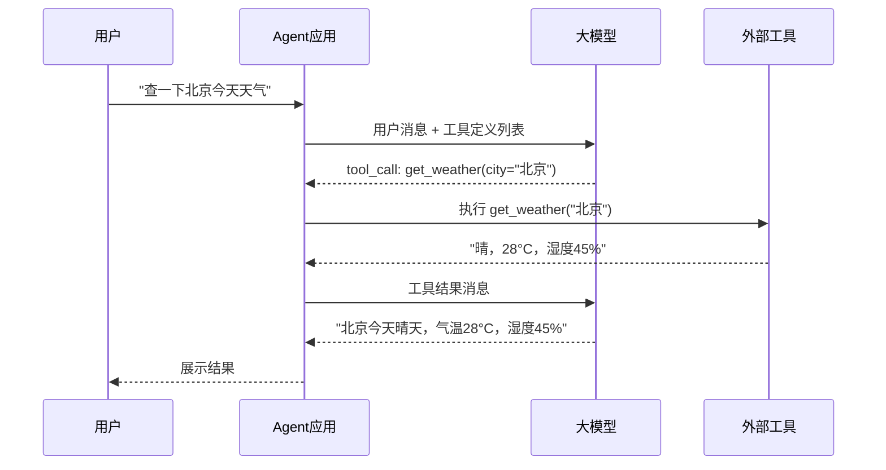
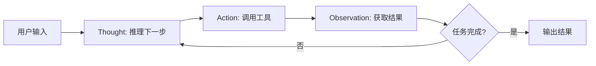
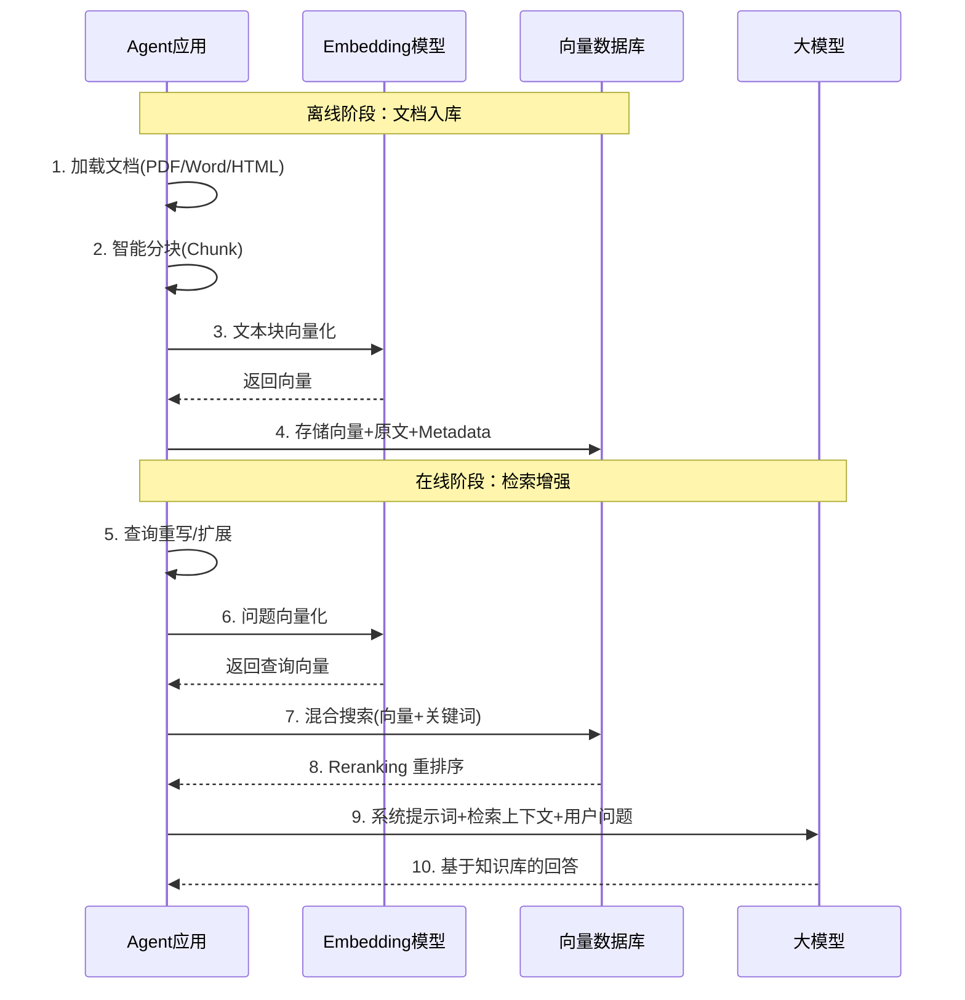
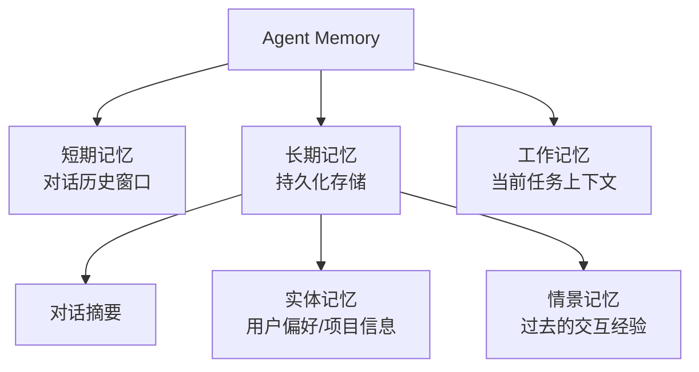

# 第三阶段：Agent 核心体系（第 14-20 周）

> 🎯 **阶段目标**：从"能构建对话应用"到"能构建自主智能体"。掌握 Agent 的全部核心组件——工具调用（Function Calling）、RAG 检索增强、记忆系统（Memory）、Agent 循环（Agent Loop），并能用五种经典范式构建不同类型的 Agent。

---

## 第一章：Function Calling — 让 LLM 能"动手"

### 1.1 为什么对话不够？

```
前两阶段你能做到的：
  用户："帮我查一下北京的天气"
  AI："我无法直接获取天气信息，建议你访问 weather.com..."

这不是智能体——这只是一个"会说话的搜索引擎"。

真正的 Agent 应该能做到：
  用户："帮我查一下北京的天气"
  AI：(内部调用 get_weather 工具) → "北京今天晴，28°C，湿度 45%"

差距在哪？
  → Agent 能调用外部工具（API、数据库、文件系统、代码执行器...）
  → 这就是 Function Calling / Tool Use 要做的事
```

### 1.2 Function Calling 的完整流程



**关键理解：LLM 不执行工具！**

```
LLM 只做一件事：输出"我想调用什么工具，传什么参数"
实际执行由你的应用程序完成

分工：
  LLM 负责 → "决策"（用哪个工具、传什么参数）
  应用负责 → "执行"（调用工具、获取结果、回填上下文）

这就是为什么 Tool Call 的结果必须通过 tool 消息返回给 LLM：
  1. LLM 输出 tool_call → 应用程序解析
  2. 应用程序执行工具 → 获取结果
  3. 应用程序构造 tool 消息 → 发回给 LLM
  4. LLM 看到结果 → 生成最终回复或决定下一步操作
```

### 1.3 工具定义的 JSON Schema

```json
{
  "type": "function",
  "function": {
    "name": "get_weather",
    "description": "获取指定城市的实时天气信息",
    "parameters": {
      "type": "object",
      "properties": {
        "city": {
          "type": "string",
          "description": "城市名称，如 '北京'、'上海'"
        },
        "date": {
          "type": "string",
          "enum": ["today", "tomorrow"],
          "description": "查询日期"
        }
      },
      "required": ["city"]
    }
  }
}
```

**JSON Schema 设计原则**：
- `description` 要精确——LLM 靠它理解工具用途
- `enum` 限制可选值——减少 LLM 输出非法参数
- `required` 标明必填参数——防止缺少关键信息

### 1.4 Spring AI 中的 Tool Calling

```java
/**
 * 自定义工具：用 @Tool 注解
 * Spring AI 自动将方法签名转为 JSON Schema 发给 LLM
 */
@Component
public class WeatherTools {

    @Tool(description = "获取指定城市的实时天气信息，包括温度、湿度、天气状况")
    public String getWeather(String city, String date) {
        // 这里调用真实的天气 API
        return String.format("%s %s 天气：晴，气温 28°C，湿度 45%%", city, date);
    }
}

/**
 * 在 ChatClient 中注册工具
 */
@Service
public class AgentService {

    private final ChatClient chatClient;
    private final WeatherTools weatherTools;

    public AgentService(ChatClient.Builder builder, WeatherTools weatherTools) {
        this.weatherTools = weatherTools;
        this.chatClient = builder
            .defaultTools(weatherTools)  // 注册工具
            .build();
    }

    public String chat(String userMessage) {
        return chatClient.prompt()
            .user(userMessage)
            .call()
            .content();
    }
}
```

---

## 第二章：Agent 五大经典范式

### 2.1 为什么需要不同的范式？

```
不同的任务需要不同的"思考方式"：

简单查询任务 → ReAct（思考→行动→观察 循环即可）
复杂多步任务 → Plan-and-Solve（先制定计划再执行）
需要自我纠错 → Reflexion（执行后反思、迭代改进）
多跳推理任务 → Self-Ask（分解为子问题逐个解决）
需要最优决策 → Tree of Thoughts（探索多条路径选最优）

没有"万能范式"——选对范式是 Agent 开发者的核心技能
```

### 2.2 ReAct — 最通用的工具型 Agent

**ReAct = Reasoning + Acting（推理 + 行动）**

```
核心循环：
  Thought: "我需要先了解项目的目录结构"
  Action: list_dir("/project")
  Observation: "src/ test/ README.md ..."
  Thought: "看到有 src 目录，让我查看其中的文件"
  Action: read_file("/project/src/Main.java")
  Observation: "文件内容..."
  Thought: "现在我明白了项目结构，可以开始修改了"
  Action: write_file("/project/src/Main.java", newContent)
  Observation: "文件已写入"
  → 任务完成，输出最终结果
```



### 2.3 Self-Ask — 问题分解范式

```
核心思想：将复杂问题分解为子问题，逐个解答

用户问："特斯拉公司 2024 年 Q3 的营收同比增长了多少？"

Self-Ask 的推理过程：
  这个问题需要拆解：
    子问题1：特斯拉 2024 Q3 营收是多少？
    子问题2：特斯拉 2023 Q3 营收是多少？
    子问题3：计算同比增长率
  
  解答子问题1：(调用搜索工具) → "251.8 亿美元"
  解答子问题2：(调用搜索工具) → "233.5 亿美元"
  解答子问题3：(251.8-233.5)/233.5 = 7.8%
  
  最终答案：同比增长 7.8%
```

### 2.4 Reflexion — 自我反思迭代优化

```
核心思想：执行完任务后自我评估，发现错误，迭代改进

循环：
  Step 1: 执行任务（如写代码）
  Step 2: 自我评估（如运行测试）
  Step 3: 反思错误（"测试失败是因为没有处理空输入"）
  Step 4: 改进后重新执行
  Step 5: 重复直到通过或达到最大迭代次数

Agent 的 Reflexion 循环：
  执行：write_file("Calculator.java", code)
  评估：execute_shell("mvn test") → 测试失败
  反思："divide 方法没有检查除数为 0"
  改进：修改代码加入除零检查
  重新执行：execute_shell("mvn test") → 测试通过
  → 任务完成
```

### 2.5 Plan-and-Solve — 先规划后执行

```
核心思想：面对复杂任务，先制定完整的执行计划，再逐步执行

用户请求："帮我重构这个项目的数据库层"

Plan-and-Solve 的过程：
  规划阶段（Planning）：
    Step 1: 分析当前数据库层结构
    Step 2: 识别需要重构的模式（N+1 查询、缺少索引等）
    Step 3: 设计新的数据库层架构
    Step 4: 逐个修改 Repository 类
    Step 5: 运行测试验证

  执行阶段（Execution）：
    执行 Step 1 → 结果
    执行 Step 2 → 结果
    ...
    执行 Step 5 → 结果
  
  优势：减少执行过程中的混乱和遗漏
  劣势：计划可能过于理想化，执行中可能需要调整
```

### 2.6 Tree of Thoughts — 探索多条路径

```
核心思想：不是线性推理，而是同时探索多条推理路径，选择最优的

问题："设计一个高并发缓存方案"

ToT 的探索过程：
  路径1：Redis 单机缓存
    → 优点：简单 → 缺点：单点故障 → 评分：60

  路径2：Redis Cluster
    → 优点：高可用 → 缺点：运维复杂 → 评分：75

  路径3：本地缓存 + Redis 二级缓存
    → 优点：极低延迟 → 缺点：一致性问题 → 评分：85

  → 选择路径3，细化方案

计算成本高（多条路径都要让 LLM 推理），
但在需要最优决策的场景中效果最好。
```

### 2.7 五种范式对比总结

| 范式 | 核心思想 | 适用场景 | 局限 | 实现复杂度 |
|------|---------|---------|------|-----------|
| ReAct | 思考-行动-观察循环 | 通用工具调用 | 容易陷入循环 | 低 |
| Self-Ask | 分解子问题逐个解答 | 多跳问答、复杂分析 | 子问题划分依赖模型 | 中 |
| Reflexion | 执行→评估→反思→改进 | 需要迭代优化的任务 | 需要评估反馈 | 中 |
| Plan-and-Solve | 先规划再执行 | 多步骤复杂任务 | 计划可能过于理想 | 中 |
| Tree of Thoughts | 探索多条路径选最优 | 需要最优解的决策 | 计算成本高 | 高 |

---

## 第三章：RAG 全链路 — 让 Agent 拥有"知识库"

### 3.1 RAG 完整流水线



### 3.2 文档分块策略

| 策略 | 原理 | 优点 | 缺点 | 适用文档 |
|------|------|------|------|---------|
| 固定长度切分 | 按字符数/Token 数 | 简单高效 | 可能切断语义 | 纯文本 |
| 递归字符切分 | 按分隔符层级切分 | 保持段落完整 | 块大小不均匀 | 通用文档 |
| 语义切分 | Embedding 相似度判断断点 | 语义完整性最好 | 计算成本高 | 高质量需求 |
| 文档结构切分 | Markdown 标题/HTML 标签 | 结构清晰 | 依赖文档格式 | 技术文档 |

```java
/**
 * 递归字符切分 — 最常用的分块策略
 *
 * 原理：按优先级从低到高的分隔符尝试切分
 * 优先用段落分隔，不行再用句子，最后用字符
 */
public List<String> recursiveSplit(String text, int chunkSize, int overlap) {
    String[] separators = {"\n\n", "\n", "。", ".", " "};
    return splitRecursive(text, separators, chunkSize, overlap);
}

private List<String> splitRecursive(String text, String[] separators,
                                     int chunkSize, int overlap) {
    if (text.length() <= chunkSize) {
        return List.of(text);
    }

    // 找到当前层级最合适的分隔符
    String separator = separators[0];
    for (String sep : separators) {
        if (text.contains(sep)) {
            separator = sep;
            break;
        }
    }

    // 按分隔符切分
    String[] parts = text.split(Pattern.quote(separator));
    List<String> chunks = new ArrayList<>();
    StringBuilder current = new StringBuilder();

    for (String part : parts) {
        if (current.length() + part.length() > chunkSize && !current.isEmpty()) {
            chunks.add(current.toString().trim());
            // 保留重叠部分（让相邻块有上下文连续性）
            String overlapText = getTail(current.toString(), overlap);
            current = new StringBuilder(overlapText);
        }
        current.append(separator).append(part);
    }
    if (!current.isEmpty()) {
        chunks.add(current.toString().trim());
    }
    return chunks;
}
```

### 3.3 检索优化：混合搜索 + Reranking

```
纯向量搜索的问题：
  查询："Spring Boot 3.0 的新特性"
  向量搜索可能返回语义相近但版本不对的文档

关键词搜索的优势：
  精确匹配 "Spring Boot 3.0" → 只返回包含这个确切版本的文档

混合搜索（Hybrid Search）：
  = 向量搜索（语义相关性）+ 关键词搜索（精确匹配）
  用 RRF（Reciprocal Rank Fusion）融合两种结果

Reranking（重排序）：
  先粗检索 Top-20 → 再用更精确的模型重新排序 → 取 Top-5
  粗检索追求召回率，重排序追求精确度
```

---

## 第四章：Memory 系统 — 让 Agent 能"记住"

### 4.1 Memory 的三种类型



| 记忆类型 | 存储位置 | 生命周期 | 示例 |
|---------|---------|---------|------|
| 短期记忆 | 内存/Redis | 单次会话 | 当前对话的最近 20 条消息 |
| 长期记忆 | 数据库/向量库 | 跨会话持久化 | 用户偏好、项目约定 |
| 工作记忆 | 内存 | 单次任务 | 当前任务的中间结果、已执行的步骤 |

### 4.2 长期记忆的实现

```java
/**
 * 长期记忆服务
 *
 * 在每次对话结束后，提取关键信息存入长期记忆：
 * 1. 对话摘要（用 LLM 压缩）
 * 2. 实体信息（用户偏好、项目信息）
 * 3. 重要决策（用户做过的重要选择）
 */
@Service
public class LongTermMemoryService {

    private final UserMemoryRepository memoryRepo;
    private final ChatClient chatClient;

    /**
     * 对话结束后提取记忆
     */
    public void extractAndSave(String userId, List<Message> conversation) {
        // 1. 生成对话摘要
        String summary = chatClient.prompt()
            .user("请用 2-3 句话总结这段对话的关键信息：\n" + formatConversation(conversation))
            .call().content();

        // 2. 提取实体信息（用户偏好、项目信息）
        String entities = chatClient.prompt()
            .user("从对话中提取用户偏好和项目信息（JSON 格式）：\n" + formatConversation(conversation))
            .call().content();

        // 3. 存入数据库
        UserMemory memory = new UserMemory();
        memory.setUserId(userId);
        memory.setSummary(summary);
        memory.setEntities(entities);
        memory.setCreatedAt(LocalDateTime.now());
        memoryRepo.save(memory);
    }

    /**
     * 检索相关记忆注入到当前对话
     */
    public String retrieveRelevantMemory(String userId, String currentQuery) {
        List<UserMemory> memories = memoryRepo.findByUserId(userId);
        // 用向量相似度找到与当前问题最相关的历史记忆
        // 注入到 System Prompt 中
        return formatMemories(memories);
    }
}
```

---

## 第五章：Agent Loop — 智能体的"心脏"

### 5.1 Agent Loop 的核心结构

```
Agent Loop = 一个 while 循环：

  while (未完成任务 && 迭代次数 < 最大次数) {
      1. 构造消息（系统提示 + 历史 + 工具定义）
      2. 调用 LLM
      3. 如果 LLM 返回了 tool_call：
         → 执行工具
         → 把结果作为 tool 消息加入历史
         → 继续循环
      4. 如果 LLM 返回了普通文本：
         → 任务完成，输出结果
  }
```

```java
/**
 * Agent Loop 核心实现
 */
public class AgentLoop {

    private static final int MAX_ITERATIONS = 10;
    private final ChatModel chatModel;
    private final Map<String, ToolCallback> tools;

    public String run(String userMessage, List<Message> history) {
        List<Message> messages = new ArrayList<>(history);
        messages.add(new UserMessage(userMessage));

        for (int i = 0; i < MAX_ITERATIONS; i++) {
            // 构造 Prompt
            Prompt prompt = new Prompt(messages, buildOptions());
            ChatResponse response = chatModel.call(prompt);

            AssistantMessage assistant = response.getResult().getOutput();

            // 检查是否有工具调用
            if (assistant.getToolCalls() != null && !assistant.getToolCalls().isEmpty()) {
                messages.add(assistant);

                // 执行每个工具调用
                for (ToolCall toolCall : assistant.getToolCalls()) {
                    String result = executeTool(toolCall);
                    messages.add(new ToolResponseMessage(
                        toolCall.id(), toolCall.name(), result));
                }
                // 继续循环（LLM 会根据工具结果决定下一步）
            } else {
                // 没有工具调用 → 任务完成
                return assistant.getText();
            }
        }

        return "抱歉，我在 " + MAX_ITERATIONS + " 次迭代内未能完成任务。";
    }

    private String executeTool(ToolCall toolCall) {
        ToolCallback tool = tools.get(toolCall.name());
        if (tool == null) {
            return "错误：未找到工具 " + toolCall.name();
        }
        try {
            return tool.call(toolCall.arguments());
        } catch (Exception e) {
            return "工具执行失败：" + e.getMessage();
        }
    }
}
```

### 5.2 错误恢复与安全机制

```
Agent Loop 中的常见问题及处理：

1. 工具执行失败
   → 返回错误信息给 LLM，让它决定下一步
   → LLM 可能选择重试、换工具、或向用户说明

2. 陷入无限循环
   → MAX_ITERATIONS 限制最大迭代次数
   → 检测到重复的 Action+参数 → 主动打断

3. Token 消耗过快
   → 每次迭代都在累积消息 → 定期做历史摘要压缩
   → 监控每次请求的 Token 总量，超过阈值报警

4. 工具调用超时
   → 为每个工具设置超时时间
   → 超时后返回"工具执行超时"让 LLM 决定
```

---

## 第六章：工具实战体系

### 6.1 四类核心工具

| 工具类型 | 实现要点 | 安全考虑 |
|---------|---------|---------|
| 联网搜索 | 调用搜索引擎 API、结果摘要提取、去重 | 限制搜索域名白名单 |
| 数据库查询 | Text-to-SQL、Schema 注入、结果格式化 | 只读权限、SQL 注入防御、查询超时 |
| 代码执行 | Docker 沙箱、资源限制、输出捕获 | 隔离执行、超时终止、文件系统限制 |
| 文件操作 | 读写权限控制、路径验证 | 目录沙箱、文件大小限制 |

### 6.2 工具安全防护

```java
/**
 * 代码执行工具 — Docker 沙箱实现
 *
 * 安全原则：
 * 1. 在隔离的 Docker 容器中执行
 * 2. 限制 CPU/内存/磁盘使用
 * 3. 设置超时时间
 * 4. 禁止网络访问
 */
@Component
public class CodeExecutionTool {

    @Tool(description = "在安全沙箱中执行 Python 代码，返回输出结果")
    public String executePython(String code) {
        // 1. 创建隔离容器
        String containerId = createContainer(
            "python:3.11-slim",
            Map.of(
                "cpu_limit", "1.0",        // 最多 1 个 CPU
                "memory_limit", "256m",    // 最多 256MB 内存
                "network", "none",          // 禁止网络
                "timeout", "30"             // 30秒超时
            )
        );

        try {
            // 2. 写入代码并执行
            writeFile(containerId, "/tmp/script.py", code);
            String output = execCommand(containerId,
                "python /tmp/script.py", 30);
            return output;
        } finally {
            // 3. 清理容器
            removeContainer(containerId);
        }
    }
}
```

---

## 第七章：主流框架实战

### 7.1 Java Agent 框架对比

| 框架 | 特点 | 适用场景 |
|------|------|---------|
| Spring AI | Spring 生态原生、与 Spring Boot 深度集成 | Spring Boot 项目首选 |
| LangChain4j | Java 版 LangChain、Agent/Memory/RAG 抽象成熟 | 需要丰富 Agent 功能 |
| 自研 Agent Loop | 完全控制、灵活定制 | 学习原理、特殊需求 |

### 7.2 LangGraph 的编排思想（可借鉴到 Java）

```
LangGraph（Python）的核心概念：
  把 Agent 建模为"状态图"（State Graph）
  → 节点（Node）= 一个处理步骤
  → 边（Edge）= 步骤之间的转换条件
  → 状态（State）= 贯穿整个流程的共享数据

这个思想可以借鉴到 Java：
  → 用 Spring State Machine 或手写状态机
  → 把 Agent 的各个步骤建模为图的节点
  → 支持条件分支、循环、并行、人工审批
```

---

## 第八章：自检清单与里程碑

### 你现在能回答这些问题吗？

```
Function Calling：
□ 1. LLM 在 Tool Call 中的角色是什么？它执行工具吗？
□ 2. tool 消息为什么要带 tool_call_id？
□ 3. JSON Schema 中的 description 为什么重要？

Agent 范式：
□ 4. ReAct 和 Plan-and-Solve 的核心区别是什么？
□ 5. Reflexion 模式的"反思"步骤做什么？什么时候用它？
□ 6. Tree of Thoughts 为什么计算成本高？适合什么场景？

RAG：
□ 7. 文档分块时为什么要设置 overlap（重叠）？
□ 8. 混合搜索（向量+关键词）为什么比纯向量搜索好？
□ 9. Reranking 的作用是什么？

Memory：
□ 10. 短期记忆和长期记忆的区别是什么？各自怎么实现？
□ 11. 为什么长期记忆需要向量检索而不是全量加载？

Agent Loop：
□ 12. Agent Loop 的核心结构是什么？
□ 13. 如何防止 Agent 陷入无限循环？
□ 14. 工具执行失败时 Agent 应该怎么处理？
```

### 下一步预告

**第四阶段**你将深入模型的底层：
- **本地部署**：用 Ollama/vLLM 在自己的机器上运行大模型
- **模型量化**：FP16/INT8/INT4，低显存也能跑大模型
- **LoRA 微调**：一张消费级显卡就能微调专属领域模型
- **推理引擎**：KV Cache、Continuous Batching、PagedAttention
