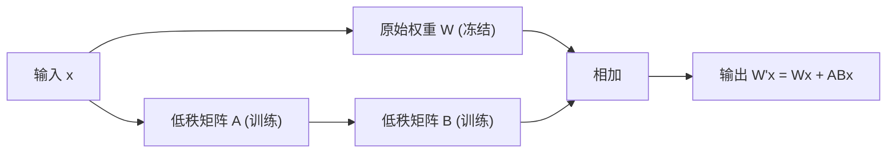

# 第四阶段：模型部署与微调（第 21-24 周）

> 🎯 **阶段目标**：从"使用模型"到"改造模型"。掌握本地部署开源大模型、模型量化、LoRA 微调、推理引擎核心技术，能在有限硬件上运行自己的专属模型。

---

## 第一章：本地开源模型部署 — 脱离第三方 API

### 1.1 为什么需要本地部署？

```
前三阶段你一直通过 API 调用模型（OpenAI/DeepSeek/通义千问）。
这在开发阶段很方便，但有几个根本问题：

1. 数据隐私：你的代码、文档、对话全部发给第三方
   → 金融机构、医疗行业、政府部门通常不允许

2. 成本随规模增长：每天 100 万次请求 = 每月数万美元
   → 本地部署一台 GPU 服务器，电费远低于 API 费用

3. 定制化需求：通用模型在垂直领域不够专业
   → 本地部署 + 微调 = 专属领域模型

4. 网络延迟：API 调用需要网络往返（50-200ms）
   → 本地推理省去了网络延迟
```

### 1.2 本地部署工具对比

| 工具 | 语言 | 特点 | 适用场景 | 硬件要求 |
|------|------|------|---------|---------|
| Ollama | Go | 最简单，一行命令启动 | 学习、个人开发 | 8GB+ RAM |
| vLLM | Python | 高性能，PagedAttention | 生产环境、高并发 | 24GB+ GPU |
| llama.cpp | C++ | CPU 可运行，GGUF 量化 | 无 GPU 环境 | 16GB+ RAM |
| TGI | Python | HuggingFace 出品，生态丰富 | 研究、多模型管理 | 24GB+ GPU |

### 1.3 Ollama 快速部署

```bash
# 安装 Ollama（macOS/Linux/Windows）
curl -fsSL https://ollama.com/install.sh | sh

# 下载并运行 Qwen2.5-7B（约 4.7GB）
ollama run qwen2.5:7b

# 下载并运行 LLaMA-3-8B
ollama run llama3:8b

# Ollama 自动提供 OpenAI 兼容 API
curl http://localhost:11434/v1/chat/completions \
  -H "Content-Type: application/json" \
  -d '{
    "model": "qwen2.5:7b",
    "messages": [{"role": "user", "content": "你好"}]
  }'
```

**Java 对接 Ollama — 只需改 base_url**

```java
// 之前对接 OpenAI：
// String BASE_URL = "https://api.openai.com/v1";

// 现在对接 Ollama 本地模型：
String BASE_URL = "http://localhost:11434/v1";

// Spring AI 配置：
// spring.ai.openai.base-url=http://localhost:11434
// spring.ai.openai.model=qwen2.5:7b
// spring.ai.openai.api-key=ollama  // Ollama 不验证 key，随便填

// 代码完全不需要改！这就是 OpenAI 兼容协议的优势
```

### 1.4 模型格式与量化

```
模型文件有两种主流格式：

1. Safetensors（HuggingFace 标准格式）
   → 完整的 FP16 精度权重
   → 7B 模型 ≈ 14GB
   → 需要 GPU 才能运行

2. GGUF（llama.cpp 量化格式）
   → 支持多种量化精度
   → Q4_K_M（4-bit 量化）：7B 模型 ≈ 4.5GB
   → CPU 也能运行！
```

**量化精度对比**

| 精度 | 每参数存储 | 7B 模型大小 | 质量损失 | 适用场景 |
|------|----------|-----------|---------|---------|
| FP16 | 2 bytes | ~14 GB | 基准 | GPU 推理 |
| INT8 (Q8_0) | 1 byte | ~7 GB | 极小 | GPU/CPU |
| INT4 (Q4_K_M) | 0.5 byte | ~4.5 GB | 可接受 | CPU 推理 |
| INT3 (Q3_K_M) | 0.375 byte | ~3.2 GB | 明显 | 极端资源受限 |

**量化的直觉理解**：
```
原始权重（FP16）：每个参数用 16 位浮点数存储
  → 精确但占空间

量化（INT4）：每个参数压缩到 4 位整数
  → 类似图片从 PNG 压缩成 JPEG
  → 体积缩小 4 倍，质量损失很小（约 1-3%）

量化方法对比：
  GPTQ：需要校准数据集，精度较高
  AWQ：保护重要权重不量化，效果更好
  GGUF：llama.cpp 专属，CPU 友好
```

---

## 第二章：推理引擎核心技术

### 2.1 KV Cache — 避免重复计算

```
问题：LLM 生成是"自回归"的
  生成第 1 个 Token：计算所有前文 Token 的 K、V
  生成第 2 个 Token：需要再次计算所有前文 + 第 1 个 Token 的 K、V
  → 大量重复计算！

KV Cache 解决方案：
  缓存已经计算过的 Key 和 Value 向量
  生成新 Token 时，只需计算新 Token 的 K、V，追加到缓存中

效果：
  无 KV Cache：生成 N 个 Token 需要 O(N²) 次完整计算
  有 KV Cache：生成 N 个 Token 只需 O(N) 次增量计算
  → 速度提升数十倍
```

### 2.2 Continuous Batching — 动态合并请求

```
问题：GPU 一次只能处理一个请求？
  不是！GPU 的并行能力很强，可以同时处理多个请求

传统 Static Batching：
  等所有请求都完成才释放 GPU
  → 有的请求短（50 Token），有的长（500 Token）
  → 短请求完成后 GPU 资源被浪费

Continuous Batching：
  动态合并请求，完成的立即移除，新来的立即加入
  → GPU 始终满载运行
  → 吞吐量提升 2-5 倍
```

### 2.3 PagedAttention — 解决显存碎片化

```
问题：KV Cache 需要预分配连续显存
  为每个请求预分配最大长度的 KV Cache
  → 大部分请求远不到最大长度
  → 大量显存被浪费（碎片化）

PagedAttention（vLLM 的核心创新）：
  借鉴操作系统的"虚拟内存分页"思想
  → KV Cache 不需要连续存储
  → 按需分配"页"（固定大小的显存块）
  → 显存利用率从 ~20% 提升到 ~90%
  → 同样显存可以处理更多并发请求
```

### 2.4 Speculative Decoding — 小模型猜、大模型验

```
问题：自回归生成是串行的（一次只能生成 1 个 Token）
  → GPU 并行能力没有被充分利用

Speculative Decoding：
  Step 1: 用小模型（如 1B）快速"猜测"后续 5 个 Token
  Step 2: 用大模型（如 70B）一次性验证这 5 个 Token
  → 如果全对：一次生成 5 个 Token（速度 x5）
  → 如果部分对：接受对的，重新猜测剩余部分

效果：
  大模型的推理速度接近小模型
  输出质量仍然是大模型的水平
```

---

## 第三章：LoRA 微调 — 低成本改造模型

### 3.1 为什么需要微调？

```
Prompt Engineering + RAG 解决不了的场景：

1. 领域术语理解
   模型不懂你们公司的产品代号、内部系统名称
   → RAG 能注入上下文，但模型理解能力有限

2. 输出风格一致性
   需要模型始终以特定格式输出（如内部工单格式）
   → Prompt 约束不够稳定

3. 复杂推理能力
   需要模型在特定领域具备专家级推理能力
   → 通用模型做不到

微调 = 调整模型权重，让它真正"学会"你的领域
```

### 3.2 LoRA 原理

```
核心思想：不修改原始权重，注入两个小矩阵

原始权重：W (d × d)
  → 可能有数十亿参数
  → 全量微调需要大量显存

LoRA：W' = W + A × B
  A 是 d × r 矩阵
  B 是 r × d 矩阵
  r 通常 = 8~64（远小于 d）

可训练参数：
  全量微调：d × d = 数百万~数十亿
  LoRA：d × r + r × d = 2 × d × r
  → 参数减少 99%+

显存需求对比（7B 模型）：
  全量微调：~120 GB（需要 4 张 A100）
  LoRA + 4-bit 量化：~8 GB（一张 RTX 4070 就够！）
```



### 3.3 微调实战流程

```
Step 1: 构造训练数据（SFT 数据）
  格式：指令-回答对
  {
    "instruction": "分析这段 Java 代码的性能问题",
    "input": "for(int i=0; i<list.size(); i++) { ... }",
    "output": "存在性能问题：list.size() 在每次循环中都被调用..."
  }

  数据质量 > 数据数量
  500 条高质量数据 > 5000 条低质量数据

Step 2: 选择基座模型
  推荐：Qwen2.5-7B-Instruct（中文好、支持 Tool Call）
  或：LLaMA-3-8B-Instruct（英文好、社区生态丰富）

Step 3: LoRA 微调
  使用 Hugging Face PEFT 库
  关键参数：
    r = 16（LoRA 秩，越大越精确但越慢）
    lora_alpha = 32（缩放因子）
    target_modules = ["q_proj", "v_proj"]（注入位置）
    epochs = 3（训练轮次）

Step 4: 合并 & 量化
  合并 LoRA 权重到基座模型
  量化为 INT4（GPTQ 或 AWQ）

Step 5: 部署
  用 Ollama 部署量化后的模型
  → OpenAI 兼容 API，无缝切换
```

```python
# LoRA 微调代码示例（使用 PEFT）
from transformers import AutoModelForCausalLM, AutoTokenizer
from peft import LoraConfig, get_peft_model, TaskType

# 加载基座模型（4-bit 量化）
model = AutoModelForCausalLM.from_pretrained(
    "Qwen/Qwen2.5-7B-Instruct",
    load_in_4bit=True
)
tokenizer = AutoTokenizer.from_pretrained("Qwen/Qwen2.5-7B-Instruct")

# 配置 LoRA
lora_config = LoraConfig(
    task_type=TaskType.CAUSAL_LM,
    r=16,                    # LoRA 秩
    lora_alpha=32,           # 缩放因子
    target_modules=["q_proj", "v_proj"],  # 注入到 Attention 的 Q 和 V
    lora_dropout=0.05,
)

model = get_peft_model(model, lora_config)
model.print_trainable_parameters()
# → 可训练参数: 20,971,520 (约 2100 万)
# → 总参数: 7,636,688,896 (约 76 亿)
# → 训练比例: 0.27%

# 训练...（使用标准 HuggingFace Trainer）
# trainer.train()

# 保存 LoRA 权重
model.save_pretrained("./lora-output")
```

### 3.4 训练数据构造

```
高质量 SFT 数据的特征：
  1. 指令清晰（明确要做什么）
  2. 回答专业（领域专家撰写）
  3. 格式一致（统一的输入输出格式）
  4. 覆盖多样（不同类型的任务、不同的难度）

数据构造方法：
  方法1：人工标注（质量最高，成本最高）
    → 领域专家手写 500-2000 条指令-回答对

  方法2：GPT 辅助生成（效率较高）
    → 用 GPT-4o 生成初始数据
    → 人工审核和修改
    → 效率提升 5-10 倍

  方法3：数据增强
    → 对现有数据做改写、扩展
    → 如：改变提问方式但保持回答不变
```

### 3.5 模型评估

| 评估方法 | 原理 | 适用场景 |
|---------|------|---------|
| Perplexity | 衡量模型对文本的"困惑度" | 通用语言能力 |
| BLEU/ROUGE | 与参考答案的 n-gram 重叠 | 翻译、摘要 |
| LLM-as-Judge | 用另一个大模型评分 | 开放式回答质量 |
| 人工评估 | 领域专家抽样打分 | 最终质量确认 |

---

## 第四章：自检清单与里程碑

### 你现在能回答这些问题吗？

```
本地部署：
□ 1. Ollama 和 vLLM 各适用于什么场景？
□ 2. GGUF 和 Safetensors 格式的区别是什么？
□ 3. 为什么 Ollama 部署后 Java 代码不需要改？

量化：
□ 4. FP16 → INT4 量化，模型大小缩小多少？质量损失多少？
□ 5. GPTQ 和 AWQ 量化方法的区别是什么？

推理引擎：
□ 6. KV Cache 解决什么问题？为什么能提速？
□ 7. Continuous Batching 和 Static Batching 的区别？
□ 8. PagedAttention 借鉴了操作系统的什么思想？

微调：
□ 9. LoRA 的核心思想是什么？为什么参数减少 99%+？
□ 10. 全量微调和 LoRA 微调的显存需求差距有多大？
□ 11. SFT 训练数据的质量如何保证？

评估：
□ 12. Perplexity 衡量的是什么？
□ 13. LLM-as-Judge 的原理是什么？有什么局限？
```

### 下一步预告

**第五阶段**你将构建多 Agent 系统：
- **Multi-Agent 协作**：主从/协商/流水线三种模式
- **MCP/A2A 协议**：Agent 标准化互操作
- **可观测性**：LangFuse 全链路追踪
- **安全与对齐**：提示注入防御、工具权限控制
