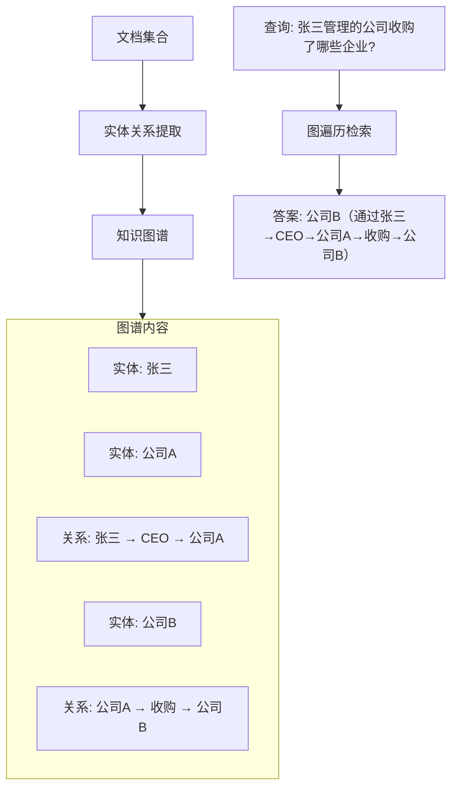
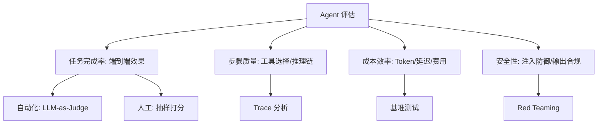

# 第六阶段：进阶优化与前沿（第 28-30 周+，持续学习）

> 🎯 **阶段目标**：从"能做"到"做到极致"。掌握高级 RAG 技术、Agent 评估体系、全链路优化手段，以及多模态、知识图谱、端侧 Agent 等前沿方向。

---

## 第一章：高级 RAG — 超越基础检索增强

### 1.1 基础 RAG 的局限

```
第三阶段你搭建了基础 RAG，但实际使用中会遇到：

1. 检索不准：语义相似的文档块不等于"能回答问题的"文档块
   → 向量搜索返回了"相关"但"无用"的内容

2. 无法跨文档推理：需要综合多篇文档的信息时力不从心
   → "A 公司的营收"在文档1，"B 公司的营收"在文档2
   → 需要推理"A 和 B 的营收差距"时，基础 RAG 做不到

3. 不必要的检索：有些问题不需要查知识库
   → "今天天气怎么样" 不需要触发 RAG
   → 但基础 RAG 总是检索，浪费时间和 Token
```

### 1.2 四种高级 RAG 技术

| 技术 | 原理 | 解决的问题 |
|------|------|------------|
| GraphRAG | 将文档构建为知识图谱，检索时遍历图关系 | 跨文档的关系推理 |
| Self-RAG | Agent 自己决定是否检索，检索后自我评估结果质量 | 减少不必要的检索 |
| Corrective RAG | 检索结果不佳时自动触发查询重写、切换策略 | 提升检索质量 |
| 多模态 RAG | 对图片/表格也做向量化和检索 | 处理非文本信息 |

**GraphRAG — 知识图谱 + RAG**



```
GraphRAG 的优势：
  基础 RAG：搜索"张三"相关文档 → 可能找不到"公司B"的信息
  GraphRAG：沿图遍历 → 张三 → 公司A → 收购 → 公司B → 完整答案

适用场景：
  企业知识管理（组织架构、项目关系）
  学术研究（论文引用网络）
  法律合规（法规之间的关联关系）
```

**Self-RAG — 自主决定何时检索**

```
Self-RAG 的决策流程：
  1. 收到用户问题
  2. Agent 自我评估：这个问题需要检索知识库吗？
     → 不需要（常识问题）→ 直接回答
     → 需要 → 触发检索
  3. 检索完成后，Agent 评估结果质量：
     → 质量高 → 基于检索结果回答
     → 质量低 → 重写查询重新检索，或坦诚说"找不到相关信息"

效果：
  减少 30-50% 的不必要检索
  降低延迟和 Token 消耗
```

---

## 第二章：Agent 评估体系

### 2.1 评估的四个维度



| 评估维度 | 核心指标 | 方法 | 工具 |
|---------|---------|------|------|
| 任务完成率 | 成功率、部分完成率 | 端到端测试集 | RAGAS、LangSmith |
| 步骤质量 | 工具选择准确率、推理链正确率 | Trace 分析 | LangFuse、Arize |
| 成本效率 | 平均 Token、延迟、单任务成本 | 监控统计 | 自建 Dashboard |
| 安全性 | 注入成功率、越权操作率 | Red Teaming | Garak、PromptBench |

### 2.2 LLM-as-Judge — 用 AI 评估 AI

```
原理：用一个强大的 LLM（如 GPT-4o）来评估你的 Agent 输出质量

评估 Prompt 示例：
  "请评估以下 AI 助手的回答质量（1-5 分）：

   用户问题：{question}
   参考答案：{reference_answer}
   AI 回答：{agent_answer}

   评估维度：
   - 准确性：回答是否正确
   - 完整性：是否涵盖了关键信息
   - 相关性：是否有不相关的内容"

优点：自动化、可规模化、成本远低于人工评估
缺点：评估 LLM 自身也有偏差（位置偏差、冗长偏好）

最佳实践：
  → LLM-as-Judge 做大批量初筛
  → 人工评估做关键样本抽查
  → 两者结合最可靠
```

### 2.3 构建评估基准

```
评估基准（Benchmark）= 一组标准化的测试用例

构造方法：
  1. 收集真实用户问题（从线上日志中提取）
  2. 标注标准答案（领域专家撰写）
  3. 分类打标（简单/中等/困难、不同业务领域）
  4. 定期更新（避免过拟合）

每次迭代后的回归测试：
  修改 Prompt/工具/RAG 策略后
  → 跑一遍完整的 Benchmark
  → 对比修改前后的指标变化
  → 确保"优化没有引入新的退化"
```

---

## 第三章：工具调用优化

### 3.1 语义缓存

```
原理：
  用户问题 → Embedding → 查询缓存
  如果缓存中有语义相似的历史问答
  → 直接返回历史答案（跳过 LLM 调用）

效果：
  命中缓存时：延迟从 5s → 0.1s，成本从 $0.01 → $0
  典型命中率：20-40%（很多问题是重复的）

实现：
  1. 每次成功的问答存入向量数据库（问题向量 + 答案）
  2. 新问题时先查缓存（余弦相似度 > 0.95 视为命中）
  3. 设置 TTL（过期时间），防止返回过时信息
```

### 3.2 并行工具调用

```
问题：Agent 需要调用 3 个独立工具
  串行：工具A(2s) → 工具B(1s) → 工具C(1.5s) = 4.5s
  并行：工具A(2s) | 工具B(1s) | 工具C(1.5s) = 2s（最慢的决定总耗时）

实现：
  LLM 一次返回多个 tool_call
  → 应用程序并行执行（CompletableFuture / 虚拟线程）
  → 所有结果一起返回给 LLM

效果：延迟降低 50%+
```

```java
/**
 * 并行工具调用实现
 */
private List<ToolResult> executeToolsParallel(List<ToolCall> toolCalls) {
    // 用虚拟线程并行执行所有工具调用
    return toolCalls.stream()
        .map(call -> CompletableFuture.supplyAsync(
            () -> new ToolResult(call.id(), executeTool(call)),
            virtualThreadExecutor
        ))
        .toList()
        .stream()
        .map(CompletableFuture::join)
        .toList();
}
```

### 3.3 熔断降级

```
原理：当工具连续失败 N 次后，暂时"熔断"（不再调用）
  → 返回降级响应（缓存结果或错误提示）
  → 避免雪崩效应（工具挂了导致所有 Agent 请求都卡住）

状态机：
  关闭（正常）→ 打开（熔断）→ 半开（试探恢复）

  关闭状态：正常调用工具
  连续失败 N 次 → 切换到打开状态
  打开状态：直接返回降级响应，不调用工具
  等待一段时间 → 切换到半开状态
  半开状态：尝试调用一次
  成功 → 切换到关闭状态
  失败 → 回到打开状态
```

### 3.4 限流保护

```
限流 = 限制单位时间内的请求数量

为什么需要限流？
  1. 保护 LLM API：API 提供商有 RPM/TPM 限制
  2. 保护工具服务：数据库查询工具不能被无限调用
  3. 保护用户公平：防止单个用户占满所有资源

实现方式：
  令牌桶算法：每秒生成 N 个令牌，每次请求消耗 1 个
  → 令牌用完则拒绝请求或排队等待
```

---

## 第四章：性能与成本优化

### 4.1 小模型路由

```
原理：用一个轻量模型（如 GPT-4o-mini）先判断问题复杂度
  → 简单问题 → 用小模型回答（快、便宜）
  → 复杂问题 → 用大模型回答（慢、贵但准确）

效果：
  80% 的问题其实很简单（日常问答、简单查询）
  → 路由后整体成本降低 50-70%
  → 复杂问题的质量不受影响

实现：
  路由模型 = 一个分类器
  输入：用户问题
  输出：简单/中等/复杂
  → 根据分类结果选择不同的 ChatModel
```

### 4.2 Prompt 压缩

```
原理：去除系统提示词中的冗余信息，减少 Token 消耗

方法：
  1. 移除重复说明
  2. 用缩写替代完整描述（在上下文中首次出现时说明）
  3. 动态加载：只在需要时注入工具定义（而不是全部塞进去）
  4. 用 Few-shot 替代冗长的规则描述

效果：Token 减少 30-50%，成本同步降低
```

### 4.3 Token 预算分配

```
一个 Agent 请求的总 Token 预算是有限的（受上下文窗口限制）。
需要合理分配给各个部分：

分配策略：
  系统提示词：1000 Token（固定）
  工具定义：按需加载，最多 2000 Token
  对话历史：动态裁剪，最多 4000 Token
  RAG 结果：相关性排序，最多 3000 Token
  用户输入：不限制
  模型输出：预留 2000 Token

总计：~12000 Token
剩余空间：足够的安全余量
```

---

## 第五章：高级 Agent 能力

### 5.1 多模态 Agent

```
多模态 = 能同时处理文本、图像、音频、视频

GPT-4o / Claude 3.5 / Gemini 都支持多模态输入

Agent 应用场景：
  → 用户上传截图 → Agent 分析 UI 问题
  → 用户上传图表 → Agent 提取数据并分析
  → 用户上传代码截图 → Agent 转为可编辑代码

Spring AI 支持：
  chatClient.prompt()
    .user(new UserMessage(
        "分析这张图片中的问题",
        new Media(MimeType.IMAGE_PNG, imageResource)
    ))
    .call().content();
```

### 5.2 知识图谱 Agent

```
知识图谱 = 实体 + 关系 的结构化网络

Agent + 知识图谱：
  1. 从对话中提取实体和关系
  2. 存入图数据库（如 Neo4j）
  3. 利用图关系做深度推理

示例：
  对话中得知："张三是公司A的CEO，公司A收购了公司B"
  → 存入图谱：张三 -[CEO]-> 公司A -[收购]-> 公司B
  → 后续问："张三间接管理了哪些公司？"
  → 图遍历：张三 → 公司A → 公司B → 答案：公司B
```

### 5.3 端侧 Agent

```
端侧 Agent = 在用户设备上运行的轻量级 Agent

模型选择：
  Phi-3-mini (3.8B)：微软出品，手机可运行
  Qwen2.5-1.5B：阿里出品，极轻量
  Gemma-2B：Google 出品

应用场景：
  → 离线场景：飞机上、偏远地区
  → 隐私场景：所有数据不离开设备
  → 实时场景：极低延迟（无网络往返）

局限：
  能力远不如 7B+ 模型
  工具调用能力较弱
  适合简单任务（文本分类、摘要、简单问答）
```

---

## 第六章：安全对齐 — 让 AI "向善"

### 6.1 RLHF / DPO — 人类反馈强化学习

```
RLHF（Reinforcement Learning from Human Feedback）：
  Step 1: 模型生成多个回答
  Step 2: 人类标注员给回答打分排序
  Step 3: 训练一个"奖励模型"（Reward Model）
  Step 4: 用强化学习（PPO）优化策略

DPO（Direct Preference Optimization）：
  更简单的方法：直接用人类偏好数据优化模型
  不需要训练奖励模型
  → 训练更稳定，资源需求更少

对 Agent 开发者的意义：
  → 理解对齐原理，知道模型"为什么拒绝某些请求"
  → 微调时可以加入对齐数据，让模型更安全
```

### 6.2 Constitutional AI — 让 AI 遵循"宪法"

```
Anthropic 的方法：
  给 AI 一套"宪法"（行为准则）
  → 不仅训练它"有用"，还训练它"无害"

  示例准则：
    "不要帮助进行非法活动"
    "不要生成有害内容"
    "在被问到超出能力范围的问题时坦诚说明"

  当 AI 的输出可能违反宪法时
  → 自我修正，输出更安全的回答
```

---

## 第七章：自检清单与里程碑

### 你现在能回答这些问题吗？

```
高级 RAG：
□ 1. GraphRAG 和基础 RAG 的核心区别是什么？
□ 2. Self-RAG 如何决定"何时检索、何时不检索"？
□ 3. Corrective RAG 在检索结果不佳时做什么？

评估体系：
□ 4. Agent 评估的四个维度是什么？
□ 5. LLM-as-Judge 的原理和局限分别是什么？
□ 6. 评估基准（Benchmark）如何构造和维护？

工具调用优化：
□ 7. 语义缓存的命中率通常是多少？什么情况下不适用？
□ 8. 并行工具调用如何实现？延迟能降低多少？
□ 9. 熔断器的三种状态（关闭/打开/半开）如何切换？

性能优化：
□ 10. 小模型路由如何判断问题复杂度？成本能降低多少？
□ 11. Prompt 压缩有哪些方法？Token 能减少多少？

高级能力：
□ 12. 多模态 Agent 能处理哪些类型的输入？
□ 13. 知识图谱 Agent 相比纯向量检索有什么优势？
□ 14. 端侧 Agent 的适用场景和局限分别是什么？

安全对齐：
□ 15. RLHF 和 DPO 的区别是什么？
□ 16. Constitutional AI 的核心思想是什么？
```

---

## 总结：从零基础到精通 Agent 的完整路径

```
预备阶段（第 1-3 周）：数学 + Python + DL 基础
  → 你理解了矩阵乘法、神经网络、Word2Vec

第一阶段（第 4-7 周）：Transformer + LLM + API
  → 你理解了 Self-Attention、Token、Embedding、API 协议

第二阶段（第 8-13 周）：Prompt + Spring AI + 对话 + 向量库
  → 你能构建生产级的对话应用，掌握向量检索

第三阶段（第 14-20 周）：Agent 核心（Tool Use + RAG + Memory + Loop）
  → 你能构建能解决实际问题的智能体

第四阶段（第 21-24 周）：模型部署 + 微调
  → 你能在本地部署和微调专属模型

第五阶段（第 25-27 周）：Multi-Agent + MCP + 可观测性 + 安全
  → 你能构建企业级多 Agent 系统

第六阶段（第 28-30 周+）：高级 RAG + 评估 + 优化 + 前沿
  → 你能让 Agent 系统做到极致：更快、更准、更省、更安全

至此，你具备了 Agent 全栈能力：
  从底层原理 → 应用开发 → 系统设计 → 性能优化 → 前沿探索
  这就是"精通 AI Agent"的含义。
```
